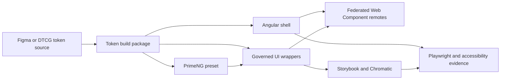

# Public Sector Federation

Public Sector Federation is a portfolio-grade Angular reference platform demonstrating runtime module federation, independently bootstrapped Web Components, governed PrimeNG wrappers, design-token delivery, Storybook evidence, and automated accessibility and integration validation.

## Start here

- [Live Storybook and visual QA](https://6a57d5b6de2da2591d3236aa-zpjdyybmmw.chromatic.com/)
- [Five-minute portfolio walkthrough](./docs/PORTFOLIO-OVERVIEW.md)
- [Testing and release gates](./docs/TESTING.md)
- [Design-system architecture](./docs/design-system/architecture/reference-architecture-recommendation.md)
- [Component catalog](./docs/design-system/components/catalog.md)
- [Generated component manifest](./packages/ui-patterns/generated/component-manifest.json)

## What this demonstrates

- Angular 21 applications composed through an Nx 23 workspace
- a shell that discovers and mounts independently deployed custom-element remotes
- shared semantic tokens delivered as CSS variables, JSON, TypeScript, and PrimeNG preset mappings
- provider-neutral component APIs that keep PrimeNG implementation details inside a governed registry
- light and dark theme propagation across shell, remotes, and body-appended overlays
- Storybook, Chromatic, Playwright, axe, type checking, link checks, and manifest validation
- a NestJS API backed by Prisma and PostgreSQL



## Repository layout

| Path | Purpose |
| --- | --- |
| `apps/shell` | Composes remote custom elements at runtime. |
| `apps/services-remote` | Public-services remote exposed as `<public-services-root>`. |
| `apps/reporting-remote` | Reporting remote exposed as `<public-reporting-root>`. |
| `apps/admin-remote` | Administration remote exposed as `<public-admin-root>`. |
| `apps/qa-remote` | Stable visual-contract and Storybook evidence surface. |
| `apps/playground` | Local component and integration playground. |
| `apps/agile-api` | NestJS API with Prisma and PostgreSQL. |
| `packages/tokens` | Token source, generated CSS variables, JSON, and TypeScript exports. |
| `packages/primeng-preset` | Shared PrimeNG theme bridge and provider. |
| `packages/ui-patterns` | Provider-neutral wrappers, patterns, and component manifest. |
| `docs` | Architecture, validation, governance, and portfolio documentation. |

The shell reads `module-federation.manifest.json` to discover remote bundles and mount them as custom elements.

## Reference status

Release `1.0.0` is complete as a public architecture and portfolio reference. The repository intentionally contains multiple component lifecycle states—active, candidate, partial, and externally blocked—to demonstrate how governance metadata identifies evidence gaps instead of presenting every component as production-approved.

Production adoption would still require organization-specific validation of the authoritative token export, ownership assignments, deployment topology, and design approvals. Those external decisions are explicitly separated from what this sample proves.

## Prerequisites

- Node.js 22 through 26
- pnpm 10.33.2
- Docker Desktop for PostgreSQL and the backend API
- Git

## Install and run

```bash
pnpm install
pnpm start:all
```

The shell opens at `http://localhost:4200`. Frontend applications use ports `4200` through `4204`; the QA Storybook uses port `4400`.

Run services individually when needed:

```bash
pnpm start:frontend
pnpm start:backend
pnpm serve:shell
pnpm serve:qa
pnpm storybook:qa
```

## Verification

Use the complete release gate before tagging or merging a release:

```bash
pnpm verify:release
```

This runs linting, link validation, type checking, unit tests, component-manifest drift checks, production builds, and the Playwright E2E suite.

Use the smaller running-platform check during development:

```bash
pnpm verify:smoke
```

Other useful commands:

```bash
pnpm build:tokens
pnpm lint:wrappers
pnpm manifest:check
pnpm test:e2e:list
pnpm test:storybook:up-button:chromium
pnpm chromatic
pnpm report:all
```

## Testing

The verified July 17, 2026 release run completed **360 Playwright executions with 360 passing** across Chromium, Firefox, and WebKit. Use `pnpm test:e2e:list` whenever an exact current collection count is needed rather than maintaining a hand-counted total.

Coverage includes:

- shell and remote federation behavior
- token inheritance and theme switching
- PrimeNG overlay behavior
- Storybook rendering and component states
- keyboard interaction and automated accessibility checks
- documentation examples and boundary rules
- component-registry and generated-manifest integrity

See [docs/TESTING.md](./docs/TESTING.md) for the authoritative commands and counting convention.

## Design-system contract

Applications and remotes consume approved UI APIs from `@public-sector/ui-patterns`. PrimeNG modules, selectors, events, and provider-specific types remain inside the registry and preset packages.

```ts
import { PublicButtonComponent } from '@public-sector/ui-patterns';
```

The shared runtime contract is:

```text
DTCG-compatible source
  -> semantic --ps-* variables
  -> component intent tokens
  -> PrimeNG --p-* bridge and preset
  -> registry wrappers
  -> shell and independently running remotes
```

Zeroheight exports are documentation and governance artifacts; they are not a runtime token source or federation configuration mechanism.

## Ownership and license

This is an independently owned public portfolio and reference repository. The source is visible for evaluation and discussion, but no open-source license is granted. See [LICENSE.md](./LICENSE.md).
