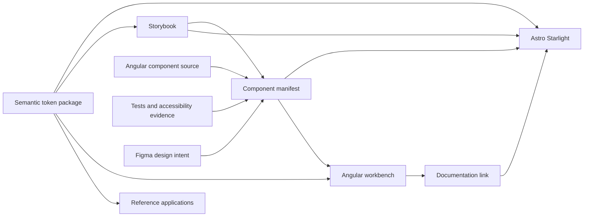

The documentation, workbench, Storybook, and reference applications are sibling outputs. They share governed data and visual foundations while retaining clear framework responsibilities.

## Runtime boundary

- Starlight owns public guidance, search, navigation, and generated documentation views.
- Angular owns component runtime behavior and integrated workbench workflows.
- Storybook owns isolated component behavior and supported controls.
- Chromatic owns visual review and regression evidence.
- The component manifest owns identity, lifecycle, evidence references, alignment status, and blockers.
- Figma owns approved design intent, not runtime implementation.

The preferred public topology mounts Starlight at `/docs/`, the Angular workbench at `/workbench/`, and Storybook at `/storybook/` or its coordinated hosted URL.
