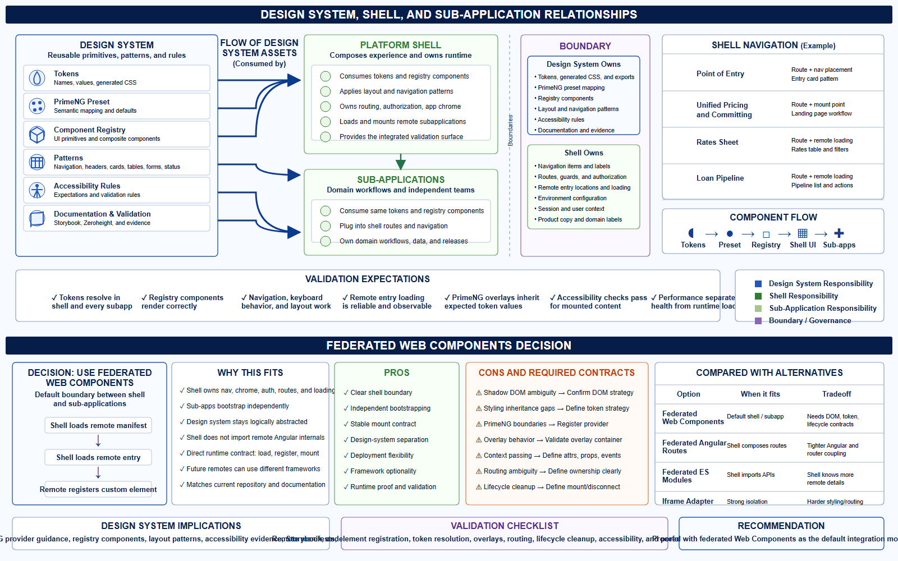

# Federated Web Components Decision

Federated Web Components are the required boundary between the platform shell
and independently owned subapplications for this work.

Other integration models can exist elsewhere, but this recommendation assumes
the required federated Web Component runtime and focuses on the token and
component-registry contracts inside it.



The diagram above shows the design system, shell, subapplication, boundary, and
validation relationships that support this decision.

## Decision

Use federated Web Components for shell-to-subapplication composition:

```text
Shell
  -> loads remote manifest
  -> loads remote entry
  -> remote registers a custom element
  -> shell mounts the custom element
```

The shell should own navigation, application chrome, authorization context,
route placement, and remote loading. Subapplications should bootstrap
independently, register their custom element, consume the shared design-system
contract, and own their domain workflows.

## Why This Fits

- The shell can own navigation, app chrome, auth, route placement, and remote
  loading.
- Subapplications can bootstrap independently and own their domain workflows.
- The design system stays logically abstracted from the shell.
- The shell does not need to import subapplication Angular routes, providers, or
  components.
- The runtime contract is direct: load remote entry, register custom element,
  mount custom element.
- Future remotes can use different Angular versions or even different frontend
  stacks if they honor the custom-element contract.
- The model matches the current repository behavior and supporting docs in
  `README.md`, `docs/design-system/focus.md`, and
  `docs/federation-primeng.md`.

## Pros

| Benefit | Why it matters |
| --- | --- |
| Clear shell boundary | The shell composes apps without owning app internals. |
| Independent bootstrapping | Each subapplication controls its own Angular runtime setup. |
| Stable mount contract | The shell mounts HTML custom elements instead of framework APIs. |
| Design-system separation | Tokens and registry components remain reusable across shell and subapps. |
| Deployment flexibility | Teams can ship subapplications independently. |
| Framework optionality | Future remotes can vary as long as the custom element contract holds. |
| Runtime proof | Shell validation proves tokens, PrimeNG, and registry patterns together. |

## Cons And Required Contracts

| Risk | Required contract |
| --- | --- |
| DOM contract | Current evidence shows light DOM; confirm in source and tests. |
| Styling inheritance gaps | Attach token CSS variables at `:root` and theme on `html.p-dark`. |
| PrimeNG boundary issues | Register the shared PrimeNG provider in every bootstrapped app. |
| Overlay behavior | Current evidence shows overlays append to `body`; validate inherited tokens. |
| Context passing | Define attributes, properties, events, and shared context explicitly. |
| Routing ambiguity | Decide what the shell owns versus what the subapplication owns. |
| Lifecycle cleanup | Define mount, reconnect, disconnect, and cleanup expectations. |
| Error handling | Define fallback UI when remote entry loading or element registration fails. |

## Compared With Alternatives

| Option | When it fits | Tradeoff |
| --- | --- | --- |
| Federated Web Components | Default shell/subapp boundary. | Needs DOM, token, and lifecycle contracts. |
| Federated Angular routes | Shell composes remote Angular routes. | Tighter Angular and router coupling. |
| Federated ES modules | Shell imports remote APIs or components. | Shell knows more remote implementation detail. |
| `mount()`/`unmount()` | A custom lifecycle API is needed. | More bespoke integration code. |
| Iframe adapter | Strong isolation or legacy containment. | Harder styling, routing, a11y, and data sharing. |
| Build-time libraries | Runtime composition is unnecessary. | Loses independent subapplication deployment. |

## Design-System Implications

The design system should not become part of the shell. It should provide:

- Tokens and generated CSS custom properties
- PrimeNG preset mapping and provider guidance
- Registry components and reusable patterns
- Navigation, page header, card, form, table, and status patterns
- Accessibility rules and validation evidence
- Storybook and Zeroheight documentation

The shell consumes those assets and uses them to assemble a specific platform
experience. When a shell-specific pattern becomes reusable across multiple
domains, promote it into the component registry. Otherwise, keep it in the shell
and consume lower-level design-system primitives.

## Validation Checklist

Before treating the pattern as production-ready, prove:

- The shell can load every remote entry from manifest configuration.
- Each remote registers the expected custom element.
- Tokens resolve in the shell and mounted light DOM subapplications.
- PrimeNG components render with the shared provider and token preset.
- PrimeNG overlays appended to `body` inherit the expected variables.
- Shell and remote routing responsibilities are documented.
- Custom element lifecycle cleanup is tested.
- Keyboard navigation and accessibility checks pass.
- Runtime performance captures manifest fetch, remote entry load, custom
  element registration, and first visible remote content.

## Recommendation

Proceed with federated Web Components as the required integration model for this
work. Keep the design-system contract portable, but focus implementation proof
on the current light DOM custom-element runtime.
