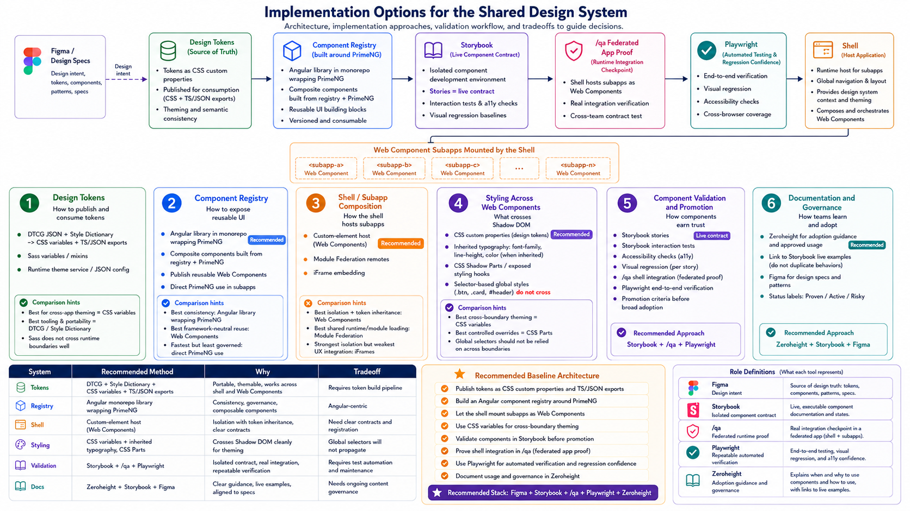

# Implementation Options

The shell and subapplication integration model should be chosen after comparing
the runtime, styling, routing, and deployment tradeoffs against the real code.

## Options To Compare

| Option | Strengths | Risks/Costs |
| --- | --- | --- |
| Web Components | Boundary, explicit host, independent mount. | Confirm Shadow DOM; design routing, DI, lifecycle. |
| Federated Angular routes | Router integration, conventions. | Tighter version coordination. |
| Native Federation ES modules | Modern loading, explicit dependencies. | Build/runtime config needed. |
| `mount()`/`unmount()` | Clear contract, flexibility. | More custom lifecycle code. |
| Iframe adapter | Strong isolation for legacy. | Styling, routing, Accessibility cost. |
| Build-time libraries | Simple where deployment unnecessary. | No runtime composition. |

## Evaluation Criteria

- Routing ownership
- Styling inheritance and isolation
- Lifecycle and cleanup
- Angular dependency sharing
- PrimeNG and overlay behavior
- Independent deployment
- Failure and fallback behavior
- Design-token compatibility
- Migration cost for existing applications

## Current Recommendation

Do not treat one mounting model as final until the repository and shell behavior
are validated. The design-system contract should remain portable across viable
options:

- Tokens should be available as CSS custom properties and package artifacts.
- Registry components should work in normal Angular applications first.
- Storybook should prove isolated component behavior.
- Shell validation should prove integration behavior.
- Zeroheight should document approved usage and link to evidence.
