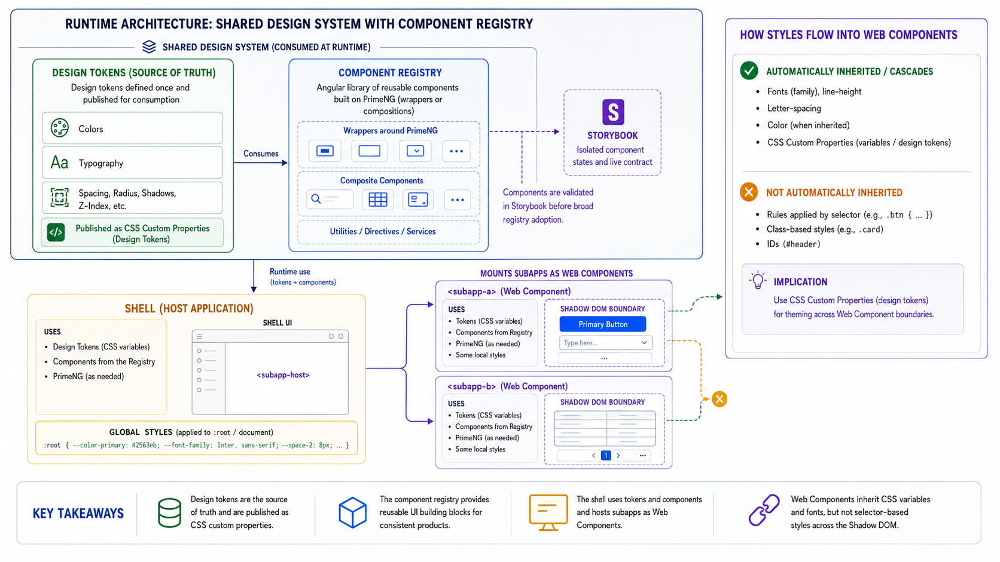

# Implementation Options

The shell and subapplication integration model is assumed for this work:
federated Web Components. This document keeps the comparison context, but the
implementation proof should focus on the required custom-element runtime.

## Options To Compare

| Option | Strengths | Risks/Costs |
| --- | --- | --- |
| Web Components | Boundary, explicit host, independent mount. | Confirm DOM strategy; design routing, DI, lifecycle. |
| Federated Angular routes | Router integration, conventions. | Tighter version coordination. |
| Native Federation ES modules | Modern loading, explicit dependencies. | Build/runtime config needed. |
| `mount()`/`unmount()` | Clear contract, flexibility. | More custom lifecycle code. |
| Iframe adapter | Strong isolation for legacy. | Styling, routing, Accessibility cost. |
| Build-time libraries | Simple where deployment unnecessary. | No runtime composition. |

## Evaluation Criteria

- Routing ownership
- Styling inheritance and isolation
- Lifecycle and cleanup
- Angular dependency sharing
- PrimeNG and overlay behavior
- Independent deployment
- Failure and fallback behavior
- Design-token compatibility
- Migration cost for existing applications

## Current Recommendation

Use federated Web Components as the required shell and subapplication boundary
for this work. They provide a stable custom-element contract, preserve
independent subapplication bootstrapping, and keep the shell from depending on
subapplication Angular internals.

Keep the design-system contract portable across viable options:

- Tokens should be available as CSS custom properties and package artifacts.
- Registry components should work in normal Angular applications first.
- Storybook should prove isolated component behavior.
- Shell validation should prove integration behavior.
- Starlight should document approved usage and link to evidence.

Federated Angular routes or ES module remotes can still be appropriate in other
contexts when the shell intentionally owns routing, providers, or a tighter
Angular integration. Those options are outside the current proof.

## Why Web Components Fit Best Here

The current architecture already points toward custom-element remotes:

- The shell loads remote configuration from `module-federation.manifest.json`.
- Remotes bootstrap independently and register custom elements.
- The shell can mount each subapplication without importing its Angular routes,
  providers, or components.
- The design system can remain separate from the shell while still proving
  tokens, registry components, PrimeNG behavior, and accessibility in the
  composed runtime.

This works well for a unified platform shell because the shell owns navigation,
authorization, app chrome, and remote loading, while subapplications own their
domain workflows and release timing.

The decision does not remove the need for explicit contracts. Runtime evidence
now answers several of them: remotes mount in light DOM, `.p-dark` is applied on
`html`, overlays append to `body`, and each remote bootstraps independently.
The remaining rules to define are:

- Inputs, attributes, events, and context passing
- Remote lifecycle and cleanup
- Route ownership between shell and subapplication
- PrimeNG provider registration in every independently bootstrapped app
- Token CSS and overlay integration tests that prove the observed runtime
