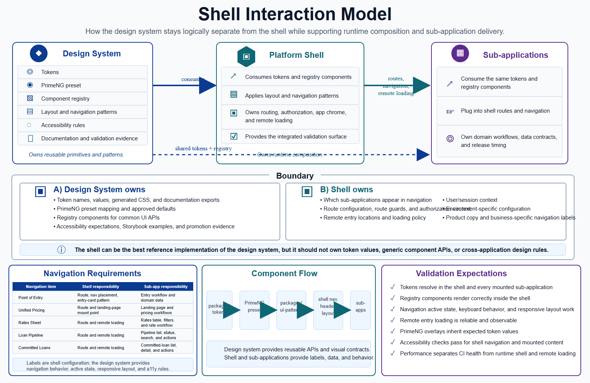

# Shell Interaction Model

The design system should remain logically separate from the platform shell. The
shell consumes the design system, proves it in a real runtime, and supplies the
navigation and application composition for a specific business domain.



```text
Design system
  -> tokens
  -> PrimeNG preset
  -> component registry
  -> layout and navigation patterns
  -> accessibility rules
  -> documentation and validation evidence

Platform shell
  -> consumes tokens and registry components
  -> applies layout and navigation patterns
  -> owns routing, authorization, app chrome, and remote loading
  -> provides the integrated validation surface

Sub-applications
  -> consume the same tokens and registry components
  -> plug into shell routes and navigation
  -> own domain workflows, data contracts, and release timing
```

## Boundary

The design system should own reusable primitives and patterns:

- Token names, values, generated CSS, and documentation exports
- PrimeNG preset mapping and approved defaults
- Registry components for common UI APIs
- Navigation, page header, app card, status, form, and table patterns
- Accessibility expectations and validation rules
- Storybook examples and promotion evidence

The shell should own runtime composition:

- Which sub-applications appear in navigation
- Route configuration and route guards
- Authentication and authorization context
- Remote entry locations and loading policy
- User/session context
- Environment-specific configuration
- Product copy and business-specific navigation labels

The shell can be the best reference implementation of the design system, but it
should not own token values, generic component APIs, or cross-application design
rules.

## Navigation Requirements

The initial shell navigation should represent these destinations:

| Navigation item | Shell responsibility | Sub-application responsibility |
| --- | --- | --- |
| Point of Entry | Route, nav placement, entry-card pattern usage | Entry workflow and domain data |
| Unified Pricing and Committing | Route and landing-page mount point | Landing page and pricing workflows |
| Rates Sheet | Route and remote loading | Rates table, filters, and rate workflow |
| Loan Pipeline | Route and remote loading | Pipeline list, status, search, and actions |
| Committed Loans | Route and remote loading | Committed-loan list, detail, and actions |

These labels are shell configuration. The design system should provide the
navigation pattern, active state, responsive behavior, icon usage, keyboard
behavior, and accessibility rules that make those items consistent.

## Component Flow

The shell should use registry components for repeatable structure:

```text
packages/tokens
  -> PrimeNG preset
  -> packages/ui-patterns
  -> shell navigation, header, page layout, cards, tables, forms
  -> sub-applications
```

For example, the design system can provide a generic platform navigation
component, while the shell provides the navigation data:

```ts
const navigationItems = [
  { label: 'Point of Entry', route: '/entry' },
  { label: 'Unified Pricing and Committing', route: '/pricing' },
  { label: 'Rates Sheet', route: '/rates' },
  { label: 'Loan Pipeline', route: '/pipeline' },
  { label: 'Committed Loans', route: '/committed-loans' },
];
```

The same approach applies to page headers, app cards, status chips, empty
states, forms, and data-table patterns. The design system owns the reusable API
and visual contract. The shell and sub-applications provide domain-specific
labels, data, and behavior.

## Validation Expectations

Before the shell pattern is treated as ready, validation should prove:

- Tokens resolve in the shell and every mounted sub-application.
- Registry components render correctly inside the shell.
- Navigation active state, keyboard behavior, and responsive layout work.
- Remote entry loading is reliable and observable.
- PrimeNG overlays inherit the expected token values.
- Accessibility checks pass for shell navigation and mounted content.
- Performance metrics separate CI test health from runtime shell and remote
  loading performance.

When a shell-specific pattern becomes reusable across multiple domains, promote
it back into the component registry. If it only serves one domain, keep it in the
shell and consume lower-level design-system primitives.
