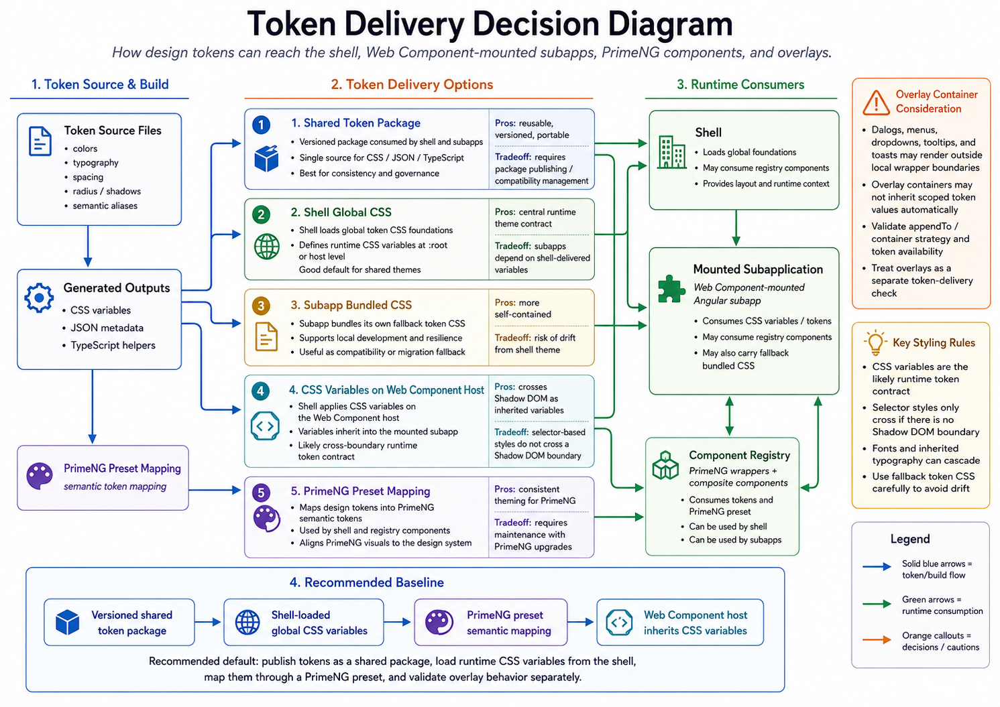

# Token Pipeline

The token pipeline should make design values reusable by the shell,
subapplications, registry components, PrimeNG, documentation, and tests.

## Proposed Flow



```text
Authoritative token source
  -> validation and transformation
  -> CSS custom properties
  -> JSON metadata
  -> TypeScript helpers or constants
  -> PrimeNG semantic token preset
  -> shell, subapplications, registry, Storybook, and documentation
```

## Responsibilities

- Token source files own the production values.
- Generated CSS exposes runtime custom properties.
- Generated JSON or TypeScript supports tooling, docs, and tests.
- The PrimeNG preset maps system tokens into PrimeNG semantic and component
  tokens.
- Storybook and shell validation prove that tokens work in isolated and
  integrated contexts.
- Zeroheight displays token guidance and examples; it does not serve production
  runtime tokens.

## Required Implementation Constraints

The architecture choice is assumed: the shell composes federated Web Components.
The token pipeline should fit that architecture instead of arguing for another
mounting model.

- The token source of truth should live in a versioned package, not in
  Zeroheight and not only in the shell.
- The shell should load global token CSS and own theme selection.
- Each remote should consume the same token package so it can run inside the
  shell and in isolation.
- The PrimeNG preset should be generated from or mapped to the same token
  values used by CSS custom properties.
- Registry components should consume semantic tokens and PrimeNG preset values,
  not define independent visual values.
- Light DOM versus Shadow DOM must be confirmed for each remote before styling
  inheritance is assumed.
- PrimeNG overlays must be validated because they may render under `body` or a
  shared overlay container rather than inside the Web Component host.
- Zeroheight should document token guidance and evidence links; it should not
  supply runtime tokens.

## Recommended Consumption Model

Applications should consume the tokens through a combination of runtime CSS and
package APIs:

```text
packages/tokens source files
  -> generated CSS custom properties for runtime styling
  -> generated JSON metadata for documentation and validation
  -> derived TypeScript exports for presets and tests
  -> PrimeNG preset mapped from the same values
```

The primary runtime contract is CSS custom properties. The shell should load the
generated token CSS once at the application boundary and apply the active theme
class. Remotes should also import the generated token CSS through the same
package so they can run independently in local development, Storybook, and
remote-specific tests. This creates a deliberate overlap: the shell provides the
integrated theme context, while remotes keep enough token dependency to avoid
being shell-only applications.

TypeScript exports should support tooling, tests, and the PrimeNG preset. They
should be generated from or derived from token build artifacts rather than
manually duplicating token values. The PrimeNG preset should map from those same
values into PrimeNG semantic and component tokens.

## Applied Repository Model

The sample repository is aligned to this model in these places:

- `packages/tokens` owns the source token files and generated artifacts.
- `packages/tokens/src/tokens.css` exposes runtime CSS custom properties.
- `packages/tokens/src/design-tokens.json` and
  `packages/tokens/src/zeroheight-tokens.json` provide tooling and
  documentation metadata.
- `packages/tokens/src/index.ts` exports derived token data from generated
  artifacts instead of maintaining a second hardcoded token copy.
- `packages/primeng-preset` consumes `@public-sector/tokens` and maps the
  values into the PrimeNG preset.
- The shell imports the generated token CSS and establishes the integrated
  runtime context.
- Each remote imports the generated token CSS so it can render inside the shell
  and in isolation.
- Federation configuration shares `@public-sector/tokens` as a singleton to
  reduce token-version drift between shell and remotes.

This is the practical answer to the consumption question: publish a versioned
token package with generated CSS, generated metadata, and derived package
exports; let the shell own active theme context; require remotes to consume the
same package for independent rendering; and use the same source to drive PrimeNG
mapping.

## Theme Flow

The shell should own the active theme decision because it owns the integrated
experience, navigation, route placement, and runtime composition. Theme changes
should be represented as stable classes or attributes on a shared ancestor such
as `html`, `body`, the shell root, or the Web Component host.

Remotes should not define competing theme values. They should read the same CSS
custom property names and respond to the shell-provided theme context. For
isolated development, a remote may apply the same theme class locally, but the
token names and values should still come from the token package.

## DOM Boundary Requirements

The current recommendation assumes token delivery must be proven against the
actual Web Component implementation:

- If a remote renders in light DOM, global CSS variables, PrimeNG theme CSS,
  typography, and selector-based component styles can reach the mounted content.
- If a remote uses Shadow DOM, CSS custom properties can still inherit through
  the host, but global selectors and PrimeNG styled-mode rules do not
  automatically cross the boundary.
- Any Shadow DOM remote must explicitly validate host-level variables, PrimeNG
  component styling, overlays, focus behavior, accessibility relationships, and
  lifecycle cleanup.

Web Components do not automatically mean Shadow DOM. The implementation must
confirm the actual rendering model before token inheritance is treated as
complete.

## PrimeNG Overlay Requirements

PrimeNG overlays require a separate token check because dialogs, menus, selects,
tooltips, and popovers may render under `body` or another overlay container. If
an overlay is outside the remote host, it may not inherit locally scoped
variables from that host.

The overlay strategy should confirm:

- where overlays append;
- whether overlay elements can resolve `--ps-*` and `--p-*` variables;
- whether dark mode and alternate themes affect overlays consistently;
- whether z-index, focus management, and keyboard behavior remain stable in the
  shell-mounted route and the isolated remote.

## Zeroheight Documentation Export

Zeroheight should receive token data from generated repo artifacts, not from
runtime application CSS. The repository remains the source of truth, and the
token package produces documentation-friendly outputs during its build.

```text
packages/tokens source files
  -> token build script
  -> tokens.css
  -> zeroheight-tokens.json
  -> design-tokens.json
  -> Zeroheight import or sync
```

`zeroheight-tokens.json` is the preferred documentation export for Zeroheight.
It should carry token names, values, descriptions, categories, and any metadata
needed for designers and engineers to understand approved usage. Production
applications should consume CSS variables, package exports, or PrimeNG preset
mapping instead of reading Zeroheight data at runtime.

The delivery mechanism should be explicit. Viable options include manual upload,
CI artifact review, API-based sync, or a scheduled publishing job. For governed
systems, prefer a CI-generated export with a review or release step so
Zeroheight reflects versioned repository state instead of hand-maintained token
values.

## Component Registry Token Consumption

Registry components should receive tokens from the repository through the same
versioned contract as applications. The component registry should not duplicate
token values or define a parallel theme source.

```text
packages/tokens
  -> generated CSS custom properties
  -> generated TypeScript or JSON helpers
  -> PrimeNG preset mapping
  -> packages/ui-patterns registry components
  -> Storybook, shell, remotes, and Zeroheight examples
```

Registry components should prefer semantic CSS variables and approved PrimeNG
semantic tokens over hardcoded values. When a registry component wraps or
composes PrimeNG, it should inherit the shared PrimeNG provider and preset so
button, input, overlay, focus, and status styles align with the same token
source.

The registry should document which tokens a component depends on, but the token
values should stay in `packages/tokens`. Storybook should render registry
components using the generated token CSS and PrimeNG preset, while tests should
verify that component styles still resolve when mounted inside the shell or a
remote application. If Zeroheight documents a registry component, it should link
to the component guidance and token names, not create independent token values.

## Runtime Considerations

CSS custom properties are a strong cross-boundary styling contract because they
can be inherited by descendants, including descendants inside a shadow tree when
the variable is defined on the host or an ancestor.

Selector-based rules are different. A custom element rendered in light DOM does
not block selector styles, while Shadow DOM does. The implementation needs to
confirm whether subapplications use Shadow DOM and where token variables are
attached.

### Light DOM And Shadow DOM

Angular components normally render into light DOM. Angular's default
`ViewEncapsulation.Emulated` scopes component styles with generated attributes,
but the rendered elements still live in the regular document tree. In this mode,
global token CSS, PrimeNG theme CSS, app-level typography, and selector-based
rules can reach the component markup. This is the safest default for
PrimeNG-based registry components because PrimeNG expects its styled mode theme,
CSS variables, and component classes to be available in the document.

Shadow DOM creates an isolated DOM tree inside a host element. Angular can opt
into this with `ViewEncapsulation.ShadowDom`, and a Web Component can choose to
attach a shadow root. Shadow DOM is useful when a component needs stronger style
isolation, but it changes the token contract. CSS custom properties can still be
inherited when they are defined on the host or an ancestor, but normal selector
rules and global theme CSS do not automatically cross the shadow boundary.

Web Components do not automatically imply Shadow DOM. A custom element can
render light DOM content, attach Shadow DOM, or mix host-level variables with
slotted content. The implementation must confirm the actual rendering model
before assuming how design tokens, selectors, and PrimeNG styles will behave.

PrimeNG needs extra scrutiny when Shadow DOM is used. Many PrimeNG components
depend on global theme CSS, semantic CSS variables, and overlay behavior.
Dialogs, menus, dropdowns, calendars, popovers, and tooltips may render overlays
under `body` or a shared overlay container rather than inside the component that
opened them. If a PrimeNG component is placed inside Shadow DOM, validate token
inheritance, overlay styling, focus management, accessibility relationships, and
lifecycle cleanup before treating the component as design-system ready.

Overlays need separate validation. If an overlay is appended to `body` or a
global overlay container, it may not inherit variables from a local component
host. The overlay strategy should be confirmed before token delivery is treated
as complete.

## Delivery Methods To Compare

| Method | Primary value | Main risk |
| --- | --- | --- |
| Shared token package | One versioned source for all. | Requires publishing management. |
| Shell-loaded global CSS | Central runtime theme contract. | Subapps depend on shell variables. |
| Subapp-bundled CSS | Self-contained subapps, fallback. | Risk of theme drift. |
| Web Component host variables | Good scoping for inherited variables. | Selectors don't cross Shadow DOM. |
| PrimeNG preset mapping | Align PrimeNG to system tokens. | Maintain through PrimeNG upgrades. |

## Questions To Validate

- Where is the authoritative token source?
- What outputs are generated?
- How is the PrimeNG preset created and versioned?
- Does the shell load tokens globally?
- Do remotes bundle tokens, inherit them from the shell, or both?
- How are runtime themes changed?
- How are fallback values handled when a remote version lags behind the shell?
- How does Zeroheight receive token data for documentation?
