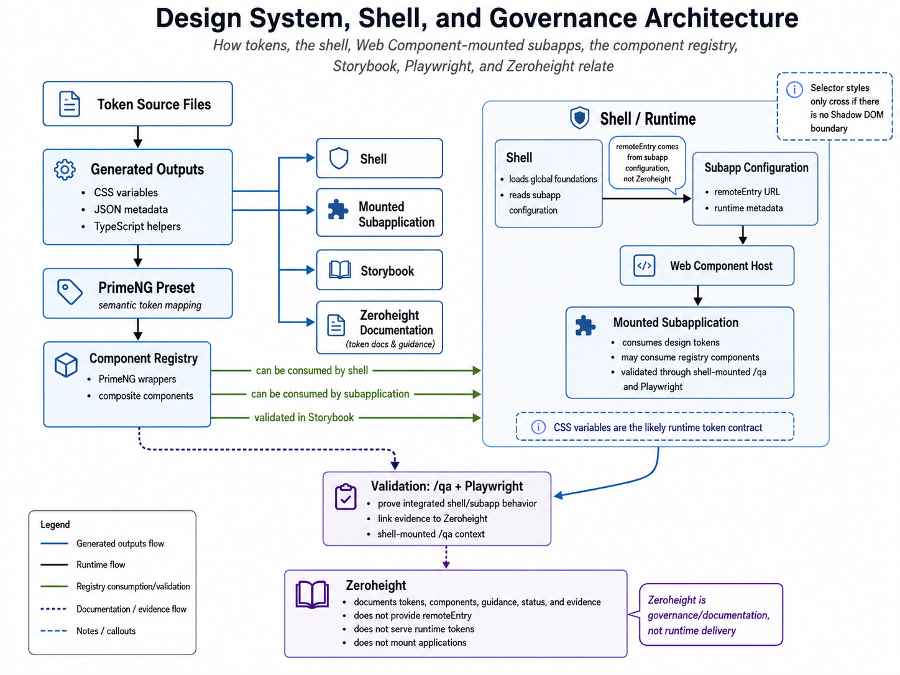

# Focus

## Primary Problem

The architecture choice is assumed: federated Web Components. The focus is now
how design tokens are consumed, validated, and documented inside that required
architecture.

The shell mounts a subapplication through a Web Component. Design tokens need to
be available to both the shell and the mounted subapplication. Some values, such
as fonts and CSS custom properties, can inherit through normal CSS inheritance.

Runtime evidence indicates the current remotes mount in light DOM rather than
Shadow DOM. `.p-dark` is applied on `html`, root CSS variables cascade into
mounted remotes, and PrimeNG overlays append to `body`. Each remote bootstraps
independently and needs the approved PrimeNG provider setup unless shared
bootstrap code handles it.

Starlight is not part of runtime delivery. It can document tokens and link to
evidence, but `remoteEntry` belongs to subapplication configuration.

## Current Focus

Given the required federated Web Component architecture, define and validate the
design-token consumption strategy.

## Immediate Deliverables

- [x] Create `architecture/token-consumption-strategy.md`.
- [x] Update `architecture/token-pipeline.md` with required implementation
  constraints.
- [x] Update `validation/repository-review-checklist.md` with
  token-consumption validation checks.
- [x] Add a Playwright spec proving token resolution in the shell and a mounted
  remote.
- [x] Create `architecture/token-consumption-recommendation.md` as the focused
  recommendation summary.

## Preboarding Scope

Before access to the actual implementation repository, use this public-sector
sample as a reference implementation to prove the token-consumption approach.

- [x] Prove the token package shape.
- [x] Generate CSS variables, JSON metadata, and derived TypeScript exports from
  one token source.
- [x] Map the same token values into a PrimeNG preset.
- [x] Model shell and remote token consumption.
- [x] Validate shell and mounted remote token resolution through Playwright.
- [x] Validate Web Component host token resolution through Playwright.
- [x] Validate PrimeNG overlay token context through Playwright.
- [x] Document the repository validation checklist.
- [x] Create a short recommendation focused only on token consumption.

## Actual Repository Validation

After access to the actual implementation repository, validate the same model
against the real framework details before treating the recommendation as final.

- [ ] Confirm where the shell loads token CSS.
- [ ] Confirm whether remotes import tokens directly or inherit them from the
  shell.
- [ ] Confirm how theme selection flows from shell to remotes.
- [x] Capture runtime evidence that the current Web Components use light DOM.
- [ ] Confirm how PrimeNG providers are registered per remote or shared
  bootstrap.
- [x] Capture runtime evidence that PrimeNG overlays append to `body`.
- [ ] Add integration proof that overlays inherit token values.
- [ ] Confirm how token package versions are kept aligned between shell and
  remotes.
- [ ] Confirm how Starlight receives generated token documentation artifacts.

## System Diagram

The diagram shows five separate flows:

- Generated output flow from token source files into CSS variables, JSON,
  TypeScript helpers, the PrimeNG preset, shell, subapps, Storybook, and
  Starlight documentation.
- Runtime flow from the shell to subapp configuration, the Web Component host,
  and the mounted subapplication.
- Registry consumption showing that registry components may be used by the
  shell and subapps and should be validated in Storybook.
- Validation flow through `/qa` and Playwright before evidence is linked into
  Starlight.
- Documentation flow showing Starlight as guidance and governance, not runtime
  delivery.

## Methods To Compare

| Method | What to evaluate |
| --- | --- |
| Shell loads global token CSS | Does the Web Component and subapp inherit the needed CSS variables? |
| Subapp imports token CSS | Does this avoid shell dependency or create version drift? |
| Shared token package | Can shell, registry, and subapps consume the same versioned artifacts? |
| Document-level variable cascade | Do `html.p-dark` and `:root` variables reach mounted light DOM remotes? |
| PrimeNG preset mapping | How do system tokens become PrimeNG semantic/component tokens? |
| Registry component consumption | Does the shell use registry components, or only subapps? |
| Overlay strategy | Do PrimeNG overlays appended to `body` inherit root token context? |

## Questions To Validate From Code

- Where does the shell get `remoteEntry` configuration?
- Does source confirm the mounted Web Component uses light DOM?
- Where are token CSS variables attached?
- Does the subapp bundle token CSS, inherit shell CSS, or both?
- Do PrimeNG overlays render under `body` in every relevant component path?
- Does the shell consume registry components?
- How are token, registry, shell, and subapp versions aligned?
