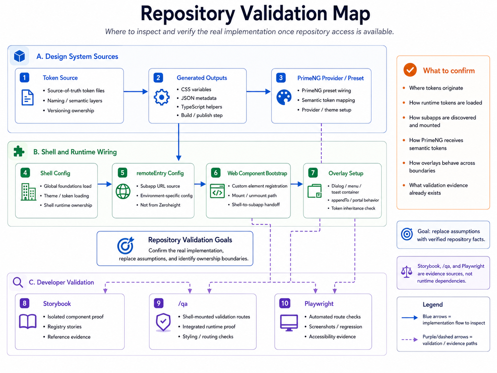

# Repository Review Checklist

Use this checklist when production repository access is available. The goal is
to replace assumptions with verified implementation details.

## Token Pipeline

- [ ] Identify authoritative token source.
- [ ] Identify generated output formats.
- [ ] Confirm PrimeNG preset mapping.
- [ ] Confirm publishing and versioning process.
- [ ] Confirm how the shell loads tokens.
- [ ] Confirm how remotes load or inherit tokens.
- [ ] Confirm runtime theme behavior.

## Component Registry

- [ ] Identify repository and package names.
- [ ] Confirm Angular and PrimeNG versions.
- [ ] Confirm wrapper strategy.
- [ ] Confirm existing component inventory.
- [ ] Confirm Storybook status.
- [ ] Confirm release pipeline.

## Shell And Subapplications

- [ ] Confirm loading mechanism.
- [ ] Confirm mounting mechanism.
- [ ] Confirm router ownership.
- [ ] Confirm Angular dependency-sharing strategy.
- [ ] Confirm failure and fallback behavior.
- [ ] Confirm whether custom elements are used.
- [ ] Confirm whether Shadow DOM is used.

## Styling

- [ ] Locate global `.p-*` selectors.
- [ ] Locate `ViewEncapsulation.None` usage.
- [ ] Confirm overlay-container behavior.
- [ ] Confirm font-loading ownership.
- [ ] Confirm runtime theme behavior.
- [ ] Confirm CSS layer strategy if present.

## Governance

- [ ] Identify component owners.
- [ ] Confirm approval process.
- [ ] Confirm version visibility.
- [ ] Confirm deprecation policy.
- [ ] Confirm where release notes live.
- [ ] Confirm how documentation is kept aligned with implementation.
