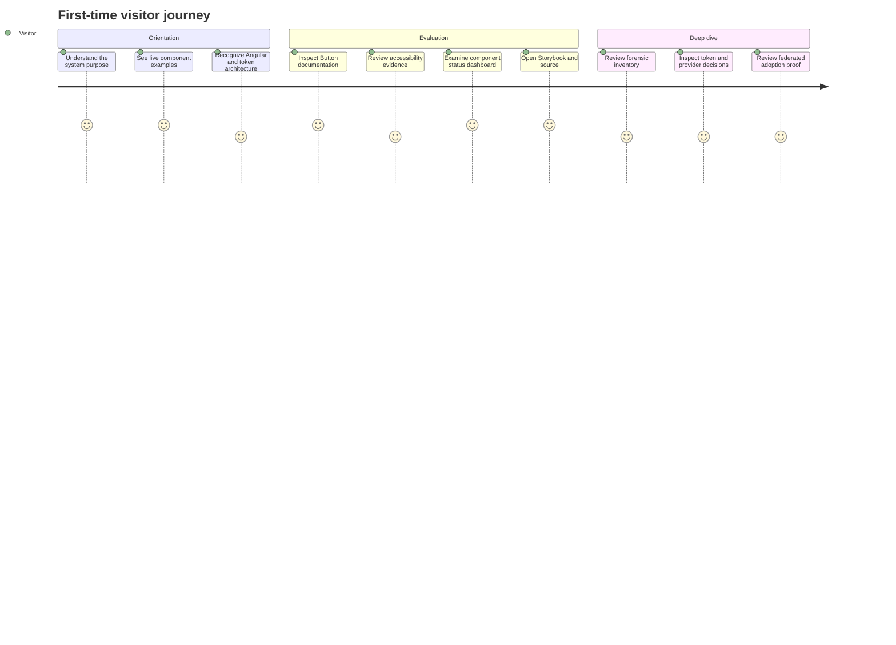

# Vision and North Star

## Product identity

The upgraded public experience should be named and presented as **Public Sector Design System**.

The repository can retain its existing package names and architectural history during migration, but the public-facing documentation should describe a design-system product rather than a federation experiment or personal portfolio package.

## Product statement

> Public Sector Design System is an Angular reference system for discovering, documenting, validating, remediating, and consolidating reusable components across complex applications. It combines semantic tokens, provider-neutral component APIs, Storybook, accessibility validation, Chromatic visual review, and manifest-driven documentation.

## Mission deliverables

1. **Component workbench** — trustworthy canonical Storybook stories, supported controls, interactions, accessibility evidence, and Chromatic visual review.
2. **Forensic audit** — an evidence-backed inventory of what ships, where it is used, which contracts overlap, and what is missing or broken.
3. **Accessibility remediation record** — severity-ranked findings, user impact, implementation decisions, and automated plus manual verification.
4. **Consolidation and Figma reference proposal** — canonical, merge, retain, deprecate, and investigate decisions grounded in shipped code.

The documentation portal, manifest, tokens, federation examples, and release gates support these deliverables. They are not separate missions.

## Portfolio statement

The work should demonstrate that an engineer can enter an existing UI ecosystem and:

- discover what components actually ship;
- identify duplicated primitives and conflicting contracts;
- inspect provider leakage and wrapper quality;
- evaluate and extend Storybook;
- document component anatomy, states, APIs, and token usage;
- identify accessibility risks without overstating automated checks;
- connect code, tests, design intent, and governance metadata;
- prepare a reliable foundation for rebuilding or correcting a Figma library;
- prove adoption across independently deployed applications.

## Primary audiences

### Design-system engineers

They need to see:

- component contracts;
- token relationships;
- provider boundaries;
- automated validation;
- status and promotion rules;
- technical tradeoffs.

### Product engineers

They need to see:

- which component to use;
- installation and imports;
- usage examples;
- supported inputs and outputs;
- theming and composition guidance;
- migration paths from direct provider usage.

### Designers

They need to see:

- purpose and usage guidance;
- anatomy;
- variants and states;
- interaction behavior;
- token references;
- design-to-code alignment status;
- known inconsistencies between design and implementation.

### Accessibility reviewers

They need to see:

- semantic expectations;
- keyboard behavior;
- focus management;
- announcement behavior;
- contrast and reduced-motion decisions;
- automated evidence;
- manual review status;
- unresolved risks.

### Hiring managers

They need to understand quickly that the repository demonstrates:

- forensic discovery;
- remediation rather than greenfield-only development;
- strong Angular and TypeScript depth;
- design-system governance;
- accessibility responsibility;
- effective documentation;
- the ability to work between design and engineering.

## Experience principles

### Teach before proving

Component pages should first teach someone how and when to use a component. Testing, evidence, and governance should support that guidance rather than dominate it.

### Show working software

Interactive Storybook examples should appear near the top of component pages. Static screenshots are supplementary.

### Expose uncertainty honestly

Missing design approval, manual accessibility review, ownership, or dedicated test coverage should be visible. The system should not invent completion.

### Keep the code as the operational source of truth

The repository owns implementation, tests, package contracts, release history, and generated metadata. Documentation projects those facts for different audiences.

### Use one vocabulary

Component names, lifecycle terms, token names, and status labels should remain consistent across Angular, Storybook, documentation, tests, and design references.

### Separate product guidance from internal process

Public documentation should explain how to use the system. Detailed remediation notes, review history, and migration blockers belong in an exploration log or decision record.

## What the homepage should communicate

The first screen should contain:

1. the product name;
2. one concise description;
3. links to explore components, open Storybook, and view source;
4. a compact set of system capabilities;
5. three featured component case studies;
6. a short architecture summary.

It should not lead with:

- exact test totals;
- local development ports;
- NestJS or database setup;
- Zeroheight workflows;
- module-federation implementation detail;
- personal skill claims;
- long disclaimers.

## Target visitor journey

## Success measures

The documentation is successful when a reviewer can answer these questions without reading repository internals:

- What problem does this design system solve?
- Which components are stable, experimental, or incomplete?
- How are tokens delivered and consumed?
- How does Storybook relate to the documentation site?
- What accessibility work is automated, manual, pending, or blocked?
- How are provider-specific details kept out of application APIs?
- What was discovered in the existing implementation?
- What was remediated?
- How does the system behave across complex applications?
- Where should a designer or engineer go next?
