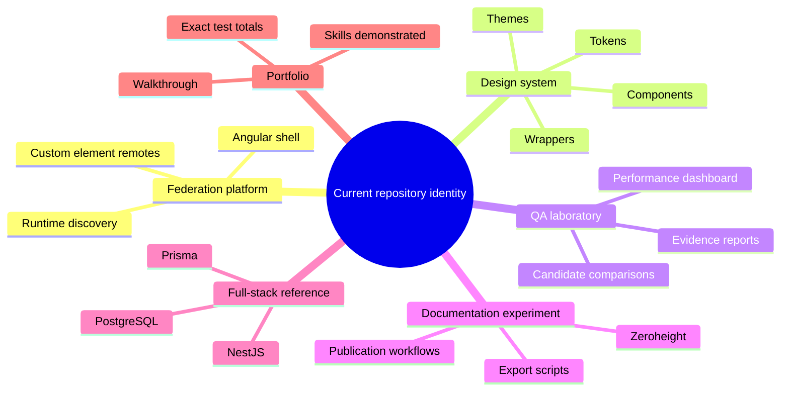

# Current-State Audit

> Scope: This document audits repository identity, presentation, and information architecture. The exported component estate, duplication clusters, evidence gaps, and dispositions are tracked separately in [18 — Component estate audit](./18-component-estate-audit.md).

## Executive assessment

The repository is technically stronger than its public presentation.

The implementation already contains many capabilities expected in a mature design-system platform:

- semantic design tokens;
- light and dark themes;
- provider-neutral Angular APIs;
- a PrimeNG adapter boundary;
- Storybook and Chromatic;
- Playwright and axe validation;
- a component manifest;
- quality gates;
- reference applications that consume the same contract.

The public experience currently asks visitors to understand too many ideas at once. It needs a smaller conceptual surface, not a smaller codebase.

## Current competing narratives

A first-time visitor should not have to decide which one is the actual product.

## Strengths to preserve

### Token architecture

The generated CSS, JSON, TypeScript, and provider mappings are excellent evidence that tokens are operational infrastructure rather than a static palette.

### Provider boundary

The design-system package prevents application code from depending directly on PrimeNG implementation details. This demonstrates API governance and migration control.

### Component manifest

The manifest is a significant differentiator. It can connect source, public APIs, provider classification, lifecycle, Storybook, tests, accessibility, design references, ownership, and blockers.

### Runtime proof

The shell and independently deployed applications prove that the design-system contract survives application boundaries, theme propagation, overlays, and complex integration.

### Validation depth

Storybook, Chromatic, Playwright, axe, type checking, link validation, production builds, and manifest drift checks demonstrate serious quality ownership.

### Honest status modeling

The repository does not pretend that automated accessibility checks equal full conformance or that every exported component has completed design approval. That honesty should remain visible.

## Presentation problems

### Federation appears before the design system

The current product name and opening description emphasize federation. This makes the design-system work appear secondary even though it is the most relevant part for the target role.

### Portfolio language weakens product realism

Terms such as `portfolio-grade`, `portfolio walkthrough`, and `skills demonstrated` make the project feel like a submission rather than a maintained system.

### QA language dominates visitor-facing labels

Names such as `qa-remote`, `QA Evidence`, `acceptance stories`, and `Candidates` are understandable internally but do not match the vocabulary most designers and application engineers expect.

### Zeroheight is overrepresented

Zeroheight export scripts, publish scripts, governance documents, metadata, and component-specific instructions create the impression that the design system depends on a paid documentation product.

### Component discovery is source-oriented

The current component catalog often leads with class names, file paths, and test evidence. Users need purpose, status, usage, and live examples first.

### Naming is inconsistent

Selectors mix `ps-*` and `public-*` conventions. Stable and candidate Button implementations coexist in the main catalog. These inconsistencies are useful forensic findings, but they should not look accidental in the final product.

### Evidence is too prominent

Exact test totals, promotion blockers, pending integrations, and validation details are valuable, but they should appear after guidance rather than before it.

### Backend content dilutes the target story

NestJS, Prisma, PostgreSQL, Docker, and backend startup commands prove full-stack capability, but they are not part of the primary design-system evaluation path.

## Content classification

| Content | Public prominence | Recommended action |
| --- | --- | --- |
| Semantic tokens | Primary | Keep and expand visually. |
| Component APIs | Primary | Keep; rewrite around user needs. |
| Storybook | Primary | Keep as live component workbench. |
| Chromatic | Primary | Keep as visual review and regression evidence. |
| Accessibility evidence | Primary | Keep; distinguish automated and manual status. |
| Component manifest | Primary | Convert into catalogs and dashboards. |
| Provider boundary | Primary | Explain as an implementation decision. |
| Federation | Secondary | Reframe as adoption proof. |
| Backend API | Tertiary | Move to reference applications. |
| Performance dashboard | Secondary | Place under system quality or experiments. |
| Zeroheight | Historical | Archive or document as a tooling experiment. |
| Candidate Button comparison | Case study | Reframe as API remediation exploration. |
| Exact test totals | Generated evidence | Remove from evergreen homepage copy. |
| Portfolio walkthrough | Private or secondary | Replace with System Overview. |
| Skills demonstrated | Remove | Let the artifact demonstrate the skills. |

## Presentation findings that require forensic follow-up

The upgraded site should not hide the following findings. They are valuable evidence of design-system discovery work:

1. Two Button contracts exist with different API philosophies.
2. Public selectors use inconsistent prefixes.
3. Some components have dedicated stories while others rely on source-level or shared integration evidence.
4. Automated accessibility coverage is more complete than manual assistive-technology review.
5. Figma bindings and final design ownership are incomplete.
6. Several components expose different levels of provider abstraction.
7. Documentation metadata is distributed across Markdown, source, manifest data, Storybook, tests, and Zeroheight-specific files.
8. The current documentation was organized around QA and promotion evidence rather than user education.

## Audit scorecard

| Area | Current strength | Current presentation | Upgrade priority |
| --- | --- | --- | --- |
| Angular architecture | Strong | Overemphasized | Medium |
| Tokens and theming | Strong | Under-visualized | High |
| Component APIs | Strong but inconsistent | Source-oriented | High |
| Storybook | Strong | QA-oriented hierarchy | High |
| Accessibility | Strong automated base | Evidence scattered | High |
| Manifest and governance | Distinctive | Too technical for discovery | High |
| Documentation IA | Extensive | Fragmented | Critical |
| Visual polish | Developing | Inconsistent | Critical |
| Design alignment | Partial | Blocker-heavy | High |
| Federation proof | Strong | Presented as identity | Medium |
| Zeroheight | Useful experiment | Overrepresented | High |

## Related mission records

- [Component estate audit](./18-component-estate-audit.md)
- [Accessibility findings and remediation](./19-accessibility-findings-and-remediation.md)
- [Component consolidation proposal](./20-component-consolidation-proposal.md)

## Audit conclusion

Do not rebuild the repository.

Build a new public documentation façade, reorganize the visitor journey, convert the manifest into understandable views, and move historical or assignment-specific content behind an exploration or archive boundary.

The desired final impression is:

> This engineer discovered and governed a real component ecosystem, documented its truth, remediated weak contracts, connected design and code, and proved the result across complex Angular applications.
