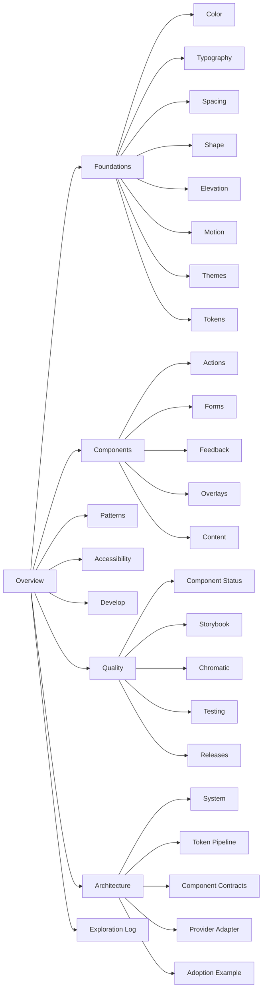
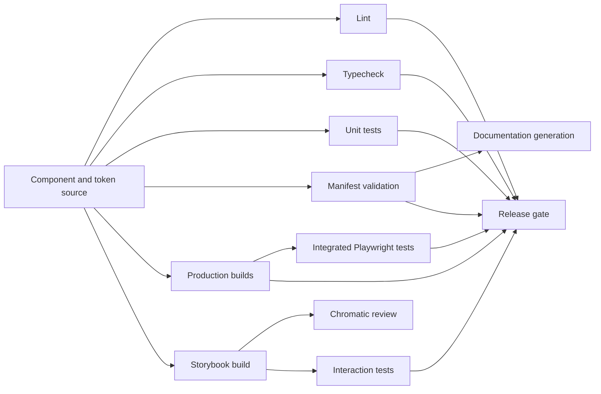
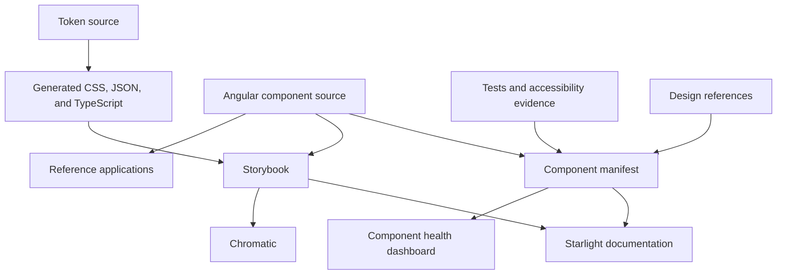

# Target Information Architecture

## Objective

The public documentation should behave like a real design-system product. It must support designers, product engineers, design-system engineers, accessibility reviewers, and hiring managers without forcing all audiences through the same technical detail.

## Primary navigation

## Overview

### Purpose

Orient visitors quickly and lead them to the most convincing live evidence.

### Recommended pages

- Introduction
- Principles
- System status
- Featured components
- Explore Storybook
- Architecture summary
- Project history and scope

### Homepage modules

1. Hero with product statement.
2. Primary links: Explore components, Open Storybook, View source.
3. Capability cards: Tokens, Accessible components, Visual testing, Manifest governance.
4. Featured case studies: Button, Select, Dialog.
5. Compact architecture diagram.
6. Component health summary.
7. Reference application proof.

## Foundations

### Color

Document semantic purpose rather than only showing raw swatches.

Recommended sections:

- roles and intent;
- light and dark resolved values;
- contrast considerations;
- provider mappings;
- usage examples;
- deprecated or experimental values.

### Typography

Document:

- families;
- scale;
- weight;
- line height;
- usage guidance;
- responsive behavior;
- implementation tokens.

### Spacing, shape, elevation, and motion

Each page should connect primitive values to semantic roles and component usage.

### Design tokens

Explain:

- token layers;
- naming;
- aliases;
- generated outputs;
- PrimeNG bridge;
- application consumption;
- documentation generation;
- validation and drift protection.

## Components

### Categories

#### Actions

- Button
- Button group

#### Forms

- Select
- Form section
- Validation message patterns

#### Feedback

- Toast
- Progress
- Skeleton
- Empty state
- Tag

#### Overlays and navigation

- Dialog
- Menu
- Popover
- Tooltip
- Pagination

#### Content and layout

- Card
- Page header
- Status card

### Component index expectations

The component index should show:

| Field | Description |
| --- | --- |
| Name | Human-readable component name. |
| Purpose | One-sentence usage summary. |
| Lifecycle | Stable, beta, experimental, deprecated, or blocked. |
| Design alignment | Aligned, partial, pending, or not applicable. |
| Storybook | Available, partial, or missing. |
| Accessibility | Automated, manual, pending, or known issue. |
| Provider | Native, PrimeNG adapter, composite, or service. |

The index should be generated from the component manifest rather than maintained separately.

## Patterns

Patterns show how components work together in real interfaces.

Recommended patterns:

- form composition;
- empty and no-results states;
- status dashboard composition;
- page header with actions;
- destructive confirmation;
- loading and asynchronous workflows;
- inline validation;
- notification hierarchy;
- responsive data navigation.

Patterns should link back to each participating component and call out accessibility considerations that emerge only in composition.

## Accessibility

Recommended pages:

- Accessibility principles
- Keyboard behavior
- Focus management
- Accessible names and descriptions
- Color and contrast
- Reduced motion
- Overlay accessibility
- Automated testing
- Manual review
- Known gaps and remediation status

The section should explicitly distinguish:

- automated rule results;
- keyboard interaction tests;
- visual contrast checks;
- manual screen-reader review;
- organizational acceptance.

## Develop

Recommended pages:

- Installation
- Angular imports and usage
- Provider-neutral contracts
- Theming
- Token consumption
- Overlay behavior
- Adding a component
- Adding a Storybook story
- Updating manifest metadata
- Testing expectations
- Migration from direct PrimeNG use
- Contribution workflow

## Quality

### Component status

A generated dashboard showing lifecycle and evidence completeness.

### Storybook

Explain the role of Storybook as the isolated component contract and interactive workbench.

### Chromatic

Explain visual baseline capture, review, regression detection, and approval history.

### Testing

Explain unit, interaction, integration, accessibility, and cross-browser responsibilities without relying on a permanently hard-coded test count.

### Release gates

Show the quality-gate flow and the relationship between source, generated metadata, builds, and tests.

## Architecture

Recommended pages:

- System overview
- Token pipeline
- Component contract model
- Provider adapter
- Manifest and documentation projection
- Theme propagation
- Overlay strategy
- Federated application adoption
- Technical decisions and tradeoffs

The architecture section should be available for deep review but should not dominate the homepage.

## Exploration Log

This section is a portfolio differentiator. It shows how the system was discovered and improved.

Recommended pages:

- Existing-system inventory
- Duplicate and competing contracts
- Naming inconsistencies
- Provider leaks
- Storybook gaps
- Accessibility gaps
- Documentation gaps
- Decisions and rejected approaches
- Remediation case studies
- Remaining unknowns

Use a consistent finding format:

| Field | Purpose |
| --- | --- |
| Observation | What exists in shipped code. |
| Risk | Why the finding matters. |
| Recommendation | Proposed remediation. |
| Decision | What was chosen and why. |
| Evidence | Source, story, test, or design reference. |
| Status | Open, in progress, resolved, deferred, or externally blocked. |

## Surface ownership

### Starlight owns

- system introduction;
- foundations;
- usage guidance;
- component overview pages;
- accessibility policy;
- architecture;
- contribution guidance;
- status dashboards;
- exploration and remediation records.

### Storybook owns

- live isolated rendering;
- controls;
- variants and states;
- interaction examples;
- developer-facing API references;
- accessibility addon results;
- component workbench behavior.

### Chromatic owns

- published Storybook;
- visual baselines;
- visual differences;
- review workflow;
- build history.

### Angular reference applications own

- composition proof;
- shell integration;
- cross-component workflows;
- overlay behavior;
- theme propagation;
- federated adoption evidence.

## Navigation rule

A visitor should never need to understand the repository layout before understanding the design system. Paths, package names, and test files are evidence links, not the primary navigation model.
