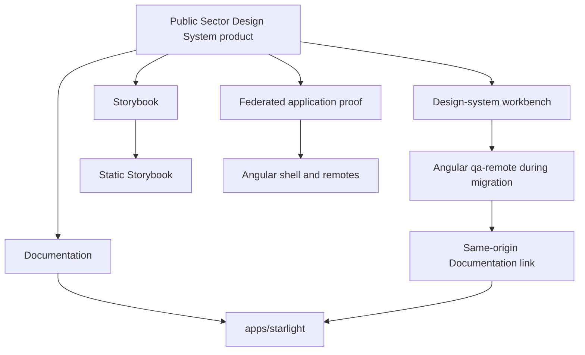
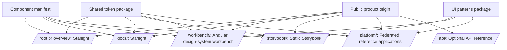
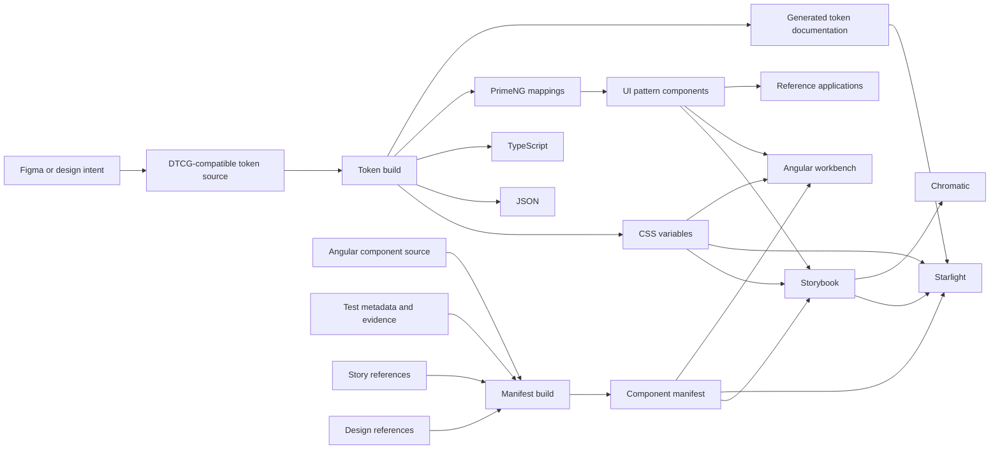
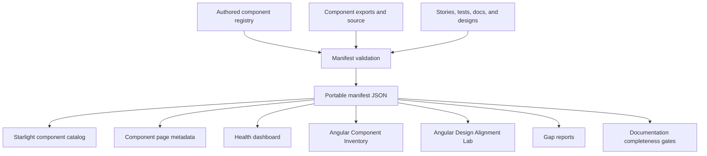
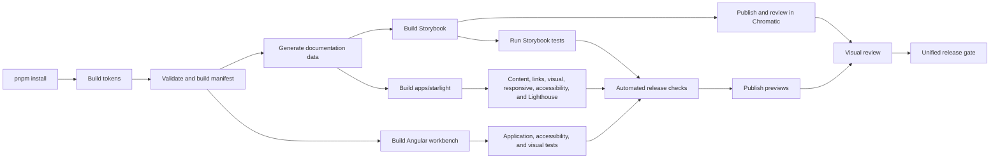

# Target Technical Architecture

## Recommendation

Add a real Astro Starlight application at `apps/starlight` inside the existing Nx workspace and treat it as the primary public documentation and discovery surface.

Build Starlight, Storybook, the Angular workbench, and the Angular federation examples as sibling application outputs that share source data, design tokens, and one public product origin.

The Angular workbench should link directly to the same-origin Starlight route. A thin Angular documentation gateway may navigate to `/docs/`, and an iframe preview may exist for an overview experience, but iframe embedding must not become the canonical documentation architecture.

See [Astro Starlight Application and Designer-Grade Quality Gate](./17-astro-starlight-application-and-designer-quality-gate.md) for the detailed application contract and release gate.

## Proposed repository layout

```text
public-sector-federation/
├── apps/
│   ├── starlight/               # Astro Starlight documentation application
│   ├── qa-remote/               # Publicly presented as the design-system workbench
│   ├── shell/                   # Federation reference shell
│   ├── services-remote/
│   ├── reporting-remote/
│   ├── admin-remote/
│   └── agile-api/               # Secondary full-stack reference
├── packages/
│   ├── tokens/
│   ├── primeng-preset/
│   ├── ui-patterns/
│   ├── component-manifest/
│   ├── documentation-data/      # Generated documentation projections
│   └── experiments/
│       └── button-contract/
├── tools/
│   ├── docs/                    # Content, polish, link, and integrity validators
│   └── archive/
│       ├── zeroheight/
│       └── reporting/
└── docs/
    ├── documentation-upgrade/
    └── archive/
```

The initial implementation does not require all physical renames. Public labels can change first while internal Nx project names remain temporarily stable.

## Product and framework boundaries



One product does not require one framework runtime.

Starlight owns documentation routing, search, Markdown and MDX rendering, static metadata, and guidance pages. Angular owns the interactive workbench and integrated application behaviors. Storybook owns isolated component behavior.

## Public deployment model



A static host, reverse proxy, or deployment platform should route each public path to the appropriate build output.

## Source-of-truth model

| Concern | Source of truth |
| --- | --- |
| Design intent | Figma or an explicit design-reference record |
| Primitive and semantic token values | Token source files |
| Generated token artifacts | Token build pipeline |
| Component public API | Angular component source and package exports |
| Component lifecycle and evidence | Component manifest |
| Live isolated behavior | Storybook |
| Visual baseline and review | Chromatic and approved page-level visual baselines |
| Integrated application behavior | Angular workbench and reference applications |
| Automated validation | Unit, Storybook interaction, Playwright, accessibility, content, link, and integrity tests |
| Human-readable guidance | Starlight documentation |
| Documentation visual quality | Starlight polish contract, visual regression, and required human review |
| Historical decision context | Exploration log and architecture decision records |

## Data flow



## Starlight responsibilities

Starlight should provide:

- the primary public product overview;
- left navigation;
- page table of contents;
- responsive layouts;
- light and dark documentation appearances;
- local search;
- Markdown and MDX content;
- reusable custom presentation components;
- architecture and Mermaid diagrams;
- generated catalogs and status dashboards;
- Storybook embeds;
- code examples;
- evidence and source links;
- structured component guidance;
- exploration and remediation case studies;
- independently deployable static output;
- content, accessibility, responsive, visual, and performance quality gates.

## Angular workbench responsibilities

The Angular workbench should provide the three mission-focused views:

1. Component Inventory;
2. Quality & Remediation;
3. Design Alignment Lab.

It should prove behaviors that static guidance and isolated stories cannot fully demonstrate:

- manifest-driven filtering and inspection;
- remediation workflows;
- Figma-to-code alignment comparison;
- body-appended overlays;
- theme propagation;
- composition of multiple components;
- page-level patterns;
- responsive application layouts;
- real routing and state;
- integrated keyboard behavior;
- application-shell constraints.

The existing `qa-remote` can retain its internal name during migration.

## Angular-to-Starlight navigation

Preferred public behavior:

```text
/workbench/ → Documentation → /docs/
```

The Angular navigation should use a normal same-origin link.

An optional `DocumentationGatewayComponent` may exist to provide route continuity or transition messaging, but it should navigate to the Starlight route rather than duplicate the Starlight application inside Angular.

An iframe preview is permitted only when it materially improves a guided overview experience. It must include a title, fallback link, same-origin hosting, responsive validation, and independent accessibility tests of the underlying Starlight pages.

## Storybook responsibilities

Storybook remains the interactive component source of truth.

It should provide:

- canonical stories for every public component;
- controls for supported public APIs;
- global light and dark modes;
- responsive viewports;
- interaction states;
- play-function tests where useful;
- accessibility addon results;
- developer-facing API details;
- experiments clearly separated from stable components.

## Chromatic responsibilities

Chromatic should provide:

- a published Storybook URL;
- visual baselines;
- visual-diff review;
- branch and pull-request review evidence;
- historical snapshots;
- links from documentation quality sections;
- visual and accessibility regression evidence where configured;
- page-level review when the Playwright integration is adopted.

Chromatic should not be described merely as hosting. Its product value is the review and visual-regression workflow.

## Manifest projection architecture

The component manifest should generate or feed:

1. component index cards;
2. lifecycle badges;
3. provider labels;
4. source and Storybook links;
5. documentation readiness;
6. accessibility status;
7. design-alignment status;
8. known blockers;
9. gap reports;
10. system health summaries;
11. Component Inventory data;
12. Design Alignment Lab summaries.



## Recommended Starlight custom components

Create a small set of reusable display components rather than custom-designing every page:

- `StoryFrame`
- `StatusBadge`
- `ComponentHeader`
- `EvidencePanel`
- `TokenTable`
- `AnatomyFigure`
- `AccessibilityStatus`
- `DecisionRecord`
- `FindingCard`
- `ComponentHealthTable`
- `ProviderBoundaryDiagram`
- `LightDarkPreview`
- `Callout`

Each custom presentation component should have visual, responsive, and accessibility coverage. New generic card-like surfaces should require a demonstrated gap.

## Story embedding strategy

Embed individual canonical Storybook stories, not the entire Storybook navigation, when the component is the focus.

Each embed should include:

- a meaningful iframe title;
- lazy loading;
- a stable public story URL;
- a fallback link to open the story directly;
- enough height to avoid nested scrolling where possible;
- an explicit light or dark context when needed.

Use static screenshots only for:

- visual-diff examples;
- historical before-and-after comparisons;
- inaccessible or non-public external tools;
- design references that cannot be embedded.

## Starlight quality-gate architecture

```mermaid
flowchart LR
  Build[Astro build and check] --> Content[Content and schema validation]
  Content --> Style[Token and style discipline]
  Style --> Responsive[Responsive Playwright checks]
  Responsive --> A11y[Automated accessibility]
  A11y --> Visual[Visual regression]
  Visual --> LHCI[Lighthouse budgets]
  LHCI --> Integrity[Manifest, Storybook, source, and Figma integrity]
  Integrity --> Preview[Pull-request preview]
  Preview --> Human[Human designer-grade polish review]
  Human --> Release[Release gate]
```



The automated gate should detect structural and regression failures. Human polish review should decide whether an intentional composition is clear, restrained, consistent, and credible.

Visual baselines must not be accepted automatically.

## Build pipeline



## Migration constraints

- Do not break current package imports during the documentation-first phase.
- Do not rename every selector as a prerequisite to publishing the new site.
- Do not move working tests only to achieve a cleaner folder tree.
- Do not make Figma or Zeroheight runtime dependencies.
- Do not duplicate manifest data manually inside Markdown.
- Do not claim manual accessibility approval when only automated evidence exists.
- Do not make iframe embedding the canonical Starlight experience.
- Do not accept visual baselines without review.
- Do not allow one-off Starlight styling to bypass shared tokens without a documented exception.

## Recommended first technical slice

1. Generate `apps/starlight` as an Nx application.
2. Configure `/docs/`, navigation, branding, search, light mode, and dark mode.
3. Consume the shared semantic-token output.
4. Create StoryFrame and ComponentHeader.
5. Add content schemas and manifest-reference validation.
6. Add three hand-authored flagship pages: Button, Select, and Dialog.
7. Render a generated component index from the manifest.
8. Add responsive, accessibility, visual, content, link, and Lighthouse checks.
9. Publish a pull-request preview.
10. Add Documentation navigation to the Angular workbench.
11. Require a human polish review before accepting visual changes.
12. Link the published Starlight application from the repository README.

This slice creates a credible, independently built public documentation application and establishes the safeguards needed to prevent the documentation from becoming visually crowded or structurally inconsistent.
