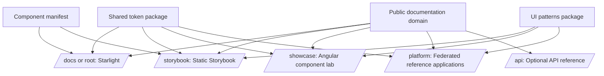
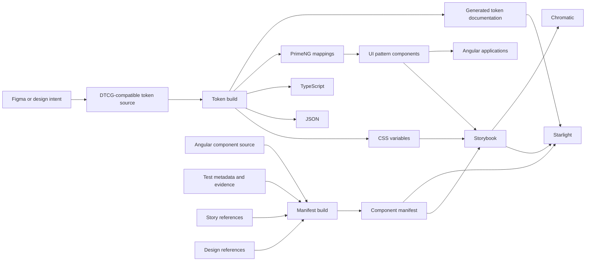
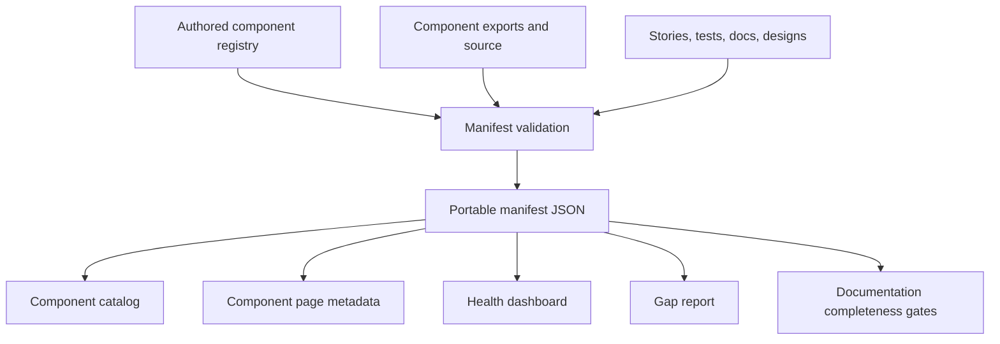
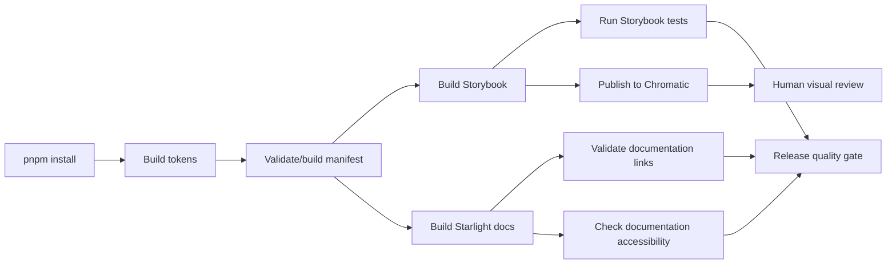

# Target Technical Architecture

## Recommendation

Add an Astro Starlight documentation application to the existing Nx workspace and treat it as the primary public entry point.

Do not attempt to render Astro inside Angular. Build the documentation, Storybook, and Angular applications as sibling outputs that share source data and one public domain.

## Proposed repository layout

```text
public-sector-federation/
├── apps/
│   ├── docs/                    # Astro Starlight documentation
│   ├── component-lab/           # Angular integrated component exploration
│   ├── shell/                   # Federation reference shell
│   ├── services-remote/
│   ├── reporting-remote/
│   ├── admin-remote/
│   └── agile-api/               # Secondary full-stack reference
├── packages/
│   ├── tokens/
│   ├── primeng-preset/
│   ├── ui-patterns/
│   ├── documentation-data/      # Generated docs projections if needed
│   └── experiments/
│       └── button-contract/
├── tools/
│   └── archive/
│       ├── zeroheight/
│       └── reporting/
└── docs/
    ├── documentation-upgrade/
    └── archive/
```

The initial implementation does not require all physical renames. Public labels can change first while internal Nx project names remain temporarily stable.

## Public deployment model



A static host, reverse proxy, or deployment platform can route each path to the appropriate build output.

## Source-of-truth model

| Concern | Source of truth |
| --- | --- |
| Design intent | Figma or an explicit design-reference record |
| Primitive and semantic token values | Token source files |
| Generated token artifacts | Token build pipeline |
| Component public API | Angular component source and package exports |
| Component lifecycle and evidence | Component manifest |
| Live isolated behavior | Storybook |
| Visual baseline and review | Chromatic |
| Integrated application behavior | Angular component lab and reference applications |
| Automated validation | Unit, Storybook interaction, Playwright, and accessibility tests |
| Human-readable guidance | Starlight documentation |
| Historical decision context | Exploration log and architecture decision records |

## Data flow



## Starlight responsibilities

Starlight should provide:

- left navigation;
- page table of contents;
- responsive layouts;
- light and dark documentation themes;
- local search;
- Markdown and MDX content;
- reusable custom components;
- architecture and Mermaid diagrams;
- generated catalogs and status dashboards;
- Storybook embeds;
- code examples;
- evidence and source links.

## Storybook responsibilities

Storybook remains the interactive component source of truth.

It should provide:

- canonical stories for every public component;
- controls for supported public APIs;
- global light and dark modes;
- responsive viewports;
- interaction states;
- play-function tests where useful;
- accessibility addon results;
- developer-facing API details;
- experiments clearly separated from stable components.

## Chromatic responsibilities

Chromatic should provide:

- a published Storybook URL;
- visual baselines;
- visual-diff review;
- branch and pull-request review evidence;
- historical snapshots;
- links from documentation quality sections.

Chromatic should not be described merely as hosting. Its portfolio value is the review and visual-regression workflow.

## Component lab responsibilities

The Angular component lab should prove behaviors that isolated stories cannot fully demonstrate:

- body-appended overlays;
- theme propagation;
- composition of multiple components;
- page-level patterns;
- responsive layouts;
- real routing and state;
- integrated keyboard behavior;
- application-shell constraints.

The current `qa-remote` can be publicly relabeled as **Component Lab** before any internal project rename.

## Manifest projection architecture

The component manifest should generate or feed:

1. component index cards;
2. lifecycle badges;
3. provider labels;
4. source and Storybook links;
5. documentation readiness;
6. accessibility status;
7. design-alignment status;
8. known blockers;
9. gap reports;
10. system health summaries.



## Recommended Starlight custom components

Create a small set of reusable display components rather than custom-designing every page:

- `StoryFrame`
- `StatusBadge`
- `ComponentHeader`
- `EvidencePanel`
- `TokenTable`
- `AnatomyFigure`
- `AccessibilityStatus`
- `DecisionRecord`
- `FindingCard`
- `ComponentHealthTable`
- `ProviderBoundaryDiagram`
- `LightDarkPreview`

## Story embedding strategy

Embed individual canonical Storybook stories, not the entire Storybook navigation, when the component is the focus.

Each embed should include:

- a meaningful iframe title;
- lazy loading;
- a stable public story URL;
- a fallback link to open the story directly;
- enough height to avoid nested scrolling where possible;
- an explicit light or dark context when needed.

Use static screenshots only for:

- visual-diff examples;
- historical before-and-after comparisons;
- inaccessible or non-public external tools;
- design references that cannot be embedded.

## Build pipeline



## Migration constraints

- Do not break current package imports during the documentation-first phase.
- Do not rename every selector as a prerequisite to publishing the new site.
- Do not move working tests only to achieve a cleaner folder tree.
- Do not make Figma or Zeroheight runtime dependencies.
- Do not duplicate manifest data manually inside Markdown.
- Do not claim manual accessibility approval when only automated evidence exists.

## Recommended first technical slice

1. Generate `apps/docs` with Starlight.
2. Configure navigation and branding.
3. Build a reusable Storybook embed component.
4. Add three hand-authored flagship pages: Button, Select, Dialog.
5. Add a script that reads the generated component manifest.
6. Render a generated component index.
7. Add the docs build and link validation to CI.
8. Publish the docs app and link it from the README.

This slice creates a credible public façade before undertaking risky refactoring.
