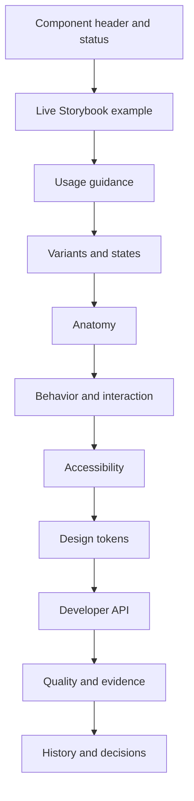
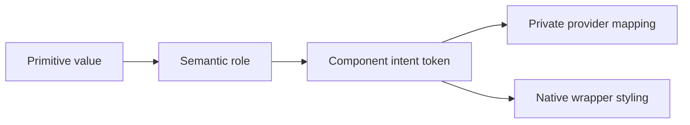

# Component Page Blueprint

## Purpose

Every public component page should follow one predictable structure so that designers, engineers, accessibility reviewers, and hiring managers can scan the same information in the same order.

The page should teach usage first, show live behavior second, and present quality evidence without turning the entire page into a QA report.

## Recommended page order



## 1. Component header

The header should contain:

- component name;
- one-sentence purpose;
- lifecycle badge;
- framework label;
- provider classification;
- accessibility status;
- direct links.

### Example

```md
# Button

Buttons initiate actions and communicate the relative importance of those actions.

`Stable` · `Angular` · `PrimeNG adapter` · `Automated accessibility`

[Open Storybook] · [View source] · [View tests] · [View manifest entry]
```

### Status vocabulary

Prefer a small public lifecycle vocabulary:

| Status | Meaning |
| --- | --- |
| Stable | Recommended for normal application use. |
| Beta | Available for limited use while known gaps are resolved. |
| Experimental | Intended for exploration, comparison, or proof-of-concept use. |
| Deprecated | Supported temporarily with a documented replacement. |
| Blocked | Cannot progress because a named requirement is unresolved. |

Internal registry states can remain more detailed, but the public page should translate them into understandable language.

## 2. Live example

Embed the canonical Storybook story near the top.

The first example should show the normal, recommended state—not a stress test, matrix, registry dashboard, or comparison view.

### Requirements

- meaningful iframe title;
- stable story identifier;
- lazy loading;
- direct fallback link;
- sufficient height;
- no hidden controls that imply unsupported APIs;
- theme context aligned with the page.

## 3. Usage guidance

### When to use

Describe the user problem the component solves.

### When not to use

Identify nearby components or native elements that may be better choices.

### Content guidance

Include label, title, message, or content-writing guidance where relevant.

### Selection guidance

For components with variants or intents, provide a decision table.

#### Button example

| Need | Recommended treatment |
| --- | --- |
| Primary page action | Primary solid Button |
| Supporting action | Secondary or outlined Button |
| Destructive action | Destructive Button with clear confirmation context |
| Low-emphasis action | Text Button |
| Navigation | Link unless Button behavior is truly required |

## 4. Variants and states

Show variants in small, focused examples.

Avoid placing one huge matrix at the top of the page.

Recommended coverage:

- default;
- variants or intents;
- sizes where supported;
- icons;
- loading;
- disabled;
- hover;
- focus-visible;
- pressed or selected;
- error or destructive states;
- light and dark themes;
- responsive behavior.

Each example should answer one question.

## 5. Anatomy

Document the visible and semantic parts of the component.

### Example anatomy list

1. Container
2. Label
3. Optional leading icon
4. Optional trailing icon
5. Focus indicator
6. Loading indicator

### Anatomy expectations

- use the same part names as Figma and code where possible;
- distinguish required and optional parts;
- explain which parts are content, decoration, or behavior;
- avoid exposing private provider implementation classes as public anatomy.

## 6. Behavior and interaction

Document:

- pointer behavior;
- keyboard behavior;
- focus entry and exit;
- loading behavior;
- disabled behavior;
- open and close behavior;
- navigation behavior;
- asynchronous behavior;
- error behavior;
- responsive behavior.

### Behavior table example

| Interaction | Expected behavior |
| --- | --- |
| Enter | Activates a focused Button. |
| Space | Activates a focused Button without scrolling the page. |
| Loading | Suppresses repeated activation and displays progress state. |
| Disabled | Removes activation while preserving understandable visual treatment. |
| Focus-visible | Displays the approved focus indicator. |

## 7. Accessibility

The accessibility section should include the contract, not only test results.

### Required fields

- semantic element or role;
- accessible name requirements;
- keyboard interaction;
- focus behavior;
- announcement behavior;
- icon treatment;
- contrast expectations;
- reduced-motion behavior;
- automated test status;
- manual review status;
- known issues.

### Evidence labels

Use explicit labels:

| Label | Meaning |
| --- | --- |
| Automated checks passing | No violations were found by the configured automated rules in tested states. |
| Keyboard tests passing | Defined keyboard interactions are covered by repeatable tests. |
| Manual review complete | A named manual assistive-technology review was recorded. |
| Manual review pending | Automated evidence exists, but manual review is incomplete. |
| Known issue | A reproducible accessibility concern remains open. |

Never convert an automated axe result into a broad conformance claim.

## 8. Design tokens

Show only the tokens that meaningfully explain the component.

### Recommended columns

| Token | Role | Light | Dark | Provider mapping |
| --- | --- | --- | --- | --- |
| `--ps-button-primary-background` | Primary background | Resolved value | Resolved value | PrimeNG Button background |
| `--ps-button-primary-foreground` | Primary label/icon | Resolved value | Resolved value | PrimeNG Button color |
| `--ps-button-focus-ring` | Focus indicator | Resolved value | Resolved value | Wrapper-owned focus style |

### Token layers



The page should make clear which layer application developers are expected to consume.

## 9. Developer API

Provide concise Angular examples.

### Installation or import

```ts
import { PublicButtonComponent } from '@public-sector/ui-patterns';
```

### Usage

```html
<ps-button
  label="Save changes"
  intent="primary"
  [loading]="isSaving"
  (activated)="save()"
/>
```

### API table

| Input or output | Type | Default | Description |
| --- | --- | --- | --- |
| `label` | `string` | required | Visible and accessible action label. |
| `intent` | `ButtonIntent` | `primary` | Semantic importance of the action. |
| `appearance` | `ButtonAppearance` | `solid` | Visual treatment. |
| `loading` | `boolean` | `false` | Shows progress and suppresses repeat activation. |
| `disabled` | `boolean` | `false` | Prevents activation. |
| `activated` | `EventEmitter<void>` | — | Emits a provider-neutral activation event. |

The table should be generated from source or manifest metadata where practical.

## 10. Quality and evidence

Keep this section compact and scannable.

### Example

| Evidence | Status | Link |
| --- | --- | --- |
| Canonical Storybook story | Available | Open story |
| Visual regression | Passing baseline | Open Chromatic build |
| Interaction tests | Available | View tests |
| Automated accessibility | Passing tested states | View report |
| Manual screen-reader review | Pending | Review requirement |
| Design alignment | Partial | View comparison |

## 11. History and decisions

Move implementation history, competing APIs, migration tradeoffs, and promotion blockers here.

Recommended structure:

### Observation

What exists in the shipped implementation?

### Risk

Why does it matter?

### Decision

What contract or design choice was made?

### Tradeoff

What was intentionally not solved?

### Status

Resolved, in progress, deferred, experimental, or externally blocked.

## Flagship component priorities

### Button

Demonstrates:

- API design;
- semantic intent;
- candidate versus stable contract analysis;
- loading and disabled behavior;
- focus treatment;
- provider abstraction.

### Select

Demonstrates:

- overlay behavior;
- form semantics;
- keyboard navigation;
- accessible naming;
- provider boundary;
- theme propagation to body-appended content.

### Dialog

Demonstrates:

- focus management;
- escape and close behavior;
- accessible names and descriptions;
- modal semantics;
- overlay tokens;
- integrated application behavior.

## Page acceptance checklist

- [ ] The purpose is understandable without implementation knowledge.
- [ ] A live canonical example appears before deep technical detail.
- [ ] Usage and non-usage guidance are present.
- [ ] Variants and states are separated into focused examples.
- [ ] Anatomy uses shared design and engineering vocabulary.
- [ ] Keyboard and focus behavior are explicit.
- [ ] Automated and manual accessibility evidence are distinguished.
- [ ] Tokens are connected to component decisions.
- [ ] The public API is concise and provider-neutral.
- [ ] Quality evidence is available but not dominant.
- [ ] Historical comparison and blockers appear at the end.
- [ ] Source, Storybook, tests, and design references are linked.
