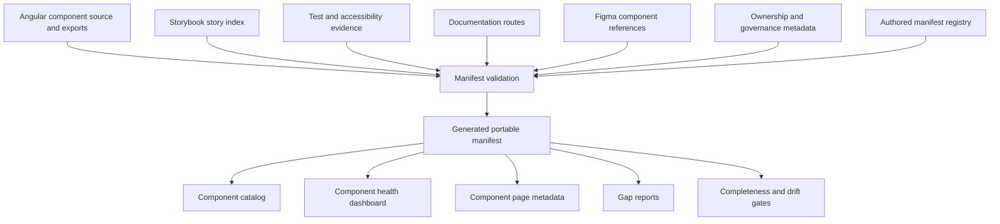
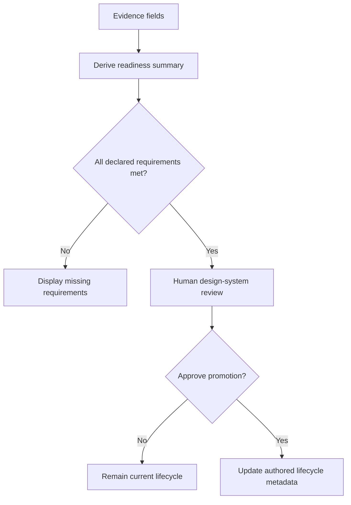

# Component Manifest Contract

## Purpose

The component manifest is the machine-readable inventory and governance contract for the public design-system surface.

It answers four questions:

1. What components and services are publicly available?
2. What contract does each public entry expose?
3. What evidence exists for design, documentation, accessibility, testing, and release readiness?
4. What gaps or blockers prevent an entry from advancing?

The manifest is not a replacement for Angular source, Storybook, tests, Figma, or human-readable documentation. It records the relationships among those sources so that drift and missing evidence become visible.

## Scope boundary

The manifest owns:

- public component identity;
- lifecycle state;
- package and selector references;
- provider-boundary classification;
- public API inventory status;
- evidence references;
- documentation readiness;
- accessibility review status;
- design-alignment status;
- ownership and promotion requirements;
- known blockers.

The manifest does not own:

- runtime component implementation;
- token values;
- visual design geometry;
- Storybook rendering;
- test execution results as raw logs;
- Figma component construction;
- release binaries;
- application composition.

## System position



## Source-of-truth rules

| Concern | Authoritative source | Manifest responsibility |
| --- | --- | --- |
| Public Angular API | Component source and package exports | Record or validate the inventory. |
| Selector | Angular component metadata | Detect selector drift. |
| Lifecycle | Authored manifest metadata | Publish and validate status. |
| Provider boundary | Component implementation and architecture rules | Classify and flag leaks. |
| Storybook evidence | Storybook index and story files | Store canonical story references and coverage status. |
| Automated tests | Test files and generated reports | Store evidence references and summarized status. |
| Accessibility contract | Documentation and test metadata | Record contract completeness and review status. |
| Design intent | Figma or recorded design reference | Store reference and alignment status only. |
| Documentation | Documentation routes and files | Validate page existence and readiness fields. |
| Ownership | Governance metadata | Record accountable roles or an honest unassigned state. |

## Recommended schema domains

### Identity

Each entry should include:

- `id`: stable machine identifier;
- `name`: public human-readable name;
- `kind`: component, directive, service, pattern, or utility;
- `category`: actions, forms, feedback, overlays, navigation, content, or other governed category;
- `description`: concise purpose statement;
- `package`: public import package;
- `exportName`: exported class, function, type, or service;
- `selector`: public Angular selector where applicable;
- `sourcePath`: canonical source file;
- `public`: whether the entry belongs to the supported public surface.

### Lifecycle

Recommended fields:

- `lifecycle`: active, candidate, partial, blocked, deprecated, or ready;
- `publicStatus`: stable, beta, experimental, blocked, or deprecated;
- `introducedVersion`;
- `deprecatedVersion`;
- `replacementId`;
- `allowedUse`;
- `promotionRequirements`;
- `blockers`.

The internal lifecycle may remain more detailed than the public status. The documentation site should translate internal states into language users understand.

### Provider boundary

Recommended fields:

- `providerKind`: native, adapter, composite, or service;
- `providerName`: PrimeNG or another private provider when applicable;
- `providerImportsPrivate`: boolean or validation status;
- `providerTypesLeaked`: list of provider-specific public types, or empty;
- `providerEventsLeaked`: list of provider-specific event payloads, or empty;
- `styleEscapeHatches`: public style overrides or provider classes exposed to consumers;
- `boundaryStatus`: clean, partial, or leaking;
- `migrationNotes`.

### Public API inventory

Recommended fields:

- `inputs`;
- `outputs`;
- `methods`;
- `models`;
- `publicTypes`;
- `defaults`;
- `deprecatedAliases`;
- `apiExtractionStatus`: complete, partial, missing, or not applicable;
- `apiSource`: compiler extraction, authored metadata, or hybrid.

The long-term target should be compiler-supported extraction with authored descriptions and governance metadata layered on top.

### Storybook evidence

Recommended fields:

- `canonicalStoryId`;
- `docsStoryId`;
- `storyPaths`;
- `lightThemeCoverage`;
- `darkThemeCoverage`;
- `responsiveCoverage`;
- `interactionCoverage`;
- `stateCoverage`;
- `storybookStatus`: complete, partial, missing, or not applicable.

The canonical story should be the live example embedded in the documentation page.

### Test evidence

Recommended fields:

- `unitTestPaths`;
- `interactionTestPaths`;
- `integrationTestPaths`;
- `e2eTestPaths`;
- `crossBrowserStatus`;
- `visualRegressionStatus`;
- `lastVerifiedBuild`;
- `testStatus`: complete, partial, missing, or not applicable.

The manifest should reference generated reports or builds rather than copying large raw results.

### Accessibility evidence

Recommended fields:

- `semanticContractDocumented`;
- `keyboardContractDocumented`;
- `focusContractDocumented`;
- `automatedA11yStatus`;
- `keyboardTestStatus`;
- `contrastReviewStatus`;
- `manualScreenReaderStatus`;
- `manualReviewRecord`;
- `knownIssues`;
- `accessibilityStatus`: complete, partial, issue, pending, or not applicable.

Automated checks must never automatically produce a broad conformance claim.

### Design-alignment reference

The manifest stores only linkage and status fields for Figma and design intent. Detailed Figma responsibilities are defined in [Figma Component Intent and Manifest Integration](./07-figma-component-intent-and-manifest-integration.md).

Recommended fields:

- `figmaFileKey`;
- `figmaNodeId`;
- `figmaComponentKey`;
- `figmaComponentSetKey`;
- `designReferenceUrl`;
- `anatomyAlignmentStatus`;
- `variantAlignmentStatus`;
- `stateAlignmentStatus`;
- `tokenAlignmentStatus`;
- `designApprovalStatus`;
- `designDifferences`.

### Documentation readiness

Recommended fields:

- `documentationPath`;
- `overviewStatus`;
- `usageGuidanceStatus`;
- `anatomyStatus`;
- `behaviorStatus`;
- `apiDocumentationStatus`;
- `tokenDocumentationStatus`;
- `accessibilityDocumentationStatus`;
- `decisionRecordPaths`;
- `documentationStatus`: complete, partial, missing, or not applicable.

### Ownership

Recommended fields:

- `engineeringOwner`;
- `designOwner`;
- `accessibilityOwner`;
- `stewardGroup`;
- `ownershipStatus`: assigned, role-only, unassigned, or external;
- `reviewCadence`.

A public sample may use role labels rather than fabricated people.

## Example conceptual entry

```ts
interface ComponentManifestEntry {
  id: string;
  name: string;
  kind: 'component' | 'service' | 'pattern';
  category: string;
  description: string;
  package: string;
  exportName: string;
  selector?: string;
  sourcePath: string;

  lifecycle: {
    internal: 'active' | 'candidate' | 'partial' | 'blocked' | 'deprecated' | 'ready';
    public: 'stable' | 'beta' | 'experimental' | 'blocked' | 'deprecated';
    promotionRequirements: string[];
    blockers: string[];
  };

  provider: {
    kind: 'native' | 'adapter' | 'composite' | 'service';
    name?: string;
    boundaryStatus: 'clean' | 'partial' | 'leaking';
    leakedTypes: string[];
    escapeHatches: string[];
  };

  api: {
    extractionStatus: 'complete' | 'partial' | 'missing' | 'not-applicable';
    inputs: ApiMember[];
    outputs: ApiMember[];
    deprecatedAliases: ApiMember[];
  };

  storybook: EvidenceSummary;
  tests: EvidenceSummary;
  accessibility: AccessibilitySummary;
  design: DesignAlignmentSummary;
  documentation: DocumentationSummary;
  ownership: OwnershipSummary;
}
```

This is a conceptual contract, not a requirement to replace the current manifest schema immediately.

## Generated public views

### Component catalog

The catalog should project:

| Field | Display |
| --- | --- |
| Name | Linked public name |
| Purpose | Concise description |
| Status | Stable, beta, experimental, blocked, or deprecated |
| Provider | Native, adapter, composite, or service |
| Storybook | Complete, partial, or missing |
| Accessibility | Automated, manual, pending, or issue |
| Design | Aligned, partial, pending, or not applicable |

### Component health dashboard

Recommended summaries:

- entries by lifecycle;
- entries by provider classification;
- entries missing canonical stories;
- entries missing complete API extraction;
- entries pending manual accessibility review;
- entries missing documentation pages;
- entries missing design references;
- entries with provider leaks;
- entries blocked from promotion.

### Component detail metadata

Each documentation page can consume manifest data for:

- status badges;
- provider label;
- canonical story link;
- source link;
- evidence table;
- known blockers;
- last verification reference;
- design-alignment summary.

### Gap reports

Generate focused reports instead of one overwhelming warning list:

1. Storybook gaps
2. Accessibility gaps
3. Public API extraction gaps
4. Design-alignment gaps
5. Documentation gaps
6. Provider-boundary gaps
7. Ownership gaps
8. Promotion blockers

## Validation rules

### Identity rules

- Every public package export has one manifest entry.
- Every public selector is unique.
- Every source path exists.
- Every export name resolves.
- IDs remain stable across file moves and renames.

### Storybook rules

- Stable interactive components have a canonical story.
- Canonical story IDs exist in the built Storybook index.
- Experimental stories are visibly labeled.
- Stable and experimental contracts do not share ambiguous names.

### Documentation rules

- Stable components have a public documentation route.
- Documentation routes resolve during the docs build.
- Usage guidance exists for stable components.
- Interactive components document keyboard and focus behavior.

### Accessibility rules

- Automated status and manual review status are separate fields.
- Known issues prevent a misleading `complete` status.
- Interactive stable components identify their keyboard contract.
- Manual review cannot be inferred from automated checks.

### Provider rules

- Application-facing APIs do not expose provider-specific types unless explicitly allowlisted.
- Direct provider imports remain confined to approved packages.
- Public style escape hatches are recorded.
- Candidate remediation work does not silently change the stable contract.

### Design-reference rules

- Figma or design-reference identifiers are optional but never fabricated.
- Design-alignment status may be pending without blocking source publication.
- A missing Figma link is reported as a gap, not converted into a false approval.

## Status derivation

Some status can be derived, but lifecycle promotion should remain a human decision.



Automation should report readiness. It should not automatically promote components.

## Migration from the current registry

### Phase 1: Preserve and clarify

- Keep the current typed registry.
- Document field meanings.
- Add public-status translation.
- Normalize evidence statuses.
- Add explicit design-reference fields.

### Phase 2: Validate external references

- Validate source and exports.
- Validate Storybook IDs.
- Validate documentation routes.
- Validate test and evidence paths.
- Validate selector uniqueness.

### Phase 3: Generate public projections

- Component catalog
- Health dashboard
- Gap reports
- Page-header metadata

### Phase 4: Improve API extraction

- Introduce compiler-supported extraction.
- Compare extracted members against authored metadata.
- Retain authored descriptions and governance decisions.

## Manifest acceptance criteria

- [ ] The manifest has a written scope boundary.
- [ ] Every public entry has a stable ID and purpose statement.
- [ ] Public lifecycle labels are understandable.
- [ ] Provider leakage can be queried.
- [ ] Storybook and documentation routes are validated.
- [ ] Automated and manual accessibility evidence are separate.
- [ ] Figma references are optional and honest.
- [ ] Missing evidence is visible without blocking unrelated work.
- [ ] Catalog and dashboard views are generated from the manifest.
- [ ] Automation reports readiness but does not promote components.
- [ ] The manifest remains a projection contract, not the runtime implementation.
