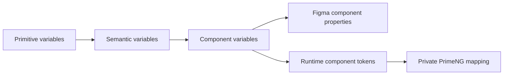
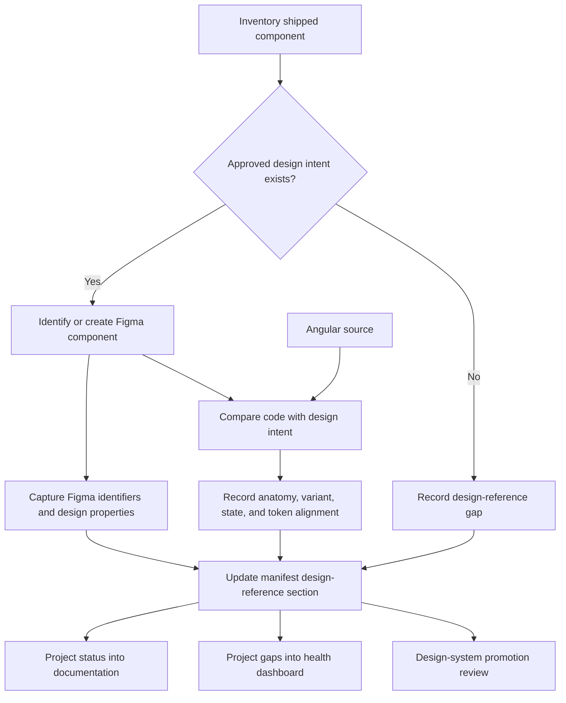
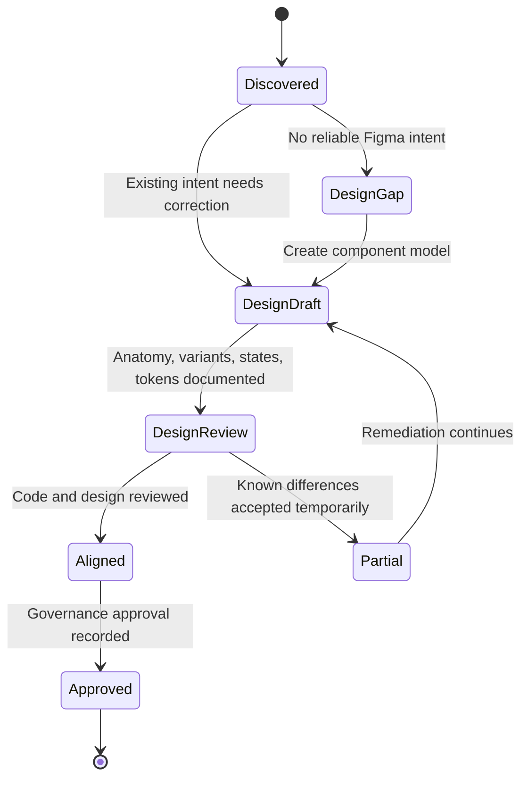

# Figma Component Intent and Manifest Integration

## Purpose

This document defines what a Figma component represents in the design-system workflow, what information should be created when a component is modeled in Figma, and how that design intent is referenced by the component manifest.

Figma and the manifest solve different problems:

- **Figma expresses approved design intent.**
- **The manifest records the relationship between design intent, shipped code, evidence, and lifecycle.**

The manifest must not attempt to recreate a Figma component. Figma must not become the runtime source of Angular behavior.

## Figma component intent

A governed Figma component should communicate the intended visual and interaction model of a reusable component.

It should answer:

1. What problem does the component solve?
2. What are its required and optional parts?
3. Which variants are intentionally supported?
4. Which interaction states must be designed?
5. Which design variables or tokens control its appearance?
6. How should content behave under realistic constraints?
7. What accessibility-related visual requirements exist?
8. Which aspects are design decisions versus implementation details?

## What a Figma component should contain

### Component identity

- canonical component name;
- brief purpose statement;
- owning design-system library;
- lifecycle label such as stable, beta, or experimental;
- link to usage documentation;
- link to live Storybook implementation when available.

### Anatomy

The component should expose named layers or component properties that match the shared design and engineering vocabulary.

For a Button, anatomy might include:

1. container;
2. label;
3. leading icon;
4. trailing icon;
5. loading indicator;
6. focus indicator.

Avoid naming public anatomy after private PrimeNG classes or DOM structure. Figma anatomy describes the design contract, not the provider implementation.

### Variants

Variants should represent meaningful product-facing decisions.

For example:

- intent: primary, secondary, destructive;
- appearance: solid, outlined, text;
- size: small, medium, large if genuinely supported;
- icon position: none, leading, trailing, icon-only if approved;
- theme context: light and dark where variant modeling is useful.

Do not create variants for every arbitrary style combination. A component set should encode the supported contract, not all visual possibilities.

### States

At minimum, interactive components should consider:

- default;
- hover;
- focus-visible;
- pressed or active;
- disabled;
- loading;
- selected or expanded where applicable;
- error or invalid where applicable.

States may be represented through variants, interactive components, state pages, or documentation examples. The chosen method should remain understandable and maintainable.

### Variables and tokens

Figma variables should point toward the same semantic and component intent used by code.

Recommended conceptual flow:



Examples:

- primitive: blue scale value;
- semantic: action background;
- component: Button primary background;
- runtime: `--ps-button-primary-background`;
- provider mapping: private PrimeNG Button background token.

The exact Figma variable name and runtime CSS variable name do not have to be identical, but the mapping must be explicit and reviewable.

### Content constraints

Figma examples should include realistic content:

- short and long labels;
- localization expansion;
- icon and no-icon configurations;
- narrow containers;
- multiline behavior where permitted;
- loading and disabled states;
- high-contrast or dark-theme examples.

### Accessibility-related visual intent

Figma should document visual aspects of accessibility such as:

- focus indicator placement and minimum visibility;
- contrast intent;
- minimum target size;
- text truncation or wrapping rules;
- disabled-state distinguishability;
- error-state communication that does not rely only on color;
- reduced-motion alternatives where motion is designed.

Figma does not prove semantic markup, keyboard behavior, accessible names, or screen-reader announcements. Those remain code and test responsibilities.

## Source-of-truth boundary

| Concern | Figma | Manifest | Angular/code | Storybook/tests |
| --- | --- | --- | --- | --- |
| Purpose and usage intent | Primary design reference | Links and status | Implements contract | Demonstrates usage |
| Anatomy | Primary design reference | Alignment status | Implements semantic structure | Renders and tests |
| Variants | Defines approved design variants | Records alignment | Exposes supported API | Demonstrates matrix |
| Interaction states | Defines visual intent | Records state alignment | Implements behavior | Tests and demonstrates |
| Token intent | Defines variable relationships | Records token alignment | Consumes generated tokens | Displays resolved behavior |
| Keyboard behavior | Notes visual focus expectations | Records documentation status | Implements | Tests |
| Semantics and ARIA | Not authoritative | Records evidence status | Authoritative implementation | Tests |
| Lifecycle | Displays public status | Authoritative governance record | May enforce deprecation | Displays status |
| Release readiness | Not authoritative | Records requirements and blockers | Build and package evidence | Test and visual evidence |

## Where Figma sits in the manifest workflow



The manifest should identify Figma artifacts and alignment status. It should not ingest uncontrolled screenshots as proof of approval.

## Manifest fields for Figma integration

### Identity fields

- `figmaFileKey`: file containing the component;
- `figmaNodeId`: specific node used as the documentation reference;
- `figmaComponentKey`: published component key where available;
- `figmaComponentSetKey`: component-set key for variants;
- `designReferenceUrl`: human-usable deep link;
- `figmaLibraryName`: governed library name;
- `figmaPageName`: page or section name;
- `figmaComponentName`: canonical Figma component name.

### Intent fields

- `designPurposeStatus`: documented, partial, or missing;
- `anatomyReferenceStatus`;
- `variantModelStatus`;
- `stateModelStatus`;
- `contentGuidanceStatus`;
- `responsiveGuidanceStatus`;
- `accessibilityVisualIntentStatus`.

### Alignment fields

- `anatomyAlignmentStatus`: aligned, partial, diverged, pending, or not applicable;
- `variantAlignmentStatus`;
- `stateAlignmentStatus`;
- `tokenAlignmentStatus`;
- `namingAlignmentStatus`;
- `designApprovalStatus`: approved, review, draft, missing, or external;
- `designDifferences`: structured list of known differences;
- `lastDesignReview`;
- `designReviewRecord`.

### Component property mapping

Where useful, record a mapping between Figma properties and public Angular inputs.

| Figma property | Angular API | Mapping status | Notes |
| --- | --- | --- | --- |
| `Intent` | `intent` | Aligned | Uses product-facing semantic values. |
| `Appearance` | `appearance` | Aligned | One exclusive appearance property. |
| `Leading icon` | `icon` plus position | Partial | Provider-neutral icon vocabulary required. |
| `Loading` | `loading` | Aligned | Figma visual state; code owns announcement and suppression. |
| `Disabled` | `disabled` | Aligned | Code owns native semantics and event suppression. |

This mapping should remain concise. The manifest does not need to store every internal Figma layer.

## Figma component creation workflow

### Step 1: Start from discovery, not assumption

Before creating a new Figma component:

- inspect shipped Angular components;
- inspect current Storybook stories;
- identify all current usages;
- identify duplicated primitives;
- identify provider behavior currently relied upon;
- identify known accessibility and API problems;
- determine whether an existing Figma component already represents the same intent.

### Step 2: Define the component contract

Agree on:

- purpose;
- anatomy;
- supported variants;
- supported states;
- content rules;
- token roles;
- accessibility-related visual requirements;
- public lifecycle.

### Step 3: Create the Figma component set

Create:

- canonical component;
- intentionally limited property model;
- light and dark examples;
- required states;
- anatomy documentation;
- variable bindings;
- realistic content examples;
- links to Storybook and documentation.

### Step 4: Compare with shipped code

Do not assume the code matches because names are similar.

Compare:

- anatomy;
- variant values;
- state behavior;
- icon model;
- loading behavior;
- disabled behavior;
- focus treatment;
- token resolution;
- responsive behavior;
- naming.

### Step 5: Update manifest metadata

Record:

- Figma identifiers;
- alignment statuses;
- differences;
- review status;
- remaining blockers;
- links to decision records.

### Step 6: Project the relationship into docs

The component page should show:

- design-reference link;
- alignment summary;
- supported variants and states;
- known differences;
- live Storybook example;
- token mapping;
- evidence status.

### Step 7: Review promotion separately

A Figma component's existence does not automatically promote the Angular component. Promotion requires the declared design, implementation, accessibility, documentation, and evidence requirements.



## Code-first versus design-first situations

### Existing shipped component with unreliable Figma

Use a code-informed reconstruction workflow:

1. inventory shipped behavior;
2. identify accidental versus intentional behavior;
3. document accessibility requirements;
4. create corrected design intent;
5. compare against code;
6. remediate either design, code, or both;
7. record differences in the manifest.

### New component with approved design intent

Use a design-led implementation workflow:

1. define purpose and contract;
2. create Figma component and variables;
3. register planned manifest entry as experimental or candidate;
4. implement Angular API;
5. create Storybook stories and tests;
6. compare output with design;
7. update evidence and promotion status.

### Component without a Figma equivalent

Do not fabricate a link or mark it aligned.

Record:

- design reference missing;
- current implementation source;
- current usage and evidence;
- whether design reconstruction is required;
- whether the component is intentionally code-only.

## Figma page organization

Recommended library structure:

```text
Foundations
├── Color variables
├── Typography
├── Spacing
├── Shape
├── Elevation
└── Motion

Components
├── Actions
│   ├── Button
│   └── Button group
├── Forms
│   └── Select
├── Feedback
│   ├── Tag
│   ├── Toast
│   └── Progress
├── Overlays
│   ├── Dialog
│   ├── Popover
│   └── Tooltip
└── Content
    ├── Card
    └── Page header

Patterns
├── Forms
├── Empty states
├── Status summaries
└── Confirmation flows

Documentation
├── Anatomy
├── Usage examples
├── Accessibility visual intent
└── Code and Storybook links

Archive
└── Deprecated and superseded components
```

## Naming alignment

Use the same public component name across:

- Figma component set;
- documentation title;
- Storybook title;
- manifest `name`;
- Angular conceptual API.

Implementation class names and selectors may include platform prefixes, but the product-facing name should remain simple.

Example:

| Surface | Name |
| --- | --- |
| Figma | Button |
| Documentation | Button |
| Storybook | Components/Actions/Button |
| Manifest | Button |
| Angular selector | `ps-button` |
| Angular class | `PublicButtonComponent` during migration |

## Relationship to Code Connect

Figma Code Connect can strengthen the relationship between Figma and code when available, but it is not required for the initial public release.

When used, it should:

- connect an approved Figma component to the supported Angular component;
- show public Angular usage rather than private PrimeNG markup;
- map meaningful Figma properties to public inputs;
- avoid exposing unsupported combinations;
- remain consistent with manifest component IDs and design references.

The manifest should record Code Connect availability as evidence, not make it a runtime dependency.

## Figma acceptance checklist

- [ ] The component has one clear purpose.
- [ ] Anatomy uses shared design and engineering vocabulary.
- [ ] Variants represent supported product decisions, not arbitrary styling.
- [ ] Required interaction states are represented.
- [ ] Variables connect to semantic and component token intent.
- [ ] Light and dark behavior is represented where relevant.
- [ ] Realistic and stress-test content examples exist.
- [ ] Focus and contrast intent are documented.
- [ ] The Figma component links to documentation and Storybook.
- [ ] The manifest stores valid Figma identifiers or an honest missing state.
- [ ] Code-versus-design differences are recorded.
- [ ] Figma existence does not automatically imply implementation approval.
- [ ] Provider-specific implementation details are not presented as public design anatomy.
