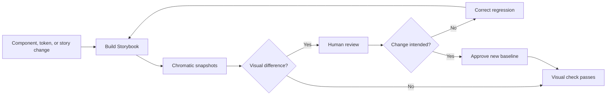
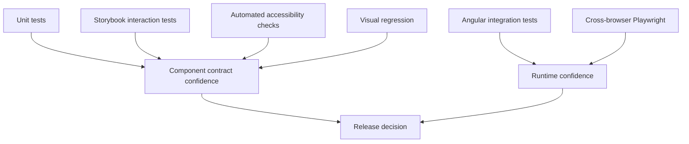

# Storybook and Chromatic Upgrade

## Objective

Reposition Storybook as the interactive component workbench and Chromatic as the visual review and regression surface.

Storybook should not read like a QA dump or a duplicate documentation website. It should make the public component contract easy to explore, compare, and test.

## Target Storybook hierarchy

```text
Foundations
├── Color
├── Typography
├── Spacing
├── Themes
└── Tokens

Components
├── Actions
│   └── Button
├── Forms
│   └── Select
├── Feedback
│   ├── Tag
│   ├── Toast
│   ├── Progress
│   └── Skeleton
├── Overlays
│   ├── Dialog
│   ├── Menu
│   ├── Popover
│   └── Tooltip
└── Content
    ├── Card
    ├── Page Header
    └── Status Card

Patterns
├── Forms
├── Empty States
├── Status Dashboards
└── Confirmation Flows

Experiments
└── Button Contract Exploration

System Health
├── Component Registry
├── Accessibility Coverage
├── Provider Boundaries
└── Documentation Readiness
```

## Story types

### Canonical story

Every public component should have one canonical story that represents recommended normal use.

This story is the default embed for the Starlight component page.

### Variant stories

Use focused stories for meaningful variants such as intent, appearance, size, and icon placement.

### State stories

Show hover, focus-visible, pressed, disabled, loading, selected, invalid, and expanded states where relevant.

### Interaction stories

Use `play` functions for repeatable interaction behavior when Storybook is an appropriate test surface.

### Stress stories

Cover long content, localization expansion, constrained containers, responsive layouts, and high-density composition.

### Comparison stories

Keep current-versus-proposed or provider-versus-wrapper comparisons under **Experiments**, not in the stable component hierarchy.

### System-health stories

Registry and evidence dashboards belong under **System Health**. They should not be mistaken for component usage guidance.

## Story naming rules

- Use product-facing names.
- Avoid `acceptance`, `QA`, internal ticket names, and person-specific terms in public story titles.
- Use `Experiments` for candidate work.
- Use one canonical component name across Storybook, documentation, manifest, and Figma.
- Keep old story aliases only when necessary for link migration, then remove them intentionally.

## Global configuration

### Themes

Provide global light and dark modes that use the same token and provider setup as the Angular applications.

### Viewports

Include representative mobile, tablet, desktop, and narrow-container viewports.

### Backgrounds

Background controls should support component evaluation without allowing arbitrary styling to obscure the supported theme contract.

### Accessibility addon

Run automated checks for representative states, but label results as automated evidence rather than complete conformance.

### Controls

Expose only supported public APIs. Do not expose private PrimeNG configuration or internal style escape hatches as normal design-system controls.

## Story coverage expectations

| Component type | Minimum Storybook coverage |
| --- | --- |
| Stable interactive component | Canonical, variants, disabled/loading, keyboard interaction, light/dark |
| Stable visual component | Canonical, meaningful variants, light/dark, responsive constraints |
| Beta component | Canonical, known gaps, supported states, visible beta label |
| Experimental component | Comparison or hypothesis stories, explicit experimental label, no production recommendation |
| Service | Usage demonstration and observable result |
| Pattern | Realistic composition and responsive behavior |

## Chromatic role

Chromatic should be described and used for:

- published Storybook builds;
- visual baseline capture;
- branch-to-baseline comparison;
- pull-request review;
- intentional change approval;
- regression detection;
- historical visual evidence.

It should not be described only as a hosting provider.

## Visual review workflow



## Documentation integration

Each Starlight component page should link to:

- canonical story;
- full component Storybook group;
- relevant Chromatic build or visual review summary;
- source and test evidence.

Do not embed an entire Storybook navigation pane on every documentation page. Embed the canonical story or a focused docs view.

## Testing layers



### Unit tests

Best for:

- input and output behavior;
- state transitions;
- provider mapping functions;
- disabled and loading suppression;
- token helpers.

### Storybook interaction tests

Best for:

- isolated keyboard and pointer behavior;
- control-driven states;
- accessible labels in representative stories;
- expected visual state transitions.

### Chromatic

Best for:

- visual changes;
- theme differences;
- responsive snapshots;
- state rendering;
- accidental regressions.

### Integrated Playwright tests

Best for:

- shell and remote composition;
- body-appended overlays;
- routing;
- application state;
- theme propagation;
- cross-component workflows.

## Current implementation status

Completed for the flagship scope:

- canonical product-facing Button, Select, and Dialog stories;
- supported controls for the flagship public APIs;
- light and dark production token infrastructure;
- manifest-validated canonical story identifiers;
- dedicated Select and Dialog keyboard and overlay evidence;
- accessibility-addon enforcement for representative stories;
- Starlight `StoryFrame` integration.

This document is not complete merely because the flagship stories are in place. The broader Storybook and Chromatic upgrade remains open as part of the later migration workstream, including:

- target hierarchy across the remaining catalog;
- portable `play` functions for Button, Select, and Dialog;
- remaining acceptance-story renames;
- explicit documentation backlinks and Chromatic review links;
- audit-comparison stories for genuine duplication clusters.

These items should be tracked alongside the migration and cleanup work in [10 — Migration and cleanup plan](./10-migration-and-cleanup-plan.md), not treated as finished simply because the flagship scope is in place.

### Audit comparison stories

Use side-by-side stories to expose genuinely duplicated or competing implementations. Record API, behavior, accessibility, and token differences. Keep these under Experiments or System Health so they are not mistaken for recommended usage.

## Storybook remediation tasks

- [ ] Create the target hierarchy.
- [ ] Identify one canonical story per public component.
- [ ] Move candidate and comparison stories under Experiments.
- [ ] Rename acceptance stories to component or pattern names.
- [ ] Remove obsolete compatibility aliases after links migrate.
- [ ] Add explicit light and dark coverage.
- [ ] Add responsive viewports.
- [ ] Add play-function tests for Button, Select, and Dialog.
- [ ] Ensure controls expose only public APIs.
- [ ] Add descriptions that match Starlight component pages.
- [ ] Link Storybook entries back to documentation.
- [ ] Validate canonical story IDs against the manifest.
- [ ] Add Chromatic links to quality sections.
- [ ] Document intentional visual changes in pull requests.

## Acceptance criteria

- [ ] Stable components are easy to find by product-facing name.
- [ ] Every stable public component has a canonical story or an explicit tracked gap.
- [ ] Experimental work is visually and structurally separated.
- [ ] Light and dark themes use production token infrastructure.
- [ ] Controls do not reveal unsupported provider APIs.
- [ ] Keyboard interactions are tested where appropriate.
- [ ] Chromatic is used for visual review, not merely publication.
- [ ] Starlight embeds stable story IDs validated by CI.
- [ ] System-health dashboards remain available without dominating component discovery.
