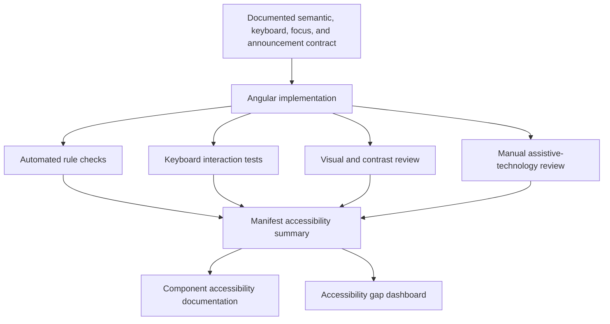
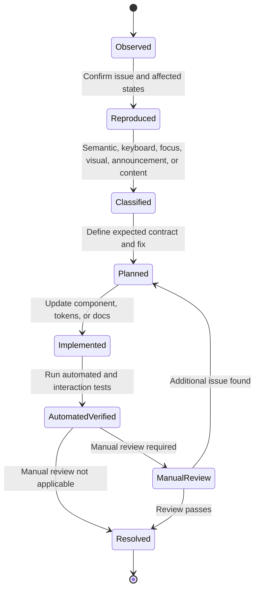

# Accessibility and Remediation Plan

## Objective

Make accessibility a documented component contract with traceable evidence, not a single addon result or a generic claim.

The upgraded site should show:

- what accessibility behavior is expected;
- which behavior is implemented;
- what is covered by automated tests;
- what has been manually reviewed;
- what remains unknown or unresolved;
- how issues move from discovery to remediation.

The operational register is [19 — Accessibility findings and remediation](./19-accessibility-findings-and-remediation.md). This plan defines the model; the register owns finding identifiers, severity, status, and verification.

## Accessibility evidence model

## Evidence categories

### Semantic contract

Document:

- native element or ARIA role;
- accessible name source;
- accessible description source;
- state and property semantics;
- grouping or landmark behavior;
- relationships such as labels, descriptions, ownership, and controls.

### Keyboard contract

Document:

- focus entry;
- expected keys;
- activation behavior;
- navigation behavior;
- escape behavior;
- focus return;
- disabled behavior;
- roving focus or active-descendant behavior where applicable.

### Focus contract

Document:

- focus-visible treatment;
- initial focus;
- trapped focus where required;
- focus restoration;
- focus order;
- programmatic focus conditions;
- behavior after validation errors or asynchronous updates.

### Announcement contract

Document:

- loading state announcement;
- error announcement;
- status updates;
- dialog names and descriptions;
- toast and live-region behavior;
- expanded, selected, pressed, or checked state communication.

### Visual accessibility

Document:

- contrast intent;
- focus indicator visibility;
- minimum target size;
- non-color indicators;
- zoom and reflow behavior;
- text truncation and wrapping;
- reduced-motion behavior;
- high-contrast considerations where tested.

## Status vocabulary

| Status | Meaning |
| --- | --- |
| Documented | The expected contract is written. |
| Automated passing | Configured automated checks pass in declared states. |
| Keyboard tested | Declared keyboard behavior has repeatable coverage. |
| Visual reviewed | Contrast, focus, and state visibility have recorded review. |
| Manual reviewed | A named manual assistive-technology review is recorded. |
| Partial | Some evidence exists, but declared requirements remain. |
| Known issue | A reproducible accessibility defect is open. |
| Pending | Review or evidence has not yet been completed. |
| Not applicable | The evidence category does not apply. |

Avoid one ambiguous `accessible` badge.

## Component accessibility record

Each interactive component should provide:

| Field | Example |
| --- | --- |
| Semantic basis | Native `button` element |
| Accessible name | Visible label or explicit icon-only label |
| Keyboard contract | Enter and Space activate |
| Focus contract | Visible focus ring; no focus removal |
| Loading behavior | Suppresses activation and communicates progress |
| Disabled behavior | Native disabled semantics where possible |
| Automated status | Passing tested stories |
| Keyboard status | Covered in Storybook/Playwright |
| Manual review | Pending |
| Known issues | None recorded / linked issues |

## Remediation workflow

## Finding record format

### Observation

Describe the exact behavior and state.

### Expected behavior

State the accessibility contract, preferably referencing native platform behavior or the component's documented model.

### User impact

Explain who is affected and how.

### Reproduction

Provide steps, story ID, route, browser, and assistive technology where relevant.

### Remediation

Describe the component, token, content, or documentation change.

### Evidence

Link tests, Storybook states, screenshots, manual review notes, or issue records.

### Status

Open, planned, implemented, verified, resolved, deferred, or external.

## Flagship component review plans

### Button

Review:

- native button semantics;
- Enter and Space activation;
- disabled semantics;
- loading announcement and repeat-click suppression;
- icon-only naming;
- focus indicator;
- destructive intent clarity;
- target size;
- contrast across themes.

### Select

Review:

- accessible label and description;
- trigger role and state;
- keyboard opening and navigation;
- active option communication;
- selection announcement;
- escape and focus return;
- disabled and invalid states;
- overlay placement and theme context;
- mobile and zoom behavior.

### Dialog

Review:

- dialog role;
- accessible name and optional description;
- initial focus;
- focus containment;
- escape behavior;
- close control naming;
- focus restoration;
- background interaction prevention;
- destructive confirmation flow;
- nested or repeated dialog constraints.

## Automated coverage

Automated checks should cover representative states rather than only the default render.

Recommended states:

- default;
- disabled;
- loading;
- invalid;
- open overlay;
- dark theme;
- narrow viewport;
- long content;
- icon-only controls.

## Manual review plan

For this design-system reference, prioritize manual review of the flagship components rather than claiming full-library completion. The accessibility plan remains open for the later migration phase, even where some flagship evidence exists.

Recommended initial matrix:

| Component | Keyboard-only | Screen reader | Zoom/reflow | High contrast | Status |
| --- | --- | --- | --- | --- | --- |
| Button | Required | Required | Required | Recommended | Planned |
| Select | Required | Required | Required | Recommended | Planned |
| Dialog | Required | Required | Required | Recommended | Planned |

Record:

- reviewer role;
- date;
- browser;
- operating system;
- assistive technology and version;
- tested story or route;
- findings;
- result;
- follow-up links.

## Documentation accessibility

The Starlight site itself must be reviewed for:

- keyboard navigation;
- visible focus;
- heading order;
- landmark structure;
- accessible link text;
- table responsiveness;
- code-block scrolling;
- iframe titles;
- color contrast;
- light and dark theme behavior;
- reduced motion;
- mobile reflow;
- skip navigation;
- Mermaid fallback or understandable surrounding text.

## Manifest integration

The component manifest should store summarized statuses and evidence references for:

- contract documentation;
- automated checks;
- keyboard tests;
- contrast review;
- manual screen-reader review;
- known issues;
- last review record.

The manifest should prevent these invalid states:

- manual review marked complete without a review record;
- accessibility marked complete while known issues remain unresolved;
- automated checks represented as manual review;
- stable interactive component missing a keyboard contract without an explicit exception.

## Accessibility backlog priorities

These items remain part of the later migration and cleanup workstream rather than being treated as already complete just because the flagship documentation model exists.

### P0

- Define accessibility status vocabulary.
- Document Button, Select, and Dialog contracts.
- Separate automated and manual evidence in the manifest.
- Add keyboard tests for flagship components.
- Add iframe titles and docs-site accessibility checks.

### P1 — Required flagship completion

- Record manual reviews for Button, Select, and Dialog.
- Generate an accessibility gap dashboard.
- Add contrast and focus review records.
- Document overlay and live-region patterns.
- Add accessibility requirements to component promotion.

### P2

- Expand manual review beyond the flagship components to remaining interactive components.
- Add high-contrast and reduced-motion evidence.
- Add regression scenarios for known historical issues.
- Generate release summaries from manifest evidence.

## Acceptance criteria

- [ ] Every flagship component has a written accessibility contract.
- [ ] Automated and manual evidence are clearly separated.
- [ ] Keyboard behavior is repeatably tested.
- [ ] Known issues are visible and linked.
- [ ] Manual review records include environment details.
- [ ] Component promotion includes accessibility requirements.
- [ ] The documentation site passes its own accessibility review.
- [ ] No public language equates axe results with full accessibility conformance.
