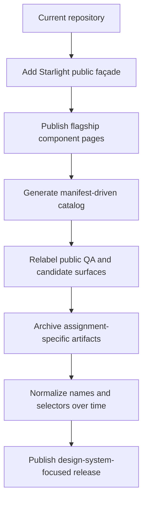
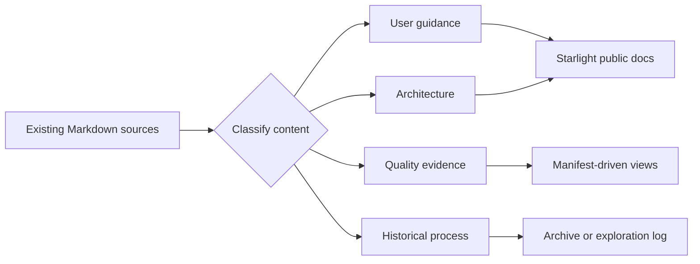

# Migration and Cleanup Plan

_Last aligned: July 20, 2026._ The Button candidate rename (Phase 1 and Phase 4, below) has
landed: the public rename map's `UP Button Candidate → Button Contract Exploration` and part of
`Candidates → Experiments` are complete in the manifest, Storybook title, and
`docs/design-system/components/button-candidate-*.md` files (the old `up-button-candidate-*.md`
files were removed, not duplicated). The `Acceptance Stories → Interaction Stories` rename is
now complete: `button-tag.acceptance.stories.ts`, `card.acceptance.stories.ts`,
`dialog-toast.acceptance.stories.ts`, `edge-case-states.stories.ts`, and
`table-paginator.acceptance.stories.ts` all use `Design System/Interaction Stories/*`, and the
matching manifest `storybookTitle` entries and hardcoded story IDs in
`apps/qa-remote/e2e/storybook-stories.spec.ts` and `scripts/storybook-e2e.mjs` were updated to
match. Everything else below remains open.

## Objective

Create a clean public design-system experience without discarding working architecture, tests, applications, or historical evidence.

The migration should be additive first, then progressively remove or archive obsolete public framing.

## Guiding principle

> Preserve the engineering. Reduce the conceptual noise.

## Migration strategy



## Keep prominently

Retain and foreground:

- semantic token source and generated outputs;
- light and dark theme behavior;
- provider-neutral Angular component contracts;
- PrimeNG adapter boundary;
- Storybook component stories;
- Chromatic visual review;
- Playwright interaction and integration tests;
- automated accessibility checks;
- component manifest;
- release validation;
- reference applications demonstrating adoption.

## Reframe

### Federation

Current framing:

> Primary identity of the repository.

Target framing:

> A reference implementation proving that the design-system contract works across independently deployed Angular applications.

### Backend API

Current framing:

> Part of the main repository feature list and setup path.

Target framing:

> A secondary full-stack reference application available to reviewers who want broader architecture evidence.

### QA remote

Current framing:

> Stable visual-contract and QA evidence surface.

Target public framing:

> Component Lab: an integrated Angular environment for component composition, overlays, themes, patterns, and application-level validation.

### Candidate Button

Current framing:

> UP Button Candidate with promotion blockers and Starlight guidance.

Target framing:

> Button Contract Exploration: a case study comparing a broad provider-influenced API with a smaller product-facing design-system API.

## Public rename map

| Current public term | Target public term |
| --- | --- |
| Public Sector Federation | Public Sector Design System |
| QA Remote | Component Lab |
| QA Evidence | Quality Evidence |
| Candidates | Experiments |
| Acceptance Stories | Component Stories or Interaction Stories |
| Overview Walkthrough | System Overview |
| Skills Demonstrated | Remove |
| UP Button Candidate | Button Contract Exploration |
| Stable vs Candidate | Current Contract vs Proposed Contract |
| externally blocked | awaiting external decision, when user-facing |

Internal project names may remain temporarily while public labels change.

## Archive candidates

Move or copy historical content into clearly marked archive locations before deletion.

### Tooling archive

```text
tools/archive/reporting/
```

Candidates:

- screenshot ZIP workflows;
- progress screenshot automation;
- report publication scripts;
- environment variables used only for retired publication workflows.

### Documentation archive

```text
docs/archive/candidate-button/
docs/archive/internal-process/
```

Candidates:

- tab-layout instructions;
- subscription or Enterprise-access limitations;
- UP-specific governance notes;
- internal stakeholder narratives;
- local machine validation paths;
- obsolete compatibility redirects;
- dated progress reports.

### Experiment archive

Stable, useful experimental code can remain active under:

```text
packages/experiments/button-contract/
```

Use this only if the experiment still provides clear comparison value. Otherwise retain the case study and remove the duplicate public component.

## Do not remove prematurely

Do not remove:

- tests referenced by current release gates;
- generated manifest fields before migrations are complete;
- legacy selectors without a compatibility plan;
- stable component APIs solely to simplify documentation;
- story aliases still used by published links;
- backend or federation applications merely because they are secondary to the new homepage.

## Selector normalization

The current mix of `ps-*` and `public-*` selectors should become a documented remediation track.

### Target policy

Prefer one selector prefix for supported public components, such as:

```text
ps-button
ps-card
ps-empty-state
ps-form-section
ps-page-header
ps-status-card
```

### Migration approach

1. Document the target convention.
2. Record inconsistent selectors in the manifest.
3. Add compatibility aliases only when Angular and package constraints permit.
4. Migrate reference applications.
5. Mark old selectors deprecated.
6. Remove aliases in a planned major release.

Do not block the documentation upgrade on selector renaming.

## Button consolidation decision

Two public Button implementations create ambiguity.

### Remediate the stable implementation in place

- keep `ps-button` as the selector;
- introduce the smaller public contract;
- retain compatibility aliases temporarily;
- remove the separate candidate implementation.

## README migration

### New opening

```md
# Public Sector Design System

An Angular design-system reference demonstrating accessible components,
semantic tokens, provider-neutral UI contracts, Storybook documentation,
and automated visual and interaction validation.
```

### New primary links

- Documentation
- Component Storybook
- Component status
- Accessibility
- Architecture
- Source

### Move lower in the README

- local full-platform startup;
- backend services;
- Docker;
- development ports;
- exact validation commands;
- federation details;
- license detail.

### Remove from opening narrative

- `portfolio-grade`;
- `skills demonstrated`;
- exact dated test totals;
- broad disclaimers.

## Storybook migration

- move stable components into product-facing categories;
- move candidate comparisons under Experiments;
- rename acceptance stories;
- designate canonical stories;
- update manifest story IDs;
- migrate documentation embeds;
- retain temporary aliases;
- remove aliases after link validation confirms no usage.

## Documentation migration



## Search-and-review terms

Before the public release, search all public content for:

- SitePen
- UP
- Neil
- Dan
- QA
- Candidate
- acceptance
- portfolio-grade
- skills demonstrated
- local drive paths
- unpublished internal URLs
- Enterprise access limitations

Each occurrence should be intentionally kept, rewritten, moved to Experiments, or archived.

## Cleanup phases

The later documentation and release workstreams in 8 and 9 should be carried forward here as open implementation work. This plan is the place where the remaining migration actions are made explicit.

### Phase 1: Public labels

Low-risk changes:

- [ ] align the product name, landing-page copy, and navigation labels with the design-system narrative;
- [x] rename Storybook categories and component status vocabulary so they no longer imply product or QA-only framing —
      the Button candidate category moved from `Design System/Candidates/*` to
      `Design System/Experiments/*`, and all five acceptance-stories files moved to
      `Design System/Interaction Stories/*`;
- [ ] audit all public-facing labels in the README, manifests, docs, and navigation for consistency —
      done for the Button candidate surface specifically (manifest `name`, Storybook title, and
      `docs/design-system/components/button-candidate-*.md`); not yet audited elsewhere.

### Phase 2: Documentation relocation

- [ ] move user guidance into Starlight so it is discoverable from the public docs site;
- [ ] move system-health and evidence data into generated views that are maintained from the manifest or release pipeline;
- [ ] move historical process notes, dated progress reports, and internal workflow detail into the exploration log or archive.

### Phase 3: Tooling retirement

This phase should be understood as the operational follow-through for the Storybook/Chromatic and accessibility workstreams from 8 and 9, not as a separate afterthought.

- [x] inventory and remove third-party documentation-platform report and publication logic from the release path;
- [ ] add neutral docs-generation commands for Starlight, Storybook, and manifest-driven views;
- [ ] archive or decommission publication scripts and environment variables that only support retired workflows;
- [ ] finish the Storybook hierarchy so stable components, experiments, and system-health views are clearly separated;
- [x] rename the remaining acceptance-style stories and ensure canonical story IDs are manifest-aligned;
- [ ] add explicit Storybook-to-docs backlinks and Chromatic review links for the public component pages;
- [ ] document the NVDA setup path for Windows contributors, including install, browser/AT configuration, and launch steps;
- [ ] define a lightweight manual accessibility acceptance checklist for release validation;
- [ ] add a short contributor note linking the NVDA workflow to the relevant Storybook, Starlight, and evidence pages;
- [ ] record the manual accessibility review plan for Button, Select, and Dialog and connect it to the manifest evidence model.

### Phase 4: Contract normalization

This phase captures the remaining product naming, docs migration, NVDA setup, Button strategy, and selector normalization work that still needs to be executed.

- [ ] document the long-term Button strategy, using the remediated stable contract as the chosen direction;
- [x] resolve the product naming and public-label migration for the Button comparison and candidate/experiment surfaces —
      `ps-up-button` now surfaces as "Button Contract Exploration" under
      `Design System/Experiments/*` everywhere (manifest, Storybook, docs); the underlying
      `ps-up-button` selector and `PublicUpButtonComponent` export were deliberately left
      unchanged so the compatibility contract stays stable while only the public label moved;
- [ ] normalize selectors around a documented public convention and record migration exceptions in the manifest;
- [ ] improve API extraction so the public contract is easier to document and consume;
- [ ] remove provider leaks and escape hatches that are no longer needed for the public story;
- [ ] complete flagship design alignment so the public component experience is coherent across stories, docs, and examples;
- [ ] finalize the accessibility evidence workflow so automated, keyboard, and manual review results are all represented clearly and honestly in the public docs and manifest.

## Cross-cutting migration checklist

Carry the earlier migration steps through the full release path:

- [ ] update navigation, sidebars, and landing-page entry points so the new public names and routes are visible and retired surfaces are no longer the first impression;
- [ ] keep the component manifest, Storybook, Starlight, and evidence pages in sync after renaming, archiving, or deprecating content;
- [ ] keep public component pages and manifest entries aligned on lifecycle status, evidence links, ownership, accessibility status, and Figma status;
- [ ] preserve compatibility and redirect paths where public links or story IDs may still be referenced externally;
- [ ] complete ownership, accessibility, and design-alignment follow-up for components that remain in the public catalog;
- [ ] verify that the public release narrative matches the actual repository state before removing old framing.

## NVDA setup guidance draft

Use this as a lightweight contributor workflow for manual accessibility review on Windows.

1. Install NVDA from the official NVDA website and confirm that it launches successfully.
2. Open the browser you will use for review, such as Edge or Chrome, and ensure the browser is configured to work with screen readers.
3. Start NVDA, then open the component page, Storybook story, or Starlight page you want to review.
4. Navigate with the keyboard only: use Tab, Shift+Tab, Enter, Space, arrow keys, and Escape to confirm that focus order, dialog behavior, and interactive states are understandable.
5. Use NVDA speech output to confirm that headings, landmarks, labels, link names, and form controls are announced clearly and that focus is not lost.
6. Record any issues found in the release notes or component evidence notes so they can be tracked before the public release.

### Lightweight acceptance checklist

- [ ] page title and main heading are announced correctly;
- [ ] heading structure is logical and not skipped;
- [ ] interactive elements can be reached and activated by keyboard;
- [ ] form labels and button names are announced clearly;
- [ ] focus order is predictable and visible;
- [ ] modal or overlay content is announced and can be dismissed without trapping focus.

## Safety checks

Before deleting or renaming anything:

- search code and documentation references;
- validate published links;
- run manifest checks;
- build Storybook;
- build Starlight;
- run type checking;
- run tests;
- verify reference applications;
- document compatibility impact.

## Acceptance criteria

- [ ] The new public façade exists before old documentation is retired.
- [ ] Historical evidence is archived rather than silently lost.
- [ ] Public labels use design-system vocabulary.
- [ ] Federation and backend remain available as supporting evidence.
- [x] The retired third-party documentation platform is no longer required for documentation publication.
- [ ] The accessibility-quality-gate setup for NVDA is documented and can be followed by a new contributor.
- [ ] The Button comparison has a clear long-term disposition.
- [ ] Selector inconsistency is tracked with a migration path.
- [ ] README and navigation prioritize the design system.
- [ ] All public links and manifest references validate after cleanup.
