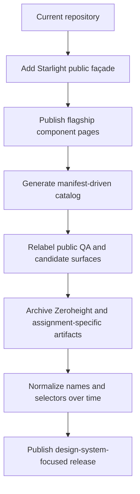
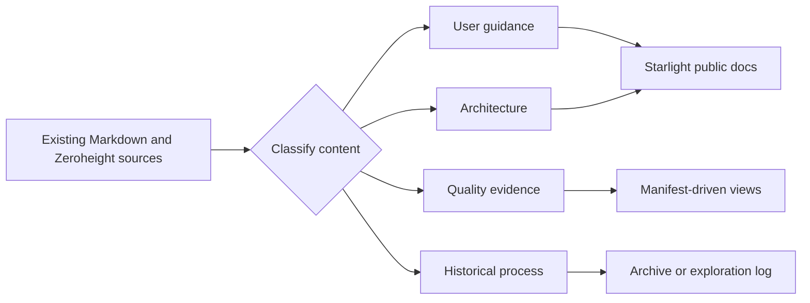

# Migration and Cleanup Plan

## Objective

Create a clean public design-system experience without discarding working architecture, tests, applications, or historical evidence.

The migration should be additive first, then progressively remove or archive obsolete public framing.

## Guiding principle

> Preserve the engineering. Reduce the conceptual noise.

## Migration strategy



## Keep prominently

Retain and foreground:

- semantic token source and generated outputs;
- light and dark theme behavior;
- provider-neutral Angular component contracts;
- PrimeNG adapter boundary;
- Storybook component stories;
- Chromatic visual review;
- Playwright interaction and integration tests;
- automated accessibility checks;
- component manifest;
- release validation;
- reference applications demonstrating adoption.

## Reframe

### Federation

Current framing:

> Primary identity of the repository.

Target framing:

> A reference implementation proving that the design-system contract works across independently deployed Angular applications.

### Backend API

Current framing:

> Part of the main repository feature list and setup path.

Target framing:

> A secondary full-stack reference application available to reviewers who want broader architecture evidence.

### QA remote

Current framing:

> Stable visual-contract and QA evidence surface.

Target public framing:

> Component Lab: an integrated Angular environment for component composition, overlays, themes, patterns, and application-level validation.

### Candidate Button

Current framing:

> UP Button Candidate with promotion blockers and Zeroheight guidance.

Target framing:

> Button Contract Exploration: a case study comparing a broad provider-influenced API with a smaller product-facing design-system API.

## Public rename map

| Current public term | Target public term |
| --- | --- |
| Public Sector Federation | Public Sector Design System |
| QA Remote | Component Lab |
| QA Evidence | Quality Evidence |
| Candidates | Experiments |
| Acceptance Stories | Component Stories or Interaction Stories |
| Portfolio Walkthrough | System Overview |
| Skills Demonstrated | Remove |
| UP Button Candidate | Button Contract Exploration |
| Stable vs Candidate | Current Contract vs Proposed Contract |
| Zeroheight Governance | Documentation Platform Experiment |
| externally blocked | awaiting external decision, when user-facing |

Internal project names may remain temporarily while public labels change.

## Archive candidates

Move or copy historical content into clearly marked archive locations before deletion.

### Tooling archive

```text
tools/archive/zeroheight/
tools/archive/reporting/
```

Candidates:

- Zeroheight export scripts;
- Zeroheight publish scripts;
- screenshot ZIP workflows;
- progress screenshot automation;
- report publication scripts;
- environment variables used only for retired publication workflows.

### Documentation archive

```text
docs/archive/zeroheight/
docs/archive/candidate-button/
docs/archive/internal-process/
```

Candidates:

- Zeroheight-specific page assembly instructions;
- tab-layout instructions;
- subscription or Enterprise-access limitations;
- UP-specific governance notes;
- internal stakeholder narratives;
- local machine validation paths;
- obsolete compatibility redirects;
- dated progress reports.

### Experiment archive

Stable, useful experimental code can remain active under:

```text
packages/experiments/button-contract/
```

Use this only if the experiment still provides clear comparison value. Otherwise retain the case study and remove the duplicate public component.

## Do not remove prematurely

Do not remove:

- tests referenced by current release gates;
- generated manifest fields before migrations are complete;
- legacy selectors without a compatibility plan;
- stable component APIs solely to simplify documentation;
- story aliases still used by published links;
- Zeroheight files before the new docs site contains equivalent useful guidance;
- backend or federation applications merely because they are secondary to the new homepage.

## Selector normalization

The current mix of `ps-*` and `public-*` selectors should become a documented remediation track.

### Target policy

Prefer one selector prefix for supported public components, such as:

```text
ps-button
ps-card
ps-empty-state
ps-form-section
ps-page-header
ps-status-card
```

### Migration approach

1. Document the target convention.
2. Record inconsistent selectors in the manifest.
3. Add compatibility aliases only when Angular and package constraints permit.
4. Migrate reference applications.
5. Mark old selectors deprecated.
6. Remove aliases in a planned major release.

Do not block the documentation upgrade on selector renaming.

## Button consolidation decision

Two public Button implementations create ambiguity.

Choose one of these strategies:

### Strategy A: Promote the smaller contract

- make the proposed API canonical;
- migrate stable usages;
- deprecate the broad API;
- retain comparison history in the exploration log.

### Strategy B: Remediate the stable implementation in place

- keep `ps-button` as the selector;
- introduce the smaller public contract;
- retain compatibility aliases temporarily;
- remove the separate candidate implementation.

### Strategy C: Preserve the experiment only as a case study

- keep stable `ps-button` unchanged;
- remove the candidate from the public package;
- retain stories, diagrams, and decision analysis under Experiments.

For portfolio clarity, Strategy B is likely the strongest long-term direction because it demonstrates remediation without forcing consumers to understand two permanent Buttons.

## README migration

### New opening

```md
# Public Sector Design System

An Angular design-system reference demonstrating accessible components,
semantic tokens, provider-neutral UI contracts, Storybook documentation,
and automated visual and interaction validation.
```

### New primary links

- Documentation
- Component Storybook
- Component status
- Accessibility
- Architecture
- Source

### Move lower in the README

- local full-platform startup;
- backend services;
- Docker;
- development ports;
- exact validation commands;
- federation details;
- license detail.

### Remove from opening narrative

- `portfolio-grade`;
- `skills demonstrated`;
- exact dated test totals;
- Zeroheight references;
- broad disclaimers.

## Storybook migration

- move stable components into product-facing categories;
- move candidate comparisons under Experiments;
- rename acceptance stories;
- designate canonical stories;
- update manifest story IDs;
- migrate documentation embeds;
- retain temporary aliases;
- remove aliases after link validation confirms no usage.

## Documentation migration



## Search-and-review terms

Before the public release, search all public content for:

- SitePen
- Zeroheight
- UP
- Neil
- Dan
- QA
- Candidate
- acceptance
- portfolio-grade
- skills demonstrated
- local drive paths
- unpublished internal URLs
- Enterprise access limitations

Each occurrence should be intentionally kept, rewritten, moved to Experiments, or archived.

## Cleanup phases

### Phase 1: Public labels

Low-risk changes:

- product name;
- landing-page copy;
- navigation labels;
- Storybook categories;
- component status vocabulary.

### Phase 2: Documentation relocation

- move user guidance into Starlight;
- move system-health data into generated views;
- move historical process into the exploration log or archive.

### Phase 3: Tooling retirement

- remove Zeroheight from report scripts;
- add neutral docs-generation commands;
- archive publication scripts;
- remove unused environment variables.

### Phase 4: Contract normalization

- consolidate Button strategy;
- normalize selectors;
- improve API extraction;
- remove provider leaks and escape hatches;
- complete flagship design alignment.

## Safety checks

Before deleting or renaming anything:

- search code and documentation references;
- validate published links;
- run manifest checks;
- build Storybook;
- build Starlight;
- run type checking;
- run tests;
- verify reference applications;
- document compatibility impact.

## Acceptance criteria

- [ ] The new public façade exists before old documentation is retired.
- [ ] Historical evidence is archived rather than silently lost.
- [ ] Public labels use design-system vocabulary.
- [ ] Federation and backend remain available as supporting evidence.
- [ ] Zeroheight is no longer required for documentation publication.
- [ ] The Button comparison has a clear long-term disposition.
- [ ] Selector inconsistency is tracked with a migration path.
- [ ] README and navigation prioritize the design system.
- [ ] All public links and manifest references validate after cleanup.
