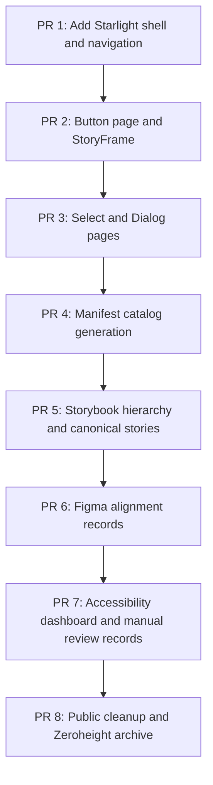

# Prioritized Backlog

## Backlog principles

- Build the new public façade before removing the old one.
- Complete a small number of flagship components before expanding breadth.
- Automate metadata projection after the page model is proven manually.
- Treat accessibility, Figma alignment, Storybook, and documentation as separate evidence dimensions.
- Do not block public presentation improvements on large internal renames.

## P0 — Establish the public design-system identity

### Documentation application

- [ ] Create `apps/docs` using Astro Starlight in the Nx workspace.
- [ ] Configure the public title as **Public Sector Design System**.
- [ ] Add Overview, Foundations, Components, Patterns, Accessibility, Develop, Quality, Architecture, and Exploration navigation.
- [ ] Add a landing page with links to Storybook, source, component status, and architecture.
- [ ] Add search, light/dark appearance, responsive navigation, and code highlighting.
- [ ] Add Mermaid support or an approved rendering strategy.
- [ ] Add documentation build and link validation targets.

### Public framing

- [ ] Rewrite the primary product statement.
- [ ] Remove `portfolio-grade` from public opening copy.
- [ ] Replace Portfolio Walkthrough with System Overview.
- [ ] Remove Skills Demonstrated from the public product experience.
- [ ] Reframe federation as adoption evidence.
- [ ] Move backend details to Reference Applications.
- [ ] Relabel QA Remote as Component Lab in public navigation.
- [ ] Relabel Candidates as Experiments.

### Reusable documentation components

- [ ] Create `StoryFrame`.
- [ ] Create `StatusBadge`.
- [ ] Create `ComponentHeader`.
- [ ] Create `EvidencePanel`.
- [ ] Create `TokenTable`.
- [ ] Create `AccessibilityStatus`.
- [ ] Create `FindingCard`.
- [ ] Create `DecisionRecord`.

## P0 — Complete three flagship component pages

### Button

- [ ] Write purpose and usage guidance.
- [ ] Choose the canonical stable story.
- [ ] Document current and proposed public API contracts.
- [ ] Document variants and interaction states.
- [ ] Document anatomy.
- [ ] Document keyboard, focus, loading, and disabled behavior.
- [ ] Show light and dark token mappings.
- [ ] Add API table.
- [ ] Add quality evidence summary.
- [ ] Move historical comparison to a final Decisions section.

### Select

- [ ] Write purpose and usage guidance.
- [ ] Create canonical and state stories.
- [ ] Document overlay and theme behavior.
- [ ] Document keyboard navigation and selection model.
- [ ] Document accessible naming and invalid state.
- [ ] Show provider-neutral API and private PrimeNG mapping.
- [ ] Add integration evidence for body-appended overlays.

### Dialog

- [ ] Write purpose and usage guidance.
- [ ] Create canonical and destructive-confirmation stories.
- [ ] Document anatomy and content hierarchy.
- [ ] Document initial focus, focus containment, Escape, close, and focus restoration.
- [ ] Document accessible name and description requirements.
- [ ] Show overlay and surface tokens.
- [ ] Add integrated application evidence.

## P0 — Manifest contract

- [ ] Publish the manifest scope and source-of-truth rules.
- [ ] Add public lifecycle translation.
- [ ] Normalize evidence status values.
- [ ] Add explicit provider-boundary status.
- [ ] Add separate automated and manual accessibility fields.
- [ ] Add documentation-route fields.
- [ ] Add Figma identity and alignment fields.
- [ ] Validate canonical Storybook story IDs.
- [ ] Validate documentation routes.
- [ ] Generate a basic component catalog.

## P0 — Figma intent model

- [ ] Define canonical Figma naming rules.
- [ ] Define anatomy, variant, state, and variable expectations.
- [ ] Create or identify Button, Select, and Dialog component references.
- [ ] Record Figma file, node, component, and component-set identifiers in the manifest.
- [ ] Create a concise Figma-property-to-Angular-API mapping.
- [ ] Record anatomy, variant, state, token, and naming alignment statuses.
- [ ] Record known code-versus-design differences.
- [ ] Link Figma components to Storybook and documentation.
- [ ] Avoid fabricated Figma approval when only draft design intent exists.

## P0 — Accessibility foundation

- [ ] Define accessibility status vocabulary.
- [ ] Document accessibility contracts for Button, Select, and Dialog.
- [ ] Add keyboard interaction tests for flagship components.
- [ ] Add automated accessibility checks for representative states.
- [ ] Add documentation-site accessibility checks.
- [ ] Ensure every Storybook iframe has a meaningful title.
- [ ] Prevent automated checks from being labeled as manual review.

## P1 — Storybook remediation

- [ ] Create the target Storybook hierarchy.
- [ ] Designate one canonical story per stable public component.
- [ ] Move candidate comparisons under Experiments.
- [ ] Rename acceptance stories.
- [ ] Add global light and dark themes.
- [ ] Add representative responsive viewports.
- [ ] Limit controls to supported public APIs.
- [ ] Add component descriptions that match Starlight guidance.
- [ ] Add links from Storybook back to documentation.
- [ ] Remove obsolete compatibility aliases after migration.

## P1 — Manifest-driven views

- [ ] Generate the public component catalog.
- [ ] Generate the component-health dashboard.
- [ ] Generate a Storybook-gap report.
- [ ] Generate an accessibility-gap report.
- [ ] Generate a documentation-gap report.
- [ ] Generate a design-alignment-gap report.
- [ ] Generate a provider-boundary-gap report.
- [ ] Generate an ownership-gap report.
- [ ] Add page-header metadata from the manifest.
- [ ] Add manifest completeness summaries to CI artifacts.

## P1 — Figma library proof

- [ ] Create a Foundations page with semantic color and component token examples.
- [ ] Create light and dark variable modes.
- [ ] Create the Button component set with intentional properties only.
- [ ] Create Select and Dialog component models or documented reconstruction plans.
- [ ] Add anatomy pages.
- [ ] Add realistic content and localization stress examples.
- [ ] Add accessibility visual-intent notes.
- [ ] Add design-to-code comparison records.
- [ ] Evaluate Code Connect for one flagship component.

## P1 — Forensic exploration log

- [ ] Publish an existing-system inventory.
- [ ] Record duplicate Button contracts.
- [ ] Record selector-prefix inconsistencies.
- [ ] Record provider API leaks and escape hatches.
- [ ] Record missing canonical stories.
- [ ] Record missing API extraction.
- [ ] Record manual accessibility review gaps.
- [ ] Record Figma alignment gaps.
- [ ] Add before-and-after remediation case studies.
- [ ] Add rejected approaches and tradeoffs.

## P1 — Public cleanup

- [ ] Remove Zeroheight from primary navigation.
- [ ] Remove local drive paths from public documentation.
- [ ] Remove person-specific references.
- [ ] Replace UP naming in general public surfaces.
- [ ] Replace QA terminology where it is not specifically about testing.
- [ ] Remove exact dated test totals from evergreen homepage copy.
- [ ] Move full-stack startup details lower in the README.
- [ ] Archive Zeroheight page-assembly instructions.

## P1 — Quality and deployment

- [ ] Add docs build to `verify:release`.
- [ ] Validate Storybook embed links.
- [ ] Validate manifest documentation paths.
- [ ] Publish docs and Storybook under one domain or coordinated domains.
- [ ] Add pull-request previews for documentation.
- [ ] Add Chromatic visual review links to pull requests.
- [ ] Add docs artifacts to CI failure output.

## P2 — Contract normalization

- [ ] Decide the long-term Button consolidation strategy.
- [ ] Prefer remediation of `ps-button` over permanent duplicate public Buttons.
- [ ] Normalize selector prefixes through a documented compatibility plan.
- [ ] Improve compiler-supported public API extraction.
- [ ] Remove provider-specific public types and events.
- [ ] Reduce public style escape hatches.
- [ ] Add deprecation metadata and replacement links.

## P2 — Broader component completion

- [ ] Create complete pages for Card, Tag, Toast, Pagination, Menu, Popover, Tooltip, Progress, Skeleton, Empty State, Page Header, Form Section, and Status Card.
- [ ] Add canonical Storybook stories for remaining public entries.
- [ ] Expand manual accessibility review to remaining interactive components.
- [ ] Add design alignment for the broader component set.
- [ ] Add pattern pages demonstrating composition.

## P2 — Documentation automation

- [ ] Generate token tables from token artifacts.
- [ ] Generate API tables from extracted source metadata.
- [ ] Generate evidence panels from the manifest.
- [ ] Generate component status badges.
- [ ] Add drift checks between Figma identifiers, manifest IDs, Storybook IDs, and docs routes where tooling permits.
- [ ] Generate release summaries without hard-coding test totals.

## P2 — Historical retirement

- [ ] Archive or remove Zeroheight export scripts.
- [ ] Archive or remove Zeroheight publish scripts.
- [ ] Replace report commands with neutral documentation and evidence commands.
- [ ] Remove obsolete environment variables.
- [ ] Remove old story aliases.
- [ ] Remove old selector aliases in a planned major release.
- [ ] Retain a concise documentation-platform case study if useful.

## Suggested first pull-request sequence

## Ready-to-start definition

A backlog item is ready when:

- its intended audience is known;
- its source of truth is identified;
- its dependencies are named;
- its acceptance criteria are measurable;
- it does not rely on fabricated external approval;
- it has a clear documentation, code, design, or evidence owner role.

## Done definition

A backlog item is done when:

- implementation or documentation is committed;
- relevant links resolve;
- manifest metadata is updated where applicable;
- Storybook and tests remain valid;
- automated checks pass;
- known manual or external gaps are recorded;
- the public wording matches the design-system vocabulary.
