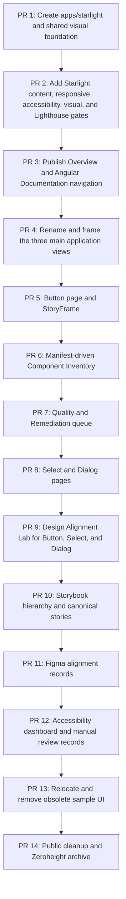

# Prioritized Backlog

## Backlog principles

- Build the new public façade before removing the old one.
- Complete a small number of flagship components before expanding breadth.
- Automate metadata projection after the page model is proven manually.
- Treat accessibility, Figma alignment, Storybook, and documentation as separate evidence dimensions.
- Do not block public presentation improvements on large internal renames.
- Replace sample-heavy application views with mission-focused design-system workbench views.
- Treat designer-grade documentation quality as a release requirement, not a final cleanup task.

## P0 — Establish the public design-system identity

### Astro Starlight application

See [Astro Starlight Application and Designer-Grade Quality Gate](./17-astro-starlight-application-and-designer-quality-gate.md).

- [x] Create `apps/starlight` as an independently built Astro Starlight application in Nx.
- [x] Configure the production base path at `/docs/` or the approved root route.
- [x] Add Nx `serve`, `build`, `preview`, and `check` targets.
- [x] Add the dedicated Nx `quality-gate` target.
- [x] Configure the public title as **Public Sector Design System**.
- [x] Add Overview, Foundations, Components, Patterns, Accessibility, Develop, Quality, Architecture, and Exploration navigation.
- [x] Add a landing page with links to Storybook, source, architecture, and the Angular workbench.
- [x] Add the component-status summary and canonical status link to the landing page.
- [x] Add search, light/dark appearance, responsive navigation, and code highlighting.
- [x] Add Mermaid support or an approved rendering strategy.
- [x] Consume the shared semantic-token CSS rather than inventing an unrelated documentation theme.
- [x] Publish the built Starlight output as a pull-request artifact.
- [ ] Publish a hosted pull-request preview URL for all Starlight changes.
- [x] Add a normal same-origin Documentation link from the Angular workbench to Starlight.
- [ ] Add an optional Angular documentation gateway route only when useful for navigation continuity.
- [x] Keep iframe embedding optional and non-canonical.

### Starlight designer-grade quality gate

- [x] Add Astro build, type, and framework validation.
- [x] Add content collection schemas and required frontmatter validation.
- [x] Add heading-level, single-`h1`, placeholder, local-path, and public-wording checks.
- [x] Add documentation link validation.
- [x] Add manifest, Storybook story, source-path, Figma-status, and docs-route integrity validation.
- [x] Add a token/style validator for raw colors, arbitrary spacing, unapproved typography, inline styles, and undocumented exceptions.
- [x] Add Playwright responsive tests at 360, 768, 1024, 1280, and 1440 pixel widths.
- [x] Add page-level no-overflow, navigation, table, light, dark, and 200%-zoom checks.
- [x] Add StoryFrame-specific clipping and embedded-story checks when `StoryFrame` is introduced.
- [x] Add Playwright and axe accessibility checks against built Starlight pages.
- [x] Add initial accessibility-tree snapshots for the critical overview heading and primary action.
- [x] Extend accessibility-tree snapshots to the flagship Button page and StoryFrame structure.
- [x] Add page-level visual regression coverage.
- [ ] Use Storybook and Chromatic for reusable Starlight presentation components.
- [x] Add Lighthouse CI scores and resource budgets.
- [x] Prevent automatic acceptance of changed visual baselines.
- [x] Require explicit `polish-approved`, `polish-approved-with-follow-up`, or `polish-changes-required` review status.
- [x] Add the Starlight quality gate to `verify:release`.

### Public framing

- [ ] Rewrite the primary product statement.
- [ ] Remove `portfolio-grade` from public opening copy.
- [ ] Replace Portfolio Walkthrough with System Overview.
- [ ] Remove Skills Demonstrated from the public product experience.
- [ ] Reframe federation as adoption evidence.
- [ ] Move backend details to Reference Applications.
- [ ] Relabel QA Remote as Component Lab in temporary public navigation.
- [ ] Relabel Candidates as Experiments where the old view remains temporarily visible.

### Main application three-view upgrade

See [Main Application Three-View Upgrade](./16-main-application-view-upgrade.md).

#### Shared shell

- [ ] Rename public navigation to **Component Inventory**, **Quality & Remediation**, and **Design Alignment Lab**.
- [ ] Add a shared application header with product purpose, Documentation, Storybook, and Source links.
- [ ] Add light/dark control and release or commit identification.
- [ ] Remove duplicate inner tab controls from `QaRemoteComponent` after the workspace owns navigation.
- [ ] Add explicit sample/generated-data labeling where live production data is unavailable.
- [ ] Verify responsive and keyboard navigation for all three views.

#### Component Inventory

- [ ] Replace the sample-heavy QA gallery with a manifest-driven inventory summary.
- [ ] Add stable, beta, experimental, deprecated, missing-story, missing-accessibility, missing-Figma, and provider-warning counts.
- [ ] Build a searchable and filterable component inventory table.
- [ ] Add filters for lifecycle, provider, category, evidence gaps, and blockers.
- [ ] Add a component detail panel with API, provider, Storybook, accessibility, Figma, documentation, findings, and next-action information.
- [ ] Add duplicate and inconsistency findings for competing Buttons, selector prefixes, provider leaks, and style escape hatches.
- [ ] Move generic Button matrices, Tag samples, Cards, tables, dialogs, and toasts to canonical Storybook stories or test fixtures.
- [ ] Preserve browser-test fixtures until replacement tests cover the new inventory view.

#### Quality & Remediation

- [ ] Replace performance-first framing with a design-system quality scorecard.
- [ ] Add open critical findings, accessibility blockers, visual regressions, missing interaction tests, missing stories, alignment gaps, provider violations, and documentation drift metrics.
- [ ] Build a prioritized remediation queue with dimension, severity, status, evidence, and recommended action.
- [ ] Add before-and-after cases for Button, Select, Dialog, selector normalization, and Storybook remediation.
- [ ] Display evidence coverage separately for code, Storybook, interaction tests, automated accessibility, manual review, Figma, and documentation.
- [ ] Move suite timing, browser variance, and baseline charts into a secondary Technical Diagnostics section.
- [ ] Ensure resolved findings link to verification evidence.

#### Design Alignment Lab

- [ ] Replace the UP Button-specific Candidates view with a reusable alignment workbench.
- [ ] Support Button, Select, and Dialog as selectable alignment cases.
- [ ] Add code lifecycle, Figma lifecycle, alignment status, selector, canonical story, blockers, and recommended decision summary.
- [ ] Add a live canonical Storybook implementation for each case.
- [ ] Add anatomy comparison between Figma, Angular structure, and rendered DOM.
- [ ] Add Figma-property-to-Angular-API mapping.
- [ ] Add semantic-token, component-token, provider-token, light-value, and dark-value comparison.
- [ ] Add explicit decision records: remediate code, correct Figma, change both, accept difference, reject, or defer.
- [ ] Remove UP, Zeroheight, and unrelated neutral/vibrant/pastel theme language from the primary view.
- [ ] Retain light and dark comparison as the default theme scope.

#### Sample cleanup and validation

- [ ] Inventory every visible sample component before removal.
- [ ] Classify each sample as canonical story, pattern example, integration fixture, test-only fixture, or obsolete.
- [ ] Do not delete sample code until dependent Playwright and Storybook tests are migrated.
- [ ] Remove sample-only models, handlers, and styles after replacement coverage passes.
- [ ] Update Playwright tests around the three new view missions.
- [ ] Add application accessibility checks for inventory filters, findings tables, detail panels, alignment comparisons, and embedded stories.
- [ ] Confirm no person-, employer-, UP-, SitePen-, or Zeroheight-specific language remains in primary application views.

### Reusable documentation components

- [x] Create `StoryFrame`.
- [ ] Create `StatusBadge`.
- [ ] Create `ComponentHeader`.
- [ ] Create `EvidencePanel`.
- [ ] Create `TokenTable`.
- [ ] Create `AccessibilityStatus`.
- [ ] Create `FindingCard`.
- [ ] Create `DecisionRecord`.
- [ ] Create `LightDarkPreview`.
- [ ] Add light, dark, responsive, visual, and accessibility coverage for each reusable Starlight component.

## P0 — Complete three flagship component pages

### Button

- [x] Write purpose and usage guidance.
- [x] Choose the canonical stable story.
- [x] Document current and proposed public API contracts.
- [x] Document variants and interaction states.
- [x] Document anatomy.
- [x] Document keyboard, focus, loading, and disabled behavior.
- [x] Show light and dark token mappings.
- [x] Add API table.
- [x] Add quality evidence summary.
- [x] Move historical comparison to a final Decisions section.
- [x] Pass the Starlight designer-grade quality gate and human polish review for Button.

### Select

- [x] Write purpose and usage guidance.
- [x] Create canonical and state stories.
- [x] Document overlay and theme behavior.
- [x] Document keyboard navigation and the provider-neutral selection model.
- [x] Document accessible naming, current invalid-state limitations, and the provider's disabled-option ARIA gap.
- [x] Show the provider-neutral API and private PrimeNG mapping.
- [x] Add integration evidence for body-appended overlays, clipping, stacking, focus return, theme inheritance, and mobile wrapping.
- [x] Complete the Select human polish review.
- [ ] Pass the complete Release Quality Gate for the exact final pull-request state.

### Dialog

- [ ] Write purpose and usage guidance.
- [ ] Create canonical and destructive-confirmation stories.
- [ ] Document anatomy and content hierarchy.
- [ ] Document initial focus, focus containment, Escape, close, and focus restoration.
- [ ] Document accessible name and description requirements.
- [ ] Show overlay and surface tokens.
- [ ] Add integrated application evidence.
- [ ] Pass the Starlight designer-grade quality gate and human polish review.

## P0 — Manifest contract

- [ ] Publish the manifest scope and source-of-truth rules.
- [ ] Add public lifecycle translation.
- [ ] Normalize evidence status values.
- [ ] Add explicit provider-boundary status.
- [ ] Add separate automated and manual accessibility fields.
- [ ] Add documentation-route fields.
- [ ] Add Figma identity and alignment fields.
- [x] Validate canonical Storybook story IDs when a component declares one.
- [x] Validate Starlight documentation routes and recorded source files.
- [ ] Generate a basic component catalog.
- [ ] Supply the Component Inventory and Design Alignment Lab from manifest projections rather than duplicated view data.

## P0 — Figma intent model

- [ ] Define canonical Figma naming rules.
- [ ] Define anatomy, variant, state, and variable expectations.
- [ ] Create or identify Button, Select, and Dialog component references.
- [ ] Record Figma file, node, component, and component-set identifiers in the manifest.
- [ ] Create a concise Figma-property-to-Angular-API mapping.
- [ ] Record anatomy, variant, state, token, and naming alignment statuses.
- [ ] Record known code-versus-design differences.
- [ ] Link Figma components to Storybook and Starlight documentation.
- [ ] Project Figma alignment data into the Design Alignment Lab.
- [ ] Avoid fabricated Figma approval when only draft design intent exists.

## P0 — Accessibility foundation

- [ ] Define accessibility status vocabulary.
- [ ] Document accessibility contracts for Button, Select, and Dialog.
- [ ] Add keyboard interaction tests for flagship components.
- [ ] Add automated accessibility checks for representative states.
- [x] Add Starlight page-level accessibility checks.
- [ ] Add accessibility checks for all three main application views.
- [ ] Ensure every Storybook and optional Starlight-preview iframe has a meaningful title.
- [ ] Prevent automated checks from being labeled as manual review.

## P1 — Storybook remediation

- [ ] Create the target Storybook hierarchy.
- [ ] Designate one canonical story per stable public component.
- [ ] Move candidate comparisons under Experiments.
- [ ] Rename acceptance stories.
- [ ] Add global light and dark themes.
- [ ] Add representative responsive viewports.
- [ ] Limit controls to supported public APIs.
- [ ] Add component descriptions that match Starlight guidance.
- [ ] Add links from Storybook back to Starlight documentation.
- [ ] Relocate generic main-application samples into appropriate canonical stories or patterns.
- [ ] Add Starlight presentation components to Storybook where visual review benefits from isolation.
- [ ] Remove obsolete compatibility aliases after migration.

## P1 — Manifest-driven views

- [ ] Generate the public component catalog.
- [ ] Generate the component-health dashboard.
- [ ] Generate the Component Inventory summary and filter data.
- [ ] Generate the Design Alignment Lab summary data.
- [ ] Generate a Storybook-gap report.
- [ ] Generate an accessibility-gap report.
- [ ] Generate a documentation-gap report.
- [ ] Generate a design-alignment-gap report.
- [ ] Generate a provider-boundary-gap report.
- [ ] Generate an ownership-gap report.
- [ ] Add page-header metadata from the manifest.
- [ ] Add manifest completeness summaries to CI artifacts.

## P1 — Figma library proof

- [ ] Create a Foundations page with semantic color and component token examples.
- [ ] Create light and dark variable modes.
- [ ] Create the Button component set with intentional properties only.
- [ ] Create Select and Dialog component models or documented reconstruction plans.
- [ ] Add anatomy pages.
- [ ] Add realistic content and localization stress examples.
- [ ] Add accessibility visual-intent notes.
- [ ] Add design-to-code comparison records.
- [ ] Use Button, Select, and Dialog records as the first Design Alignment Lab cases.
- [ ] Evaluate Code Connect for one flagship component.

## P1 — Forensic exploration log

- [ ] Publish an existing-system inventory.
- [ ] Record duplicate Button contracts.
- [ ] Record selector-prefix inconsistencies.
- [ ] Record provider API leaks and escape hatches.
- [ ] Record missing canonical stories.
- [ ] Record missing API extraction.
- [ ] Record manual accessibility review gaps.
- [ ] Record Figma alignment gaps.
- [ ] Add before-and-after remediation case studies.
- [ ] Project selected findings and remediation cases into the main application.
- [ ] Add rejected approaches and tradeoffs.

## P1 — Public cleanup

- [ ] Remove Zeroheight from primary navigation.
- [ ] Remove local drive paths from public documentation.
- [ ] Remove person-specific references.
- [ ] Replace UP naming in general public surfaces.
- [ ] Replace QA terminology where it is not specifically about testing.
- [ ] Remove exact dated test totals from evergreen homepage copy.
- [ ] Move full-stack startup details lower in the README.
- [ ] Archive Zeroheight page-assembly instructions.
- [ ] Remove generic sample-component walls from the main application after evidence is relocated.

## P1 — Quality and deployment

- [x] Add `starlight:quality-gate` to `verify:release`.
- [ ] Validate Storybook embed links.
- [x] Validate manifest documentation paths.
- [ ] Publish Starlight, Storybook, and Angular under one origin or coordinated domains.
- [x] Add a pull-request build artifact for Starlight.
- [ ] Add hosted pull-request previews for Starlight and the Angular workbench.
- [ ] Add Chromatic visual review links to pull requests.
- [ ] Add documentation and visual-diff artifacts to CI failure output.
- [ ] Add visual regression coverage for the three upgraded application views.
- [x] Require human polish approval for substantial Starlight visual changes.
- [x] Prevent visual baselines from being auto-accepted.

## P2 — Contract normalization

- [ ] Decide the long-term Button consolidation strategy.
- [ ] Prefer remediation of `ps-button` over permanent duplicate public Buttons.
- [ ] Normalize selector prefixes through a documented compatibility plan.
- [ ] Improve compiler-supported public API extraction.
- [ ] Remove provider-specific public types and events.
- [ ] Reduce public style escape hatches.
- [ ] Add deprecation metadata and replacement links.

## P2 — Broader component completion

- [ ] Create complete pages for Card, Tag, Toast, Pagination, Menu, Popover, Tooltip, Progress, Skeleton, Empty State, Page Header, Form Section, and Status Card.
- [ ] Add canonical Storybook stories for remaining public entries.
- [ ] Expand manual accessibility review to remaining interactive components.
- [ ] Add design alignment for the broader component set.
- [ ] Add pattern pages demonstrating composition.
- [ ] Apply the Starlight polish contract to every new page rather than allowing one-off layouts.

## P2 — Documentation automation

- [ ] Generate token tables from token artifacts.
- [ ] Generate API tables from extracted source metadata.
- [ ] Generate evidence panels from the manifest.
- [ ] Generate component status badges.
- [ ] Add drift checks between Figma identifiers, manifest IDs, Storybook IDs, and Starlight routes where tooling permits.
- [ ] Generate release summaries without hard-coding test totals.
- [ ] Generate a content-density warning report.
- [ ] Generate a token/style exception report.
- [ ] Track Lighthouse, accessibility, and visual-regression trends.

## P2 — Historical retirement

- [ ] Archive or remove Zeroheight export scripts.
- [ ] Archive or remove Zeroheight publish scripts.
- [ ] Replace report commands with neutral documentation and evidence commands.
- [ ] Remove obsolete environment variables.
- [ ] Remove old story aliases.
- [ ] Remove old selector aliases in a planned major release.
- [ ] Retain a concise documentation-platform case study if useful.

## Suggested first pull-request sequence

## Ready-to-start definition

A backlog item is ready when:

- its intended audience is known;
- its source of truth is identified;
- its dependencies are named;
- its acceptance criteria are measurable;
- its responsive and visual review expectations are known when it affects UI;
- it does not rely on fabricated external approval;
- it has a clear documentation, code, design, or evidence owner role.

## Done definition

A backlog item is done when:

- implementation or documentation is committed;
- relevant links resolve;
- manifest metadata is updated where applicable;
- Storybook and tests remain valid;
- automated checks pass;
- known manual or external gaps are recorded;
- sample UI is removed only after its evidence and test responsibilities are relocated;
- substantial visual changes receive human polish approval;
- visual baselines are reviewed rather than automatically accepted;
- the public wording matches the design-system vocabulary.
