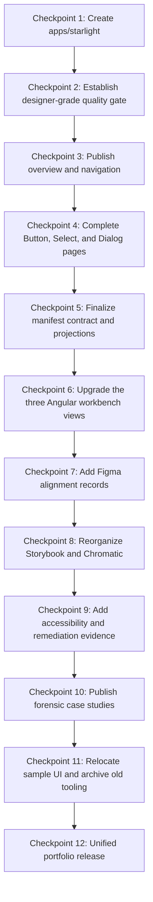

# Delivery Roadmap

_Last aligned: July 19, 2026 · mission realignment branch_

## Current roadmap state

### Completed foundation

1. Starlight documentation foundation.
2. Designer-grade documentation quality gate.
3. Button and StoryFrame flagship slice.
4. Select flagship and overlay evidence.
5. Manifest-driven forensic workbench.
6. Dialog flagship and platform simplification.
7. Release and dependency hardening.

### Remaining mission checkpoints

8. Component-estate usage audit and duplication classification.
9. Severity-ranked accessibility findings and manual flagship reviews.
10. Component consolidation decisions and migration windows.
11. Code-informed Figma reconstruction reference.
12. Storybook and Chromatic final alignment.
13. Semantic token boundary and component-test remediation.
14. Unified public release.

The numbered checkpoint descriptions below remain detailed target-state references. Where their sequence conflicts with this status, this current roadmap state takes precedence.

## Roadmap purpose

This roadmap converts the documentation-upgrade package into reviewable implementation checkpoints. Each checkpoint should produce visible evidence, preserve working functionality, and move the repository closer to the north star without requiring one risky all-at-once rewrite.

The roadmap assumes:

- `apps/starlight` becomes the public documentation application;
- the Angular `qa-remote` evolves into the mission-focused workbench;
- Storybook remains the isolated component workbench;
- the manifest connects code, stories, tests, accessibility, Figma, and documentation;
- visual quality is protected by automated checks plus human polish review;
- Zeroheight becomes historical rather than canonical.

## Delivery sequence

## Checkpoint 1 — Create `apps/starlight`

### Goal

Create Astro Starlight as a real, independently built Nx application rather than a loose Markdown directory.

### Deliverables

- `apps/starlight` project;
- Nx serve, build, preview, and check targets;
- `/docs/` production base path;
- public title and navigation;
- shared token consumption;
- responsive Starlight shell;
- search;
- light and dark appearances;
- initial pull-request preview;
- Documentation link from the Angular workbench.

### Acceptance criteria

- `pnpm nx serve starlight` starts the documentation application;
- `pnpm nx build starlight` creates the expected static output;
- the production base path works;
- navigation is keyboard accessible;
- light and dark modes use shared tokens;
- the Angular application can navigate to the Starlight route;
- Starlight remains independently deployable.

### Review question

> Does this feel like a first-class area of the same product without creating a framework-level dependency between Astro and Angular?

## Checkpoint 2 — Establish the designer-grade quality gate

### Goal

Prevent the Starlight application from becoming visually crowded, structurally inconsistent, or evidence-heavy as content grows.

### Deliverables

- content collection schemas;
- heading and page-structure validation;
- local-path, placeholder, and public-wording checks;
- manifest, Storybook, source, Figma-status, and docs-route integrity checks;
- shared-token and style-discipline validator;
- Playwright responsive checks;
- page-level axe checks;
- critical accessibility-tree snapshots;
- page visual-regression coverage;
- reusable Starlight-component visual coverage in Storybook and Chromatic;
- Lighthouse CI scores and budgets;
- PR preview template;
- required human polish-review status;
- visual-baseline acceptance policy.

### Acceptance criteria

- `pnpm nx run starlight:quality-gate` runs the complete automated gate;
- the gate fails on broken content references, missing titles, invalid hierarchy, horizontal overflow, new axe violations, or unreviewed visual changes;
- representative pages are checked at mobile, tablet, and desktop widths;
- light and dark screenshots exist;
- visual baselines are not accepted automatically;
- substantial visual changes require `polish-approved` or `polish-approved-with-follow-up`;
- the gate is included in `verify:release`.

### Review question

> Would the gate catch the types of drift that previously turned the documentation into a dense collection of panels, status labels, disclaimers, and evidence blocks?

## Checkpoint 3 — Publish overview and navigation

### Goal

Make the design system the unmistakable public product.

### Deliverables

- Overview page;
- concise north-star statement;
- links to Components, Storybook, Workbench, Source, Quality, and Architecture;
- Foundations navigation;
- Components navigation;
- Accessibility and Quality navigation;
- Exploration Log entry point;
- federation reframed as adoption proof;
- backend content moved to Reference Applications.

### Acceptance criteria

- a first-time visitor can identify the product purpose within approximately 30 seconds;
- the opening content does not lead with module federation, backend setup, Zeroheight, exact test totals, or personal skill claims;
- the page passes the Starlight quality gate;
- mobile and desktop hierarchy are both intentionally designed;
- the human polish review is approved.

### Review question

> Does the first screen communicate a maintained design-system product rather than a portfolio assignment?

## Checkpoint 4 — Complete Button, Select, and Dialog pages

### Goal

Prove the standard component-page model with three high-value flagship components.

### Deliverables

For each component:

- purpose and usage guidance;
- canonical Storybook embed;
- anatomy;
- variants and meaningful states;
- content guidance;
- interaction behavior;
- accessibility contract;
- token mapping;
- public Angular API;
- provider boundary;
- quality evidence;
- Figma alignment status;
- decisions and known gaps.

### Acceptance criteria

- live implementation appears near the top;
- usage guidance appears before large evidence tables;
- Storybook links resolve;
- manifest metadata matches the page;
- light and dark modes are reviewed;
- responsive and accessibility checks pass;
- the human polish review is approved;
- no page becomes a giant candidate-status or evidence dashboard.

### Review question

> Can designers and engineers both understand how to use the component, what is trustworthy, and what remains unresolved?

## Checkpoint 5 — Finalize manifest contract and projections

### Goal

Make the manifest the dependable relationship layer between code, documentation, design, stories, tests, and governance.

### Deliverables

- finalized schema domains;
- lifecycle vocabulary;
- provider-boundary status;
- documentation route fields;
- Storybook story IDs;
- source paths;
- automated and manual accessibility fields;
- Figma identity and alignment fields;
- blockers and ownership;
- catalog projection;
- health and gap projections;
- CI integrity validation.

### Acceptance criteria

- stable components have resolvable documentation and canonical story references;
- missing Figma or manual review states are explicit rather than fabricated;
- Starlight pages consume projections instead of manually duplicating manifest facts;
- invalid references fail CI;
- Component Inventory data can be generated from the manifest.

### Review question

> Does the manifest expose the truth of the system without pretending to own runtime behavior or design intent?

## Checkpoint 6 — Upgrade the three Angular workbench views

### Goal

Replace sample-heavy QA, performance, and candidate screens with mission-focused forensic and remediation workflows.

### Deliverables

#### Component Inventory

- manifest-driven summary;
- searchable and filterable component table;
- detail panel;
- duplicate-contract findings;
- selector inconsistency findings;
- Storybook, accessibility, documentation, Figma, and provider gaps.

#### Quality & Remediation

- quality scorecard;
- prioritized findings queue;
- evidence coverage;
- before-and-after remediation cases;
- technical diagnostics as secondary content.

#### Design Alignment Lab

- Button, Select, and Dialog selection;
- Figma-to-code anatomy mapping;
- Figma-property-to-Angular-API mapping;
- token-chain comparison;
- live Storybook evidence;
- decision records and blockers.

### Acceptance criteria

- generic sample walls are removed from primary views;
- useful samples are relocated before deletion;
- application tests are updated;
- each view has one clear mission;
- primary language contains no UP, SitePen, or Zeroheight dependency;
- the Documentation navigation reaches Starlight cleanly;
- responsive, visual, and accessibility checks pass.

### Review question

> Does every prominent component on each page contribute directly to discovery, remediation, or design alignment?

## Checkpoint 7 — Add Figma alignment records

### Goal

Show how approved or draft design intent relates to shipped code without making Figma the runtime source of truth.

### Deliverables

- canonical naming rules;
- Button component set;
- Select and Dialog models or reconstruction plans;
- light and dark variable modes;
- anatomy records;
- variant and state records;
- content constraints;
- accessibility visual-intent notes;
- manifest identifiers;
- alignment statuses;
- known design-versus-code differences;
- Design Alignment Lab projections.

### Acceptance criteria

- Figma status is honest;
- component existence in Figma does not imply code promotion;
- Figma properties map deliberately to public Angular APIs;
- decorative design combinations are not mistaken for public API commitments;
- references resolve from Starlight and the manifest.

### Review question

> Could a designer use these records to rebuild or correct the library based on what actually ships?

## Checkpoint 8 — Reorganize Storybook and Chromatic

### Goal

Make Storybook the trustworthy isolated component workbench and Chromatic the visual-review and regression surface.

### Deliverables

- target Storybook hierarchy;
- canonical story per stable public component;
- experiments separated from stable components;
- light and dark modes;
- representative responsive viewports;
- supported controls only;
- interaction tests;
- accessibility-addon configuration;
- Starlight presentation-component stories where useful;
- documentation backlinks;
- Chromatic PR review workflow.

### Acceptance criteria

- canonical story IDs match manifest and Starlight references;
- old acceptance and candidate naming is removed or archived;
- visual changes require review;
- Storybook does not duplicate full documentation guidance;
- Chromatic is presented as testing and review, not only hosting.

### Review question

> Can reviewers distinguish stable components, experiments, visual regressions, and intentional design changes quickly?

## Checkpoint 9 — Add accessibility and remediation evidence

### Goal

Make accessibility responsibilities and remediation progress visible without overstating conformance.

### Deliverables

- accessibility status vocabulary;
- component-level automated results;
- page-level Starlight and Angular results;
- manual-review status;
- keyboard behavior records;
- focus-management records;
- findings queue;
- before-and-after evidence;
- unresolved risks;
- links to verification.

### Acceptance criteria

- automated and manual evidence are separate;
- new violations block release;
- known legacy exceptions are explicit;
- resolved findings link to verification;
- no page claims complete compliance from axe alone;
- cognitive density is included in human review.

### Review question

> Does the system make accessibility debt actionable while remaining honest about what has and has not been manually verified?

## Checkpoint 10 — Publish forensic case studies

### Goal

Demonstrate remediation and discovery work rather than only greenfield construction.

### Recommended first cases

1. competing Button contracts;
2. selector-prefix inconsistency;
3. Select overlay and accessible naming;
4. Dialog focus containment and restoration;
5. missing canonical Storybook stories;
6. provider leakage and escape hatches;
7. rebuilding Figma intent from shipped code.

### Required case structure

- observed condition;
- discovery method;
- affected users or teams;
- evidence;
- options considered;
- decision;
- implementation or proposed remediation;
- verification;
- remaining limitations.

### Acceptance criteria

- cases are grounded in repository evidence;
- before-and-after differences are understandable;
- rejected approaches and tradeoffs are included;
- the case does not expose employer-sensitive information;
- the Starlight polish gate passes.

### Review question

> Does the case prove that the engineer can enter an imperfect system, discover reality, and improve it responsibly?

## Checkpoint 11 — Relocate sample UI and archive old tooling

### Goal

Remove obsolete presentation clutter without losing useful test and evidence coverage.

### Deliverables

- sample inventory;
- sample classification;
- canonical Storybook relocation;
- pattern-page relocation;
- integration-fixture relocation;
- replacement Playwright tests;
- sample-only model, handler, and style removal;
- Zeroheight scripts archived or removed;
- local paths removed;
- person- and employer-specific language removed;
- old story aliases and obsolete navigation retired.

### Acceptance criteria

- no dependent tests are silently lost;
- primary Angular views contain only mission-relevant UI;
- Starlight pages do not inherit the old evidence-wall structure;
- archive content is clearly separated from canonical guidance;
- release verification passes.

### Review question

> Did the cleanup reduce noise while preserving every important proof responsibility?

## Checkpoint 12 — Unified portfolio release

### Goal

Publish one coherent product experience across Starlight, Angular, Storybook, Chromatic, Figma references, and source.

### Deliverables

- public Starlight URL;
- public Angular workbench URL;
- public Storybook URL;
- coordinated navigation;
- validated manifests and links;
- flagship component pages;
- three upgraded workbench views;
- accessibility and quality evidence;
- forensic case studies;
- polished README entry point;
- release notes.

### Acceptance criteria

- the first-time visitor journey works without repository archaeology;
- all major routes share a coherent vocabulary and visual language;
- the Starlight designer-grade quality gate passes;
- Angular, Storybook, and manifest quality gates pass;
- visual changes are reviewed;
- no canonical route depends on Zeroheight;
- the product supports the north star clearly.

### Review question

> Can a hiring manager see discovery, remediation, accessibility responsibility, design-to-code translation, governance, and Angular engineering depth in one coherent system?

## Roadmap governance

### Checkpoint review record

Each checkpoint should record:

- scope completed;
- routes or components affected;
- automated gate results;
- visual-review result;
- polish-review result;
- unresolved risks;
- deferred work;
- next checkpoint dependencies.

### Change-control rule

Do not expand a checkpoint merely because another component or page would be easy to add. Finish the intended product slice, pass its gates, and then expand through the backlog.

### Final roadmap principle

The upgrade should grow through a small number of complete, polished, truthful slices rather than a large number of partially documented surfaces.
