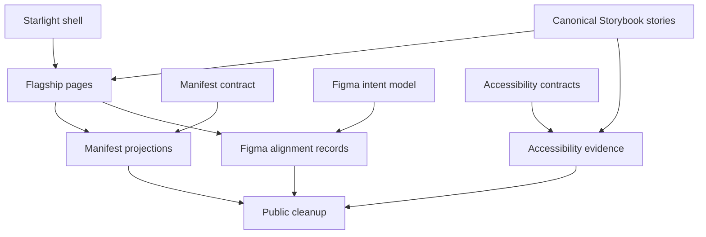

# Delivery Roadmap

## Objective

Deliver the documentation upgrade in reviewable checkpoints that each produce visible value without requiring a full repository rewrite.

## Roadmap overview

```mermaid
flowchart LR
  C1[Checkpoint 1: Public façade] --> C2[Checkpoint 2: Flagship pages]
  C2 --> C3[Checkpoint 3: Manifest projections]
  C3 --> C4[Checkpoint 4: Storybook remediation]
  C4 --> C5[Checkpoint 5: Figma alignment]
  C5 --> C6[Checkpoint 6: Accessibility evidence]
  C6 --> C7[Checkpoint 7: Forensic case studies]
  C7 --> C8[Checkpoint 8: Cleanup and public release]
```

## Checkpoint 1 — Public façade

### Goal

Create the new Starlight documentation application and establish the design-system identity.

### Deliverables

- `apps/docs` Starlight application;
- product title and navigation;
- landing page;
- Storybook and source links;
- reusable status and Storybook embed components;
- docs build and link validation.

### Acceptance criteria

- A first-time visitor understands the system purpose from the first screen.
- Federation does not dominate the introduction.
- Storybook and source are reachable in one click.
- No Zeroheight dependency is required to view the core documentation.
- The docs application builds in CI.

### Review question

> Does the new front door communicate a real design-system product before asking the visitor to understand the repository architecture?

## Checkpoint 2 — Flagship component pages

### Goal

Prove the component-page model with Button, Select, and Dialog.

### Deliverables

- complete Button page;
- complete Select page;
- complete Dialog page;
- live canonical Storybook embeds;
- usage, anatomy, behavior, accessibility, tokens, API, and quality sections;
- decision history at the bottom of each page.

### Acceptance criteria

- Guidance appears before evidence.
- Live components appear near the top.
- Keyboard and focus behavior are explicit.
- Automated and manual accessibility statuses are separate.
- Token references connect to actual component decisions.
- Stable and experimental contracts are clearly distinguished.

### Review question

> Could a designer and an Angular engineer independently understand the same component contract from this page?

## Checkpoint 3 — Manifest projections

### Goal

Turn the manifest into public discovery and health views.

### Deliverables

- component catalog;
- component health dashboard;
- documentation-gap report;
- Storybook-gap report;
- accessibility-gap report;
- design-alignment-gap report;
- validated documentation and story references.

### Acceptance criteria

- Public component status is generated from manifest data.
- Missing evidence is visible.
- Stable component routes and canonical stories validate.
- Provider leaks and incomplete API extraction can be queried.
- Automation reports readiness without promoting components.

### Review question

> Does the manifest reduce drift while remaining understandable and honest?

## Checkpoint 4 — Storybook remediation

### Goal

Make Storybook a clean interactive component workbench.

### Deliverables

- product-facing hierarchy;
- canonical stories;
- experiments separated from stable components;
- light and dark globals;
- responsive viewports;
- interaction tests for flagship components;
- links back to Starlight;
- Chromatic review workflow documentation.

### Acceptance criteria

- Stable components are easy to locate.
- Controls expose supported APIs only.
- Candidate comparisons appear under Experiments.
- Canonical story IDs match manifest references.
- Chromatic visual differences are reviewed intentionally.

### Review question

> Would a designer or engineer use this Storybook to explore the system without needing an explanation of the old QA structure?

## Checkpoint 5 — Figma alignment

### Goal

Demonstrate how shipped code and design intent are reconciled.

### Deliverables

- Figma intent model for Button, Select, and Dialog;
- component or component-set references;
- anatomy, variants, states, and variable mappings;
- Figma identifiers in the manifest;
- code-versus-design comparison records;
- alignment statuses and known differences;
- optional Code Connect proof for one component.

### Acceptance criteria

- Figma represents supported product decisions rather than provider internals.
- Manifest identifiers are valid or honestly missing.
- Design approval is not inferred from component existence.
- Known code-versus-design differences are recorded.
- Figma, docs, Storybook, and manifest use the same public component names.

### Review question

> Could the design team rebuild or correct its library using the documented relationship to shipped code?

## Checkpoint 6 — Accessibility evidence

### Goal

Establish explicit contracts and honest evidence for flagship components.

### Deliverables

- semantic, keyboard, focus, announcement, and visual contracts;
- keyboard interaction tests;
- automated accessibility results for representative states;
- manual review records where completed;
- accessibility status in the manifest;
- accessibility gap dashboard;
- docs-site accessibility review.

### Acceptance criteria

- Automated checks are not described as full conformance.
- Manual review requires a review record.
- Known issues prevent misleading completion status.
- Flagship component keyboard behavior is repeatably tested.
- Documentation embeds and navigation are accessible.

### Review question

> Can a reviewer tell exactly what was tested, what was manually reviewed, and what remains unknown?

## Checkpoint 7 — Forensic case studies

### Goal

Make the remediation skill visible.

### Deliverables

- existing-system inventory;
- Button contract case study;
- selector inconsistency finding;
- provider-boundary finding;
- Storybook gap analysis;
- accessibility gap analysis;
- design-alignment finding;
- before-and-after decisions;
- rejected approaches and tradeoffs.

### Acceptance criteria

- Findings cite observable implementation evidence.
- Risks are explained without exaggeration.
- Decisions include tradeoffs.
- Deferred or external items remain visible.
- The case studies show remediation, not only greenfield construction.

### Review question

> Does the work demonstrate how the engineer thinks when an existing design system is incomplete or unreliable?

## Checkpoint 8 — Cleanup and public release

### Goal

Retire obsolete public framing and publish a cohesive portfolio release.

### Deliverables

- rewritten root README;
- Starlight as the primary public entry point;
- Zeroheight removed from primary navigation;
- archived Zeroheight and reporting scripts where appropriate;
- public naming cleanup;
- coordinated deployment of docs, Storybook, and showcase;
- release validation and link checks.

### Acceptance criteria

- The repository reads as a design-system product.
- Historical work remains available without dominating discovery.
- Federation is clearly supporting proof.
- The Button experiment has a clear disposition.
- Public links, docs, stories, manifest references, and builds validate.
- No person-specific, local-path, or assignment-specific language remains unintentionally public.

### Review question

> Is the final experience memorable as a mature Angular design-system exploration rather than a collection of unrelated experiments?

## Dependencies

## Risk controls

| Risk | Control |
| --- | --- |
| Large rename breaks working code | Change public labels first; migrate internal names later. |
| Docs duplicate manifest data | Generate statuses and links from the manifest. |
| Storybook IDs break embeds | Validate IDs against the built index. |
| Figma appears more complete than it is | Use explicit draft, review, partial, and missing statuses. |
| Accessibility is overstated | Separate automated, keyboard, visual, and manual evidence. |
| Cleanup removes useful history | Archive before deletion. |
| Scope expands to every component | Finish three flagship components before broadening. |
| Federation work is lost | Preserve it as an architecture and adoption case study. |

## Release readiness checklist

- [ ] Docs app builds and publishes.
- [ ] Storybook builds and publishes.
- [ ] Canonical story embeds resolve.
- [ ] Manifest validation passes.
- [ ] Flagship pages are complete.
- [ ] Accessibility statuses are honest.
- [ ] Figma alignment statuses are recorded.
- [ ] Component catalog and health dashboard render.
- [ ] Public naming review is complete.
- [ ] Root README points to the docs site.
- [ ] Zeroheight is not required for the core experience.
- [ ] Full release validation passes.
