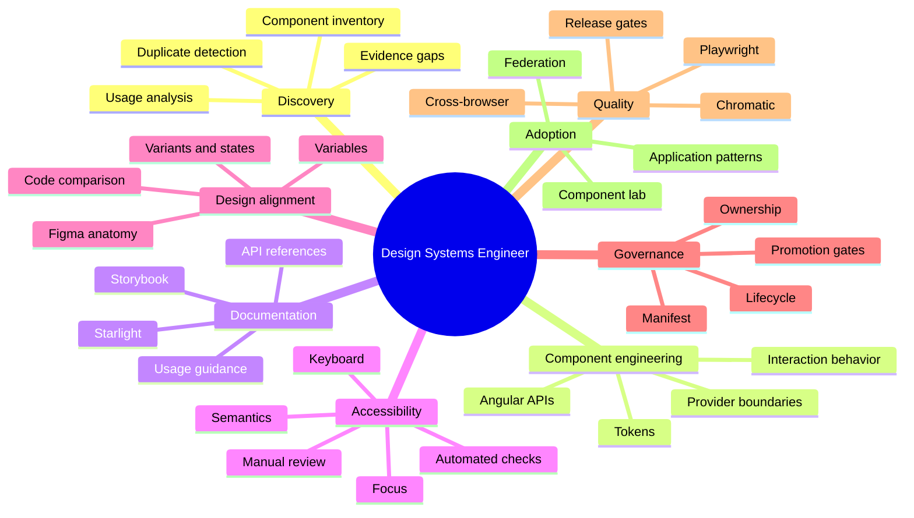

# Role-Proof Matrix

## Purpose

Map the documentation upgrade and existing repository evidence to the responsibilities of a forensic and remediation-oriented design-systems engineering role.

The goal is not to mirror a job posting word for word. The goal is to make the relevant capability visible through working artifacts.

## Current proof status

| Capability | Status | Strongest evidence | Remaining gap |
| --- | --- | --- | --- |
| Component inventory | Complete foundation | Generated manifest and Component Inventory | Add usage counts and duplication classifications |
| Storybook extension | Complete flagship scope | Canonical Button, Select, and Dialog stories | Add `play` functions and finish catalog hierarchy |
| Accessibility contracts | Complete flagship documentation | Starlight guidance and interaction evidence | Manual AT reviews and ranked finding verification |
| Accessibility remediation | Partial | Dialog focus work and Select overlay evidence | Findings register must link before/after verification |
| Consolidation | Partial | Button candidate comparison and provider boundaries | Final dispositions and compatibility windows |
| Figma reconstruction readiness | Partial | Design Alignment Lab and manifest statuses | Produce the reconstruction reference and real identifiers |
| Durable documentation | Complete foundation | Starlight, StoryFrame, manifest validation, release gates | Hosted preview URLs and remaining catalog projections |

Working mission artifacts:

- [Component estate audit](./18-component-estate-audit.md)
- [Accessibility findings and remediation](./19-accessibility-findings-and-remediation.md)
- [Component consolidation proposal](./20-component-consolidation-proposal.md)

## Role alignment

| Role responsibility | Repository evidence | Upgrade artifact | Interview message |
| --- | --- | --- | --- |
| Inspect an existing component ecosystem | Public exports, wrappers, Storybook stories, reference applications | Existing-system inventory | I start from what actually ships rather than assuming the design library is accurate. |
| Identify duplicated primitives | Stable and experimental Button contracts | Button Contract Exploration | I can distinguish duplication from intentional migration and propose a consolidation path. |
| Evaluate and extend Storybook | Existing Storybook, Chromatic, interaction and Playwright tests | Storybook remediation plan and canonical stories | I treat Storybook as the live component contract, not only a gallery. |
| Document the current truth | Typed registry and generated manifest | Component catalog and health dashboard | I expose partial, missing, and blocked evidence instead of presenting false completion. |
| Find accessibility issues | Axe, keyboard tests, overlay and integration tests | Accessibility contracts and gap dashboard | Automated checks are one evidence layer; I keep manual review and semantics separate. |
| Connect designers to shipped code | Tokens, wrapper APIs, component states | Figma intent and alignment records | I use code-informed reconstruction when the Figma library is unreliable. |
| Prepare Figma library remediation | Token source, Storybook states, manifest references | Figma component intent model | Designers receive anatomy, variants, states, token intent, and known differences grounded in implementation. |
| Create reusable component guidance | Component catalog and Markdown documentation | Standard component page blueprint | Each page teaches use, behavior, accessibility, tokens, API, and evidence in a predictable order. |
| Improve provider abstraction | PrimeNG wrapper boundary and lint rules | Provider-boundary dashboard | I reduce provider leakage while preserving migration compatibility. |
| Establish governance | Lifecycle states, promotion requirements, evidence metadata | Manifest contract and release criteria | Automation reports readiness, but human review controls promotion. |
| Support complex applications | Shell, remotes, custom elements, overlays | Federated adoption case study | The design system is proven outside isolated demos. |
| Partner across design and engineering | Shared vocabulary across tokens, APIs, stories, and docs | Figma-property-to-Angular-API mapping | I create a common contract rather than forcing either discipline to adopt the other's internal representation. |
| Communicate tradeoffs | Existing architecture and candidate decisions | Exploration log and decision records | I explain what was chosen, what was deferred, and why. |
| Deliver a durable artifact | Public Nx repository and automated quality gates | Starlight portal plus Storybook and manifest | The output is versioned, searchable, reviewable, and connected to working code. |

## Competency map

## Strongest product proof points

### 1. Manifest-driven component inventory

This is one of the most distinctive parts of the project because it treats component status as data and makes evidence gaps visible.

Demonstrates:

- inventory discipline;
- governance modeling;
- source validation;
- documentation drift prevention;
- honest reporting.

### 2. Provider-neutral Angular contracts

The wrapper boundary demonstrates that the public design-system API does not need to mirror a vendor component library.

Demonstrates:

- API design;
- migration strategy;
- abstraction judgment;
- enforcement through lint and validation;
- awareness of escape-hatch risk.

### 3. Storybook, Chromatic, and integrated application evidence

The combination shows the difference between isolated component confidence and real application confidence.

Demonstrates:

- interactive documentation;
- visual regression;
- cross-browser testing;
- overlay and theme validation;
- complex adoption proof.

### 4. Code-informed Figma reconstruction

The Figma intent document demonstrates how to work when design artifacts are incomplete or unreliable.

Demonstrates:

- forensic design-system work;
- shared vocabulary;
- component anatomy and state modeling;
- explicit design-to-code differences;
- readiness for Figma library remediation.

### 5. Accessibility evidence separation

The project does not collapse all accessibility into one pass/fail badge.

Demonstrates:

- semantic responsibility;
- keyboard and focus understanding;
- appropriate use of automation;
- manual review planning;
- honest risk communication.

## Potential weak areas and how the upgrade addresses them

| Potential concern | Current risk | Upgrade response |
| --- | --- | --- |
| Repository appears too broad | Federation, backend, QA, and docs compete | Starlight front door creates one design-system story. |
| Figma proof is incomplete | Design references and approvals are pending | Figma intent model and honest alignment statuses show the correct workflow. |
| Too much QA language | Pages read like evidence reports | Component blueprint places guidance and live examples first. |
| Two Button contracts are confusing | Stable and candidate APIs coexist | Exploration case study plus a consolidation decision. |
| Manual accessibility review is incomplete | Automated coverage may be overread | Separate status fields and prioritized manual reviews. |
| Naming is inconsistent | `ps-*` and `public-*` selectors coexist | Public naming policy and staged selector migration. |
| Zeroheight may look like the center | Tool-specific scripts and guidance are extensive | Archive strategy and repository-owned documentation portal. |
| Product wording feels self-conscious | Skills are explicitly listed | Product language replaces self-referential framing. |

## Five-minute review route

Do not label this publicly as a walkthrough, but use it during interviews.

1. Open the Starlight landing page.
2. Open the Button component page and use the embedded story.
3. Show the component health dashboard generated from the manifest.
4. Show the Button design-to-code alignment record.
5. Show one accessibility contract and test.
6. Open the provider-boundary architecture diagram.
7. Show the component in the federated reference application.
8. End with the exploration log explaining the original finding and remediation decision.

## Evidence-to-answer pattern

Use this structure when describing any product feature:

### Problem

What was unreliable, duplicated, missing, or difficult for users?

### Observation

What did the shipped code and current tools actually show?

### Decision

What contract, architecture, or process did you choose?

### Implementation

What did you build or change?

### Evidence

How did you validate the result?

### Tradeoff

What remains incomplete or organization-specific?

## Example role narrative

> I treated the repository as an existing system rather than a greenfield component library. I inventoried the public Angular surface, provider boundaries, Storybook evidence, tests, design references, and accessibility status in a typed manifest. That exposed duplicate Button contracts, inconsistent selectors, uneven Storybook coverage, missing manual accessibility reviews, and incomplete Figma alignment. The documentation upgrade turns those findings into a Starlight component catalog and health dashboard, uses Storybook as the live contract, Chromatic for visual review, and reference applications for integration proof. Figma is linked through explicit component identifiers and alignment statuses, so design intent can be rebuilt from what actually ships without pretending the current design library is authoritative.

## Role-proof acceptance criteria

- [ ] Every major role responsibility maps to visible repository evidence.
- [ ] The strongest evidence is reachable in a short review route.
- [ ] Claims distinguish completed work from planned work.
- [ ] The artifact demonstrates remediation, not only greenfield construction.
- [ ] Design, engineering, accessibility, and governance all have clear roles.
- [ ] The repository's architectural complexity supports the story rather than obscuring it.
