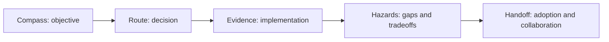
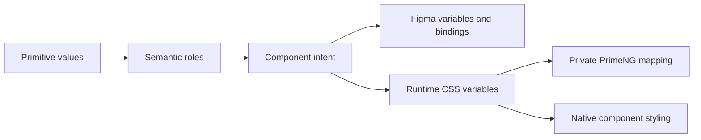

# Wayfinder Interview Guide

## Purpose

Use this guide to practice explaining the design-system work in a structured interview format.

Each answer is evaluated through five directions:

- **Compass** — Did you identify the real objective?
- **Route** — Did you explain your decision and tradeoffs?
- **Evidence** — Did you connect the answer to concrete work?
- **Hazards** — Did you acknowledge risks, gaps, and uncertainty?
- **Handoff** — Did you explain how designers and engineers use the result?

## Answer framework



A strong answer should usually follow this order:

1. State the user or organizational problem.
2. Explain what you inspected.
3. Describe the decision or model.
4. Point to implementation evidence.
5. Name what remains incomplete or external.
6. Explain how another person would use or continue the work.

## Checkpoint 1 — Forensic discovery

### Prompt

You join a company whose designers cannot tell which components already exist, engineers frequently rebuild primitives, Storybook is incomplete, and the Figma library is unreliable.

Before changing code, what do you inspect and what artifact do you produce?

### Strong-answer landmarks

- inventory package exports and selectors;
- inspect application usage rather than only component folders;
- inspect Storybook coverage and story quality;
- inspect provider imports and API leakage;
- inspect accessibility contracts and evidence;
- compare Figma names, anatomy, variants, and states against shipped code;
- produce a component inventory or manifest with evidence and gaps;
- review the inventory with design and engineering before remediation.

### Hazards to mention

- assuming Figma is authoritative;
- treating every export as production-approved;
- using automated accessibility results as full conformance;
- deleting duplicates before understanding migration usage;
- creating a second manually maintained source of truth.

## Checkpoint 2 — Component manifest

### Prompt

Why use a component manifest instead of maintaining a spreadsheet or a large documentation table?

### Strong-answer landmarks

- stable machine identifiers;
- validation against source exports and selectors;
- canonical Storybook references;
- evidence and lifecycle projection;
- generated catalogs and dashboards;
- visible missing data;
- human-controlled promotion;
- manifest is a relationship contract, not runtime implementation.

### Evidence to show

- typed registry;
- generated portable manifest;
- validation command;
- Storybook registry views;
- planned Starlight catalog and gap reports.

## Checkpoint 3 — Figma reconstruction

### Prompt

The Figma library does not match what is shipped. Do you rebuild Figma from code exactly as it exists?

### Strong-answer landmarks

- shipped code is evidence, not automatically ideal design intent;
- inventory real behavior and usage;
- separate accidental provider behavior from intentional product contract;
- define anatomy, variants, states, and token intent;
- create corrected Figma intent;
- compare design and code;
- remediate design, code, or both;
- record differences and alignment status in the manifest.

### Hazards to mention

- copying provider-specific DOM into design anatomy;
- encoding every style combination as a Figma variant;
- marking design approved because a component exists;
- ignoring inaccessible shipped behavior;
- creating design properties that code cannot support.

## Checkpoint 4 — Button contract

### Prompt

You find two Button wrappers: one broad API influenced by the provider and one smaller experimental API. What do you do?

### Strong-answer landmarks

- inspect actual usage and compatibility requirements;
- compare product intent rather than only visual styling;
- identify provider leakage and escape hatches;
- prefer one canonical product-facing API;
- use compatibility aliases temporarily if necessary;
- keep the comparison as an experiment or case study;
- choose a deprecation and migration path;
- validate keyboard, loading, disabled, focus, and visual behavior.

### Strong portfolio direction

Remediate the stable `ps-button` toward the smaller contract while preserving temporary compatibility, rather than permanently teaching users two public Buttons.

## Checkpoint 5 — Storybook strategy

### Prompt

What belongs in Storybook and what belongs in the documentation site?

### Strong-answer landmarks

Storybook owns:

- live isolated rendering;
- controls;
- variants and states;
- interaction examples;
- developer API details;
- accessibility addon results.

Starlight owns:

- usage guidance;
- principles;
- foundations;
- anatomy and behavior explanations;
- accessibility policy;
- architecture;
- contribution guidance;
- health dashboards and remediation records.

Chromatic owns:

- visual baselines;
- visual diffs;
- review and approval history.

### Hazard to mention

Do not duplicate large bodies of prose and status metadata across Storybook and Starlight.

## Checkpoint 6 — Accessibility

### Prompt

Your Storybook axe checks pass. Is the component accessible?

### Strong-answer landmarks

- no broad conclusion from one automated tool;
- document semantic, keyboard, focus, announcement, and visual contracts;
- test representative states;
- run keyboard interaction tests;
- review contrast and focus;
- perform manual assistive-technology review;
- record environment and findings;
- keep known issues visible.

### Evidence to show

- accessibility contract on component page;
- test path;
- manifest status fields;
- manual review record or honest pending status.

## Checkpoint 7 — Provider boundaries

### Prompt

Why wrap PrimeNG rather than allowing applications to import it directly?

### Strong-answer landmarks

- stable product-facing API;
- controlled upgrade surface;
- semantic tokens and theme mapping;
- consistent accessibility expectations;
- migration and deprecation control;
- reduced vendor vocabulary in applications;
- lint and manifest checks enforce the boundary.

### Tradeoff to mention

A wrapper can become a low-value mirror if it exposes the provider's entire API. The design-system contract must remain opinionated.

## Checkpoint 8 — Tokens

### Prompt

How do Figma variables, semantic tokens, component tokens, and PrimeNG tokens relate?

### Strong-answer landmarks



Explain that:

- primitive values should not usually be consumed directly by applications;
- semantic roles express product intent;
- component tokens support intentional component decisions;
- provider tokens are private implementation mappings;
- mappings should be generated or validated to prevent drift.

## Checkpoint 9 — Governance

### Prompt

Should a component automatically become stable when all manifest evidence fields are complete?

### Strong-answer landmarks

- automation can derive readiness;
- human review still controls promotion;
- design approval, API impact, migration risk, and accessibility judgment require accountable decisions;
- manifest requirements make review consistent;
- promotion updates authored lifecycle metadata explicitly.

## Checkpoint 10 — Federation relevance

### Prompt

Why keep module federation in a design-system portfolio?

### Strong-answer landmarks

- it proves adoption across independently bootstrapped applications;
- validates token and theme propagation;
- reveals overlay and global-style problems;
- demonstrates package and runtime boundaries;
- shows the design system beyond isolated stories.

### Important framing

Federation is proof of durability, not the homepage identity.

## Checkpoint 11 — Documentation platform choice

### Prompt

Why not keep Zeroheight as the primary documentation platform?

### Strong-answer landmarks

- Zeroheight is useful for nontechnical editing and enterprise governance;
- it is expensive and integration-limited for an individual portfolio;
- Starlight is versioned with the code;
- pull requests review docs and implementation together;
- manifest and token projections can be automated;
- Storybook embeds remain live;
- the custom portal demonstrates design-system platform engineering.

### Balanced answer

Do not criticize Zeroheight broadly. Explain that tool choice depends on organizational needs and that the portfolio benefits more from owning the integration.

## Checkpoint 12 — Incomplete evidence

### Prompt

What do you do when Figma approval, manual screen-reader review, or ownership cannot be completed in a public sample?

### Strong-answer landmarks

- do not fabricate completion;
- record the missing evidence explicitly;
- define the required process and acceptance criteria;
- complete representative proof where possible;
- mark organization-specific decisions as external;
- explain how a real team would assign owners and review.

## Self-scoring rubric

Score each direction from 0 to 2.

| Direction | 0 | 1 | 2 |
| --- | --- | --- | --- |
| Compass | Missed the objective | Partially identified it | Clearly framed the actual problem |
| Route | Listed tasks only | Gave a decision with limited rationale | Explained decision and tradeoffs |
| Evidence | No concrete proof | Mentioned generic tools | Pointed to specific repo artifacts |
| Hazards | Ignored uncertainty | Named one risk | Clearly separated gaps, risks, and external decisions |
| Handoff | Answer ended at implementation | Mentioned collaboration | Explained how others consume and continue the work |

A strong answer scores 8–10.

## Practice answer template

```md
### Compass
The real problem is ...

### Route
I would first inspect ... and then choose ... because ...

### Evidence
In this repository, that is demonstrated by ...

### Hazards
The work does not yet prove ... and I would avoid claiming ...

### Handoff
Designers would use ... while application engineers would use ...
```

## Final interview message

> I am strongest when a design system is not cleanly greenfield. I can inventory what actually ships, identify competing APIs and provider leakage, improve Storybook, establish semantic token and component contracts, separate automated from manual accessibility evidence, and create documentation that helps designers rebuild intent around working code. The manifest makes gaps visible, Figma records design intent, Storybook demonstrates behavior, Chromatic reviews visuals, and the Angular applications prove adoption.
