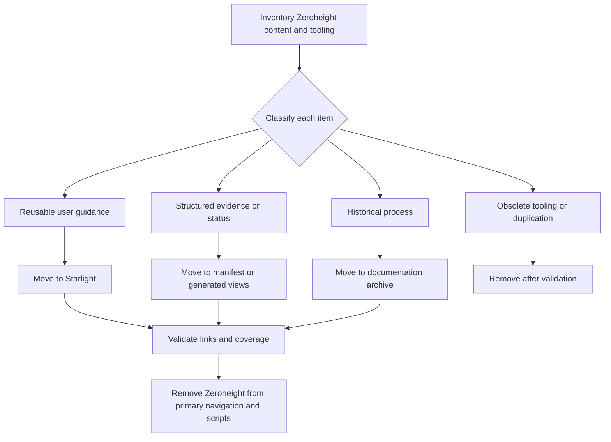
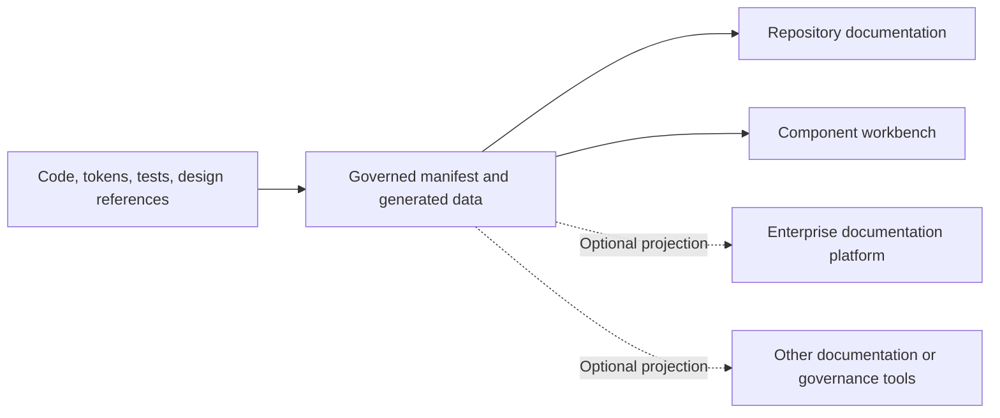

# Zeroheight Retirement Strategy

## Objective

Retire Zeroheight as the canonical public documentation surface without discarding the useful governance, content-organization, and tooling lessons produced during the experiment.

Zeroheight should become:

- an optional historical reference;
- a documentation-platform case study;
- an archived export and publication experiment;
- evidence of familiarity with enterprise documentation workflows.

It should no longer be:

- required to understand the design system;
- required to publish component guidance;
- the primary owner of lifecycle and evidence status;
- a runtime dependency;
- a prominent part of the public product identity.

## Why retire it as the center

### Product economics

A paid hosted documentation platform is difficult to justify for a single-team design-system reference when the strongest integrations may require higher-tier access.

### Engineering value

A repository-owned documentation portal demonstrates more of the relevant work:

- architecture;
- content modeling;
- generated data projections;
- pull-request review;
- source-controlled guidance;
- integration with Storybook, tokens, tests, and the manifest.

### Source-control alignment

Starlight content can evolve in the same pull request as:

- Angular component changes;
- Storybook stories;
- token changes;
- manifest metadata;
- tests;
- decision records.

### Reduced duplication

A manifest-driven Starlight site can project status and evidence directly rather than requiring repeated manual updates in a separate SaaS workspace.

## What Zeroheight proved

Preserve the useful lessons:

- documentation needs clear audience separation;
- component pages need usage, design, development, and validation information;
- live Storybook examples are more useful than screenshot-only pages;
- lifecycle status must be visible;
- Figma, code, Storybook, tests, and governance need explicit source-of-truth boundaries;
- documentation quality is a product-design problem, not only a writing problem;
- QA evidence should support guidance rather than dominate it.

## Content migration map

| Zeroheight-era content | Target location |
| --- | --- |
| Component overview | Starlight component page |
| Usage guidance | Starlight component page |
| Design and token guidance | Starlight plus generated token tables |
| Developer API | Starlight summary plus Storybook/API extraction |
| Validation evidence | Manifest-driven quality panel |
| Lifecycle status | Component manifest |
| Figma link | Manifest design-reference fields and component page |
| Storybook link/embed | Starlight `StoryFrame` |
| Promotion blockers | Manifest plus decision record |
| Ownership | Manifest governance fields |
| Page assembly instructions | Archive |
| Zeroheight publish scripts | Tooling archive |

## Retirement workflow



## Recommended archive structure

```text
docs/archive/zeroheight/
├── README.md
├── up-button-page-plan.md
├── governance-model.md
├── export-format-notes.md
└── migration-map.md

tools/archive/zeroheight/
├── export-zeroheight-package.mjs
├── publish-zeroheight-package.mjs
└── README.md
```

The archive README should explain:

- why the experiment existed;
- what it demonstrated;
- why it was replaced;
- which current documentation supersedes it;
- that the scripts are not part of the supported workflow.

## Script migration

### Current tool-specific concepts

- `zeroheight:export`
- `zeroheight:publish`
- report commands that call Zeroheight publication
- environment variables used only by the publication bridge

### Target neutral concepts

Potential replacements:

```json
{
  "docs:build": "nx build docs",
  "docs:validate": "nx run docs:check",
  "docs:preview": "nx serve docs",
  "evidence:generate": "node scripts/generate-documentation-data.mjs",
  "quality:report": "node scripts/generate-quality-summary.mjs",
  "report:all": "pnpm verify:smoke && pnpm evidence:generate"
}
```

The exact commands should follow the final Nx targets. The key change is that publication no longer assumes one external product.

## Page migration priority

### First

Migrate the Button material because it is the most developed and exposes the current presentation problems.

Split it into:

- Button component guidance;
- Button Contract Exploration;
- Button design-to-code alignment;
- Button accessibility evidence;
- Button decision record.

### Second

Migrate system-level governance material:

- source-of-truth boundaries;
- component lifecycle;
- promotion model;
- ownership roles;
- evidence requirements.

These should be driven by the manifest contract rather than a Zeroheight page template.

### Third

Archive page-composition instructions, screenshots, publication notes, and subscription limitations.

## Public wording

### Avoid

- “Zeroheight is the governed documentation destination.”
- “The component is blocked until Zeroheight is configured.”
- “Enterprise access is required before documentation can be complete.”

### Prefer

- “The repository-owned documentation site is the public guidance surface.”
- “The component manifest records lifecycle, evidence, design references, and blockers.”
- “External documentation platforms may project the same governed data when an organization chooses to use them.”

## Preserve tool-neutral architecture

The final documentation architecture should allow an organization to add Zeroheight later without redesigning the system.



Zeroheight becomes one possible projection, not the authority.

## Retirement stages

### Stage 1 — Deprecate publicly

- remove Zeroheight from primary navigation;
- point visitors to Starlight;
- retain existing links temporarily;
- mark Zeroheight pages as historical or superseded where possible.

### Stage 2 — Replace scripts

- add neutral docs and evidence generation commands;
- remove Zeroheight calls from default report workflows;
- keep archive scripts available for reference only.

### Stage 3 — Migrate metadata

- move lifecycle and evidence status into the manifest;
- move design references into manifest Figma fields;
- generate quality and status views in Starlight.

### Stage 4 — Archive content

- archive page plans and governance notes;
- remove local-path and assignment-specific language;
- retain a concise case study.

### Stage 5 — Remove obsolete dependencies

- remove unused environment variables;
- remove dead publication code;
- update link checks;
- update README and contribution guidance;
- verify the complete release gate.

## Balanced product explanation

Use this framing in interviews:

> Zeroheight was useful for exploring how designers, developers, QA, accessibility, and governance audiences might consume one component record. For the public design-system experience, I moved the canonical guidance into a repository-owned Starlight application so the documentation can be reviewed and versioned with the Angular components, Storybook stories, tokens, tests, and manifest metadata. The architecture still allows Zeroheight or another enterprise platform to consume the same governed data later.

## Retirement acceptance criteria

- [ ] Starlight contains the useful component and governance guidance.
- [ ] Lifecycle and evidence status are manifest-owned.
- [ ] Figma identifiers and alignment status are manifest-owned.
- [ ] Zeroheight is absent from primary public navigation.
- [ ] Default report and release commands do not require Zeroheight.
- [ ] Historical scripts and page plans are archived or removed intentionally.
- [ ] Superseding documentation links are clear.
- [ ] The architecture remains compatible with an optional future enterprise documentation projection.
