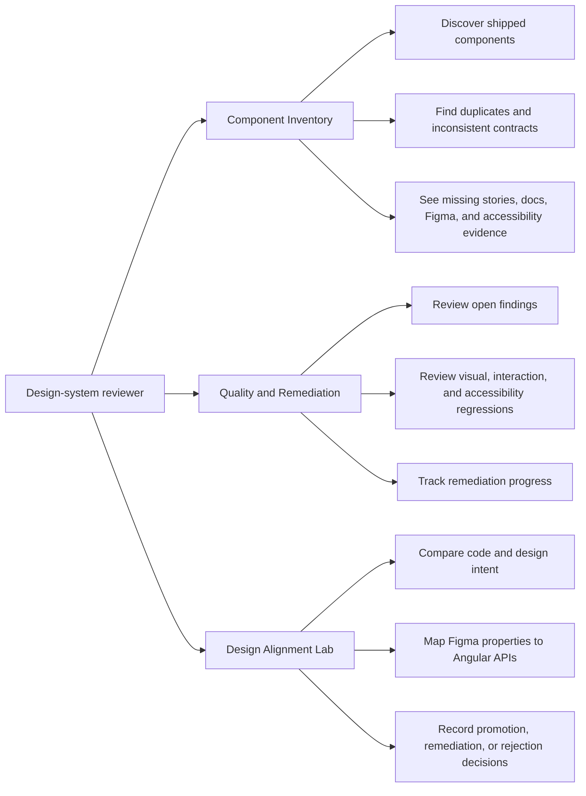
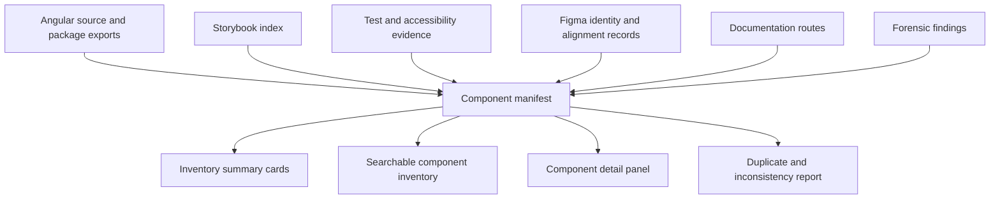
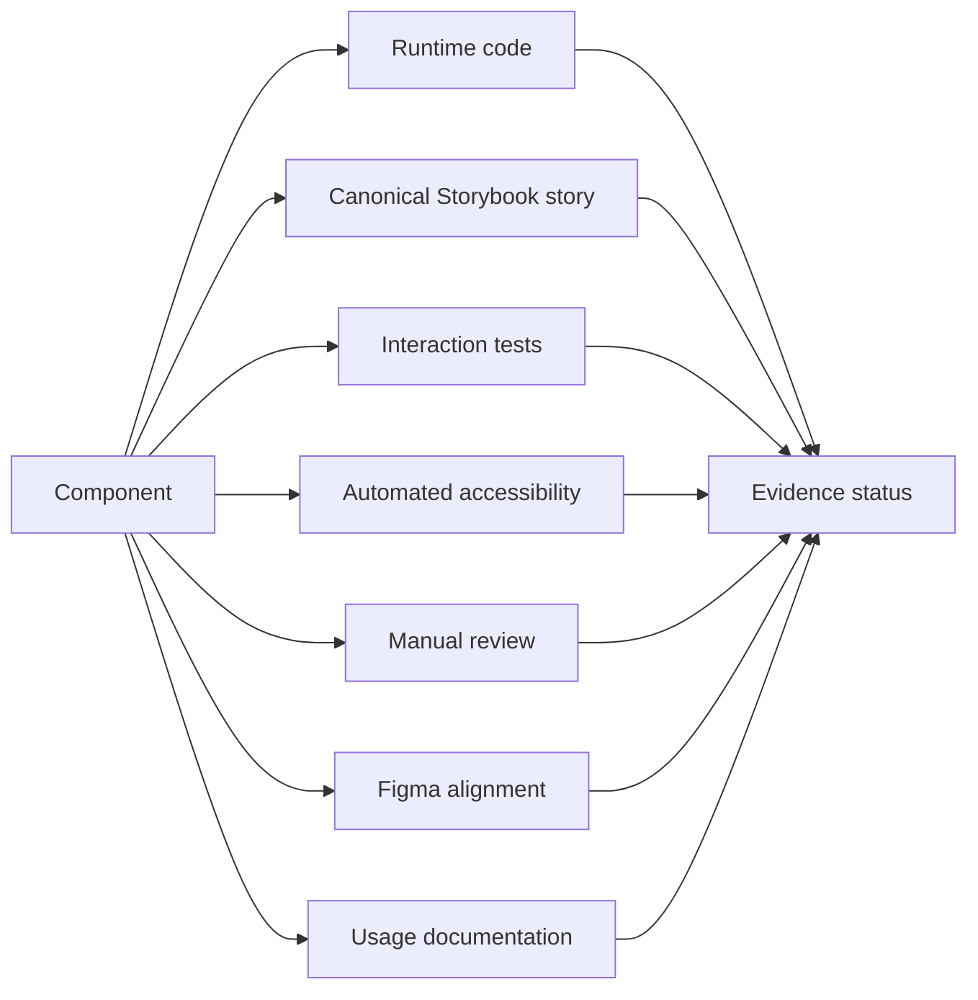
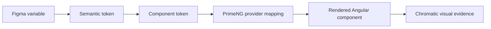
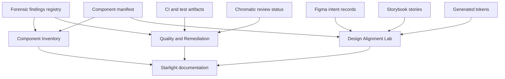
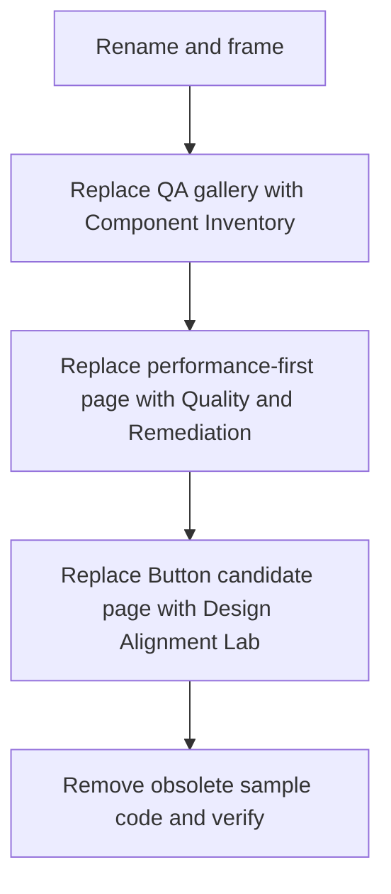

# Main Application Three-View Upgrade

## Purpose

The current `qa-remote` application contains three top-level views:

1. **QA Components**;
2. **Performance Tracking**;
3. **Candidates**.

These views contain valuable implementation and testing work, but they currently present too many generic sample components and too much internal QA language. The result feels like a component demonstration and test harness rather than a focused design-system exploration product.

The upgraded application should become a small, intentional workbench for the mission of a forensic design-systems engineer:

- discover what components already exist;
- expose duplication and inconsistent contracts;
- evaluate Storybook coverage;
- identify accessibility and design-alignment gaps;
- compare shipped code with proposed design intent;
- track remediation and promotion decisions;
- give designers a reliable code-informed basis for rebuilding Figma components.

This plan upgrades the existing three-view structure rather than replacing the application.

---

## Target view model

| Current view | Target view | Primary question |
| --- | --- | --- |
| QA Components | **Component Inventory** | What exists, what is duplicated, and what evidence is missing? |
| Performance Tracking | **Quality & Remediation** | What is broken, risky, regressing, or waiting for remediation? |
| Candidates | **Design Alignment Lab** | How should shipped code, Figma intent, tokens, and public APIs converge? |

---

# View 1 — Component Inventory

## Mission

The Component Inventory replaces the broad **QA Components** gallery.

It should answer:

- Which public components currently ship?
- Which components have overlapping purposes or duplicate contracts?
- Which selectors and APIs are inconsistent?
- Which components have a canonical Storybook story?
- Which components have documentation, accessibility, testing, and Figma evidence?
- Which provider boundaries are clean and which leak implementation details?

This is the most direct match to the position's problem statement: designers cannot reliably see what exists, engineers reimplement primitives, and accessibility issues remain hidden.

## Remove or relocate

Remove these from the primary Inventory page:

- large matrices of every Button treatment;
- repeated Tag severity samples;
- generic metric Cards;
- generic long-content Cards;
- sample empty-state Cards;
- generic sortable program tables;
- direct federation-readiness tables;
- duplicate dialog and toast demonstrations;
- large collections of unrelated primitives shown only to prove that they render.

These examples are not deleted. Move them to one of:

- canonical Storybook stories;
- component detail pages;
- pattern pages;
- integration-test fixtures;
- an archived visual-contract route when a browser-level test still depends on them.

The main view should not be a wall of samples.

## New primary components

### 1. Inventory summary

Use compact status cards for meaningful system information:

- total public components;
- stable, beta, experimental, deprecated counts;
- components without canonical stories;
- components without manual accessibility review;
- components without Figma alignment;
- components with provider-boundary warnings;
- suspected duplicate or overlapping contracts.

These cards should be generated from the manifest, not hand-authored.

### 2. Searchable component table

The core of the page should be a searchable and filterable inventory.

Recommended columns:

| Column | Meaning |
| --- | --- |
| Component | Public human-readable name |
| Purpose | One-sentence responsibility |
| Lifecycle | Stable, Beta, Experimental, Deprecated |
| Provider | Native, PrimeNG adapter, Composite, Service |
| Storybook | Canonical story status |
| Accessibility | Automated and manual status |
| Figma | Alignment status |
| Documentation | Page status |
| Findings | Number and severity of open findings |

Recommended filters:

- category;
- lifecycle;
- provider;
- missing Storybook;
- missing accessibility review;
- missing Figma alignment;
- open blockers;
- possible duplicate responsibility.

### 3. Component detail panel

Selecting a component should reveal a focused detail panel or drawer with:

- purpose and intended use;
- selector and package export;
- public API summary;
- provider boundary;
- canonical Storybook link;
- documentation route;
- Figma identity and alignment;
- accessibility contract and evidence;
- known findings;
- related or potentially overlapping components;
- recommended next action.

### 4. Duplicate and inconsistency findings

Add a dedicated section for findings such as:

- `ps-button` and `ps-up-button` overlap;
- mixed selector prefixes (`ps-*` and `public-*`);
- broad style escape hatches;
- direct provider concepts in public APIs;
- components with similar names or responsibilities;
- components present in code but absent from design or Storybook;
- Figma components without code counterparts.

## Inventory data flow

## Evidence produced

This view demonstrates that Jeffrey can:

- inventory an existing design system;
- distinguish shipped code from claimed design assets;
- expose documentation and accessibility gaps honestly;
- reduce duplicate engineering work;
- create a shared discovery artifact for designers and engineers.

---

# View 2 — Quality & Remediation

## Mission

The Quality & Remediation view replaces the generic **Performance Tracking Dashboard**.

Raw test-duration and browser timing information is useful operationally, but it is not the strongest primary story for this role. The upgraded view should focus on design-system quality signals and the remediation queue.

It should answer:

- What design-system problems are open now?
- Which findings are blocking promotion?
- Which components regressed visually or behaviorally?
- Where is accessibility evidence incomplete?
- Which issues are improving, stable, or worsening?
- What was fixed and how was it verified?

## Retain but reframe

Retain performance data only where it supports a design-system quality decision, such as:

- Storybook build health;
- interaction-test duration regressions that indicate unstable tests;
- visual test completion;
- documentation build status;
- accessibility scan completion;
- release-gate duration as an operational secondary metric.

Move detailed browser duration tables and general suite timing below the main remediation content or into a technical diagnostics subsection.

## New primary components

### 1. Quality scorecard

Recommended scorecard metrics:

- open critical findings;
- open accessibility blockers;
- visual regressions awaiting review;
- components missing interaction tests;
- components missing canonical stories;
- Figma/code alignment gaps;
- provider-boundary violations;
- documentation drift warnings.

### 2. Remediation queue

Create a prioritized findings table.

Recommended columns:

| Column | Meaning |
| --- | --- |
| Finding | Concise problem statement |
| Component | Affected component or system area |
| Dimension | Accessibility, API, Visual, Design, Docs, Provider, Test |
| Severity | Critical, High, Medium, Low |
| Status | Open, In progress, Verification, Resolved, Deferred |
| Evidence | Story, test, screenshot, source, or Figma link |
| Recommended action | Next remediation step |

### 3. Before-and-after remediation cases

Show a small number of high-value cases rather than many generic samples.

Each case should contain:

- observed problem;
- user or team impact;
- shipped-code evidence;
- design evidence;
- remediation decision;
- implementation change;
- verification evidence;
- remaining limitation.

Recommended first cases:

1. Button API consolidation;
2. Select overlay and accessible naming;
3. Dialog focus behavior;
4. selector-prefix normalization;
5. missing Storybook story remediation.

### 4. Evidence coverage

Display coverage by dimension, not as one misleading completeness percentage.

### 5. Technical diagnostics

Keep existing performance charts and suite metrics here as a collapsible or secondary area:

- suite duration;
- browser variance;
- baseline comparison;
- flaky or slow test signals;
- release-gate trends.

This preserves the existing work without allowing it to dominate the mission.

## Evidence produced

This view demonstrates that Jeffrey can:

- convert broad QA output into an actionable remediation program;
- prioritize accessibility and user-impact findings;
- connect findings to evidence;
- verify that remediation actually worked;
- communicate quality honestly without overstating conformance.

---

# View 3 — Design Alignment Lab

## Mission

The Design Alignment Lab replaces the narrow **Candidates** page.

The current page is dominated by one UP Button comparison and repeated promotion disclaimers. The upgraded view should become a reusable space for reconciling shipped code, design intent, tokens, Storybook behavior, and proposed public contracts.

It should answer:

- What does the shipped component currently do?
- What does the Figma component intend?
- Where do anatomy, states, variants, tokens, naming, and accessibility expectations differ?
- Should the code be remediated, the design be corrected, both be changed, or the proposal be rejected?
- What evidence is required before alignment or promotion?

## Remove or reduce

Remove or reduce:

- repeated UP-specific language;
- repeated statements that only Button is in scope;
- public dependence on Zeroheight;
- neutral, vibrant, and pastel theme matrices unless those themes remain product requirements;
- long side-by-side matrices of every Button state;
- repeated lifecycle and publication tables;
- repeated evidence cards that duplicate the manifest dashboard;
- local Storybook startup instructions in the public view.

Use light and dark mode as the primary theme comparison unless additional themes represent a deliberate design-system capability.

## New page structure

### 1. Component selector

Allow the reviewer to choose a flagship alignment case:

- Button;
- Select;
- Dialog.

Future cases can be added without changing the view architecture.

### 2. Alignment summary

For the selected component, display:

- code lifecycle;
- Figma lifecycle;
- overall alignment status;
- current public selector;
- canonical Storybook story;
- open blockers;
- recommended decision.

### 3. Live implementation

Embed or render the canonical Storybook implementation.

Allow controlled comparison of meaningful states only:

- default;
- hover or focus visual intent;
- disabled;
- loading where applicable;
- invalid where applicable;
- destructive or confirmation use where applicable;
- light and dark.

### 4. Anatomy comparison

Compare the Figma anatomy with the rendered DOM and Angular component structure.

| Design anatomy | Code structure | Status | Decision |
| --- | --- | --- | --- |
| Container | Host or provider element | Aligned | None |
| Label | Projected or input text | Aligned | None |
| Leading icon | Provider icon span | Partial | Normalize naming |
| Focus indicator | CSS focus-visible ring | Partial | Align token and thickness |
| Loading indicator | Provider spinner | Divergent | Document announcement behavior |

### 5. Variant and state mapping

Map only supported design properties to public Angular APIs.

Example:

| Figma property | Figma values | Angular API | Code values | Status |
| --- | --- | --- | --- | --- |
| Intent | Primary, Secondary, Destructive | `intent` | Same | Aligned |
| Appearance | Solid, Outlined, Text | `appearance` | Same | Aligned |
| State | Default, Disabled, Loading | `disabled`, `loading` | Boolean inputs | Representational difference |
| Icon position | None, Leading, Trailing | icon inputs | Partial | Decision needed |

### 6. Token comparison

Show the token chain:

For each important token, show:

- Figma variable;
- semantic token;
- component token;
- provider variable;
- resolved light value;
- resolved dark value;
- alignment status.

### 7. Decision record

Every alignment case ends with one of:

- remediate code;
- correct Figma;
- change both through a new shared contract;
- accept an intentional implementation difference;
- reject the candidate or proposed change;
- defer pending product or accessibility decision.

The decision must include rationale and evidence.

## Evidence produced

This view demonstrates that Jeffrey can:

- reconstruct design intent from shipped code;
- give designers an honest basis for rebuilding Figma components;
- map design properties to Angular contracts without mirroring a provider API;
- distinguish visual agreement from behavioral and accessibility agreement;
- facilitate a cross-functional promotion decision.

---

# Shared application shell upgrade

## Navigation labels

Recommended labels:

- **Component Inventory**
- **Quality & Remediation**
- **Design Alignment Lab**

Avoid internal labels such as QA Remote, Performance Tracking, and Candidates in the public application navigation.

## Page header

Add a shared application header containing:

- product name;
- concise purpose;
- links to Documentation, Storybook, and Source;
- current release or commit identifier;
- light/dark control;
- a clear notice when data is sample or generated.

## Shared components

The application should rely on a small set of meaningful shared patterns:

- status summary cards;
- searchable data table;
- filter bar;
- finding severity tag;
- evidence link group;
- component detail panel;
- alignment comparison table;
- remediation case card;
- decision record;
- empty, loading, and error states.

Do not add components simply to increase the visible catalog.

## Responsive behavior

- Summary cards wrap cleanly.
- Tables provide meaningful narrow-screen alternatives.
- Detail panels become full-screen dialogs on small screens.
- Evidence links remain keyboard accessible.
- Storybook embeds have an external-link fallback.
- No information is communicated by color alone.

---

# Data ownership

## Source-of-truth rule

The application is a projection and workbench. It must not become a second manually maintained truth source.

- component identity and lifecycle come from the manifest;
- runtime behavior comes from Angular and Storybook;
- automated evidence comes from CI and test artifacts;
- Figma identity and design alignment come from governed alignment records;
- public guidance belongs in Starlight;
- the application assembles these sources into reviewable views.

---

# Migration strategy

## Stage 1 — Rename and frame

- rename the public navigation labels;
- add the shared application header;
- replace QA language with discovery, quality, and alignment language;
- preserve existing view components temporarily behind the new labels.

## Stage 2 — Inventory replacement

- build the manifest-driven summary;
- build the searchable component inventory;
- add a detail panel;
- move generic sample matrices to Storybook or test fixtures;
- add duplicate and inconsistency findings.

## Stage 3 — Quality replacement

- add the findings queue;
- add evidence coverage by dimension;
- add remediation case studies;
- move current timing dashboards under Technical Diagnostics.

## Stage 4 — Alignment replacement

- remove UP-specific framing;
- support Button, Select, and Dialog cases;
- add Figma anatomy and property mapping;
- add token-chain comparison;
- add decision records.

## Stage 5 — Cleanup and verification

- remove obsolete duplicate tab controls inside `QaRemoteComponent`;
- remove sample-only code no longer used by stories or tests;
- update Playwright coverage around the new view missions;
- update manifest and documentation links;
- perform accessibility and responsive review;
- confirm no SitePen, UP, or Zeroheight-specific language remains on the primary views.

---

# Acceptance criteria

## Component Inventory

- A visitor can discover every public component from one searchable view.
- Duplicate and overlapping contracts are visible.
- Storybook, accessibility, documentation, Figma, and provider-boundary status are independently visible.
- Generic component samples no longer dominate the page.
- Component information is projected from the manifest.

## Quality & Remediation

- Open findings are prioritized by severity and user impact.
- Accessibility, visual, API, provider, documentation, and design findings are distinguishable.
- At least three before-and-after remediation cases are visible.
- Technical performance metrics remain available but secondary.
- Resolved findings include verification evidence.

## Design Alignment Lab

- Button, Select, and Dialog can be selected as alignment cases.
- Each case compares Figma intent, public Angular API, rendered behavior, tokens, and accessibility expectations.
- Each case ends with a documented decision.
- UP and Zeroheight are not required to understand the view.
- Light and dark coverage is available without unrelated theme clutter.

## Whole application

- The three views tell one coherent forensic design-systems story.
- Visible components serve the mission of the page rather than acting as generic samples.
- The application is understandable to designers, engineers, accessibility specialists, and hiring reviewers.
- Existing useful tests and technical evidence are preserved or relocated before sample code is deleted.
