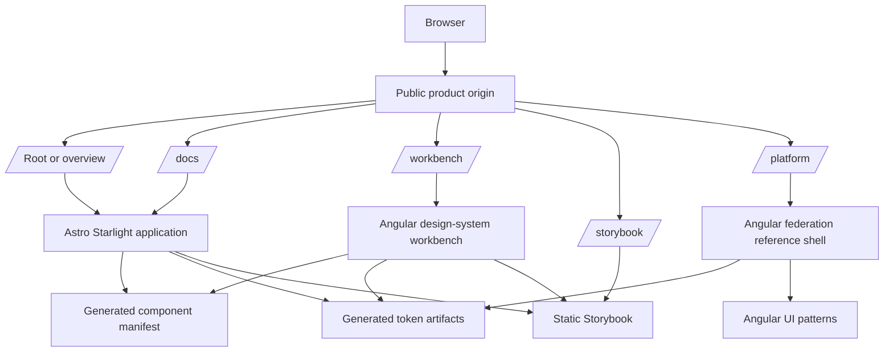
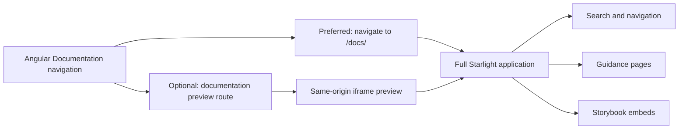
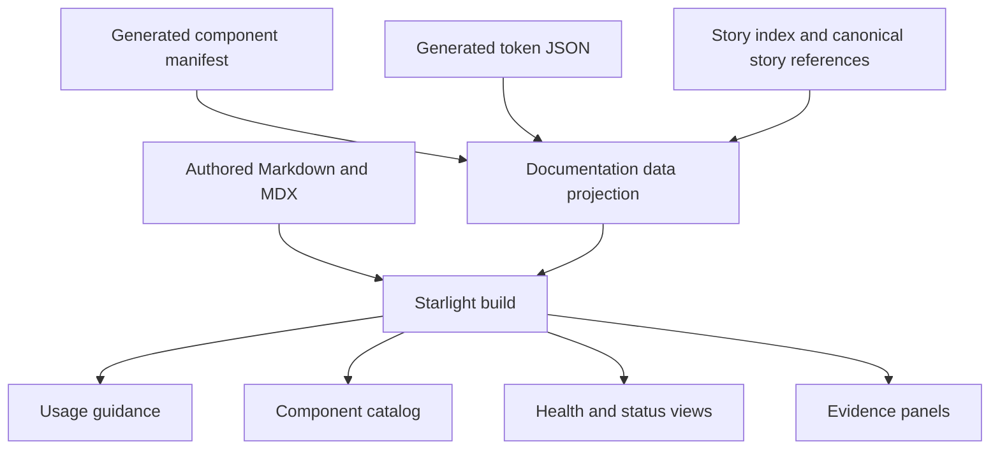
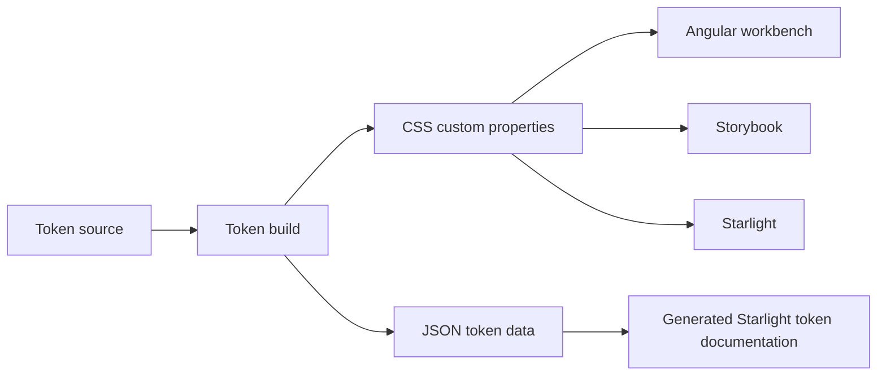
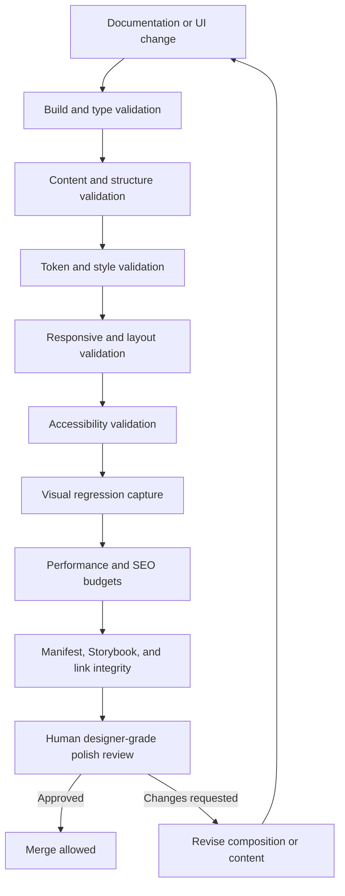
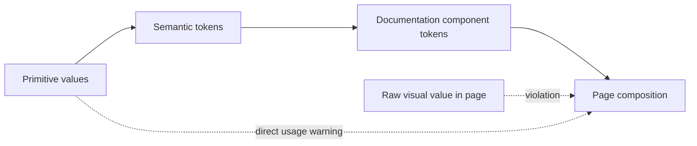
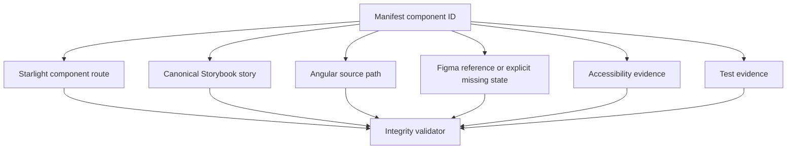
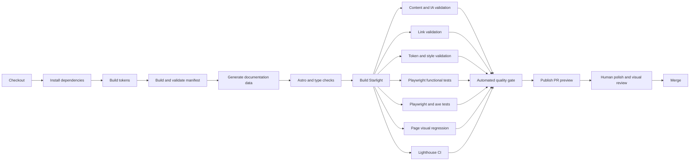

# Astro Starlight Application and Designer-Grade Quality Gate

## Decision summary

Astro Starlight must be implemented as a **real application inside the Nx workspace**, not as a loose collection of Markdown files and not as content assembled manually inside another documentation product.

The target project is:

```text
apps/starlight
```

The Starlight application will:

- build independently;
- have its own Nx project targets;
- own the public documentation routes;
- consume generated manifest and token data;
- embed canonical Storybook stories;
- share the design-system tokens and visual language;
- publish as a static application;
- appear as a first-class area of the same public product as the Angular workbench.

The Angular application and Starlight should feel like one coherent product, but they should remain separate framework applications.

> **Product-level integration does not require framework-level embedding.**

The preferred production model is to mount Starlight at `/docs/` on the same public origin and link to it from the Angular application. A thin Angular documentation gateway route may navigate to `/docs/`, but Angular should not attempt to compile or own Astro pages.

An iframe-based Starlight preview can exist as an optional demonstration route, but it should not be the canonical documentation experience.

---

# 1. North-star relationship

The Starlight application exists to support the larger north star:

> Transform the repository into a believable design-system product that shows how an engineer discovers what actually ships, exposes gaps and duplication, reconciles design with code, remediates problems, and proves the result in real Angular applications.

Starlight is not the product by itself. It is the primary **guidance and discovery surface** for the product.

It should answer:

- What is this design system?
- Which components exist?
- Which component should I use?
- How should it be used?
- What is stable, experimental, deprecated, incomplete, or blocked?
- What do the design tokens mean?
- How does the component behave in Storybook?
- What accessibility work is complete or pending?
- How closely does the code align with Figma intent?
- What was discovered and remediated in the existing implementation?
- Where can I inspect source, tests, design references, and decisions?

It should not become another evidence warehouse, giant dashboard, or wall of disconnected components.

---

# 2. Application boundary

## 2.1 Recommended repository layout

```text
public-sector-federation/
├── apps/
│   ├── starlight/                    # Astro Starlight documentation application
│   │   ├── astro.config.mjs
│   │   ├── project.json
│   │   ├── package.json              # Only if project-local dependencies are required
│   │   ├── public/
│   │   ├── src/
│   │   │   ├── assets/
│   │   │   ├── components/
│   │   │   ├── content/
│   │   │   │   └── docs/
│   │   │   ├── data/
│   │   │   ├── layouts/
│   │   │   ├── pages/
│   │   │   ├── styles/
│   │   │   └── content.config.ts
│   │   └── tests/
│   │       ├── accessibility/
│   │       ├── content/
│   │       ├── e2e/
│   │       ├── visual/
│   │       └── fixtures/
│   ├── qa-remote/                    # Internally retained name during migration
│   ├── shell/
│   ├── services-remote/
│   ├── reporting-remote/
│   ├── admin-remote/
│   └── agile-api/
├── packages/
│   ├── tokens/
│   ├── primeng-preset/
│   ├── ui-patterns/
│   ├── component-manifest/
│   └── documentation-data/
├── tools/
│   ├── docs/
│   │   ├── validate-content.mjs
│   │   ├── validate-design-polish.mjs
│   │   ├── validate-links.mjs
│   │   ├── validate-manifest-links.mjs
│   │   └── generate-docs-data.mjs
│   └── archive/
└── docs/
    ├── documentation-upgrade/
    └── archive/
```

The internal project may be named `starlight` even though the public route is `/docs/`.

That naming makes the architectural boundary obvious:

- **Starlight** is the application technology;
- **Documentation** is the public product area.

## 2.2 Deployment topology



A reverse proxy or static deployment router should mount each build output at its intended path.

## 2.3 Angular integration

The Angular workbench should include a visible **Documentation** navigation item.

Preferred behavior:

```text
Angular /workbench/ → Documentation link → /docs/
```

This is a same-origin product transition. It may perform a normal browser navigation because Starlight owns the target route.

A thin Angular route can exist when route continuity is useful:

```text
/workbench/documentation → DocumentationGatewayComponent → /docs/
```

The gateway should:

- explain that documentation is opening;
- preserve a normal anchor target for accessibility;
- navigate using a standard link or `window.location.assign()`;
- avoid copying Starlight navigation or page content into Angular;
- avoid turning documentation into an Angular runtime dependency.

### Optional embedded preview

An optional route may embed Starlight in an iframe for a portfolio walkthrough or internal demonstration:

```text
/workbench/documentation-preview
```

This preview must not become the canonical public route.

When used, it requires:

- a meaningful iframe title;
- same-origin hosting;
- a visible “Open full documentation” link;
- no hidden keyboard traps;
- explicit height and overflow handling;
- responsive testing;
- independent accessibility testing of the actual Starlight pages;
- no assumption that parent-page axe checks can fully audit the iframe contents.



## 2.4 Why Starlight should not be rendered as Angular content

Attempting to make Angular directly render Astro output would create unnecessary complexity:

- duplicated routing responsibilities;
- duplicated application shells;
- conflicting asset paths;
- hydration and lifecycle confusion;
- harder independent builds;
- harder local development;
- nested navigation and focus behavior;
- weaker search and static-site behavior;
- a tighter coupling between the design-system workbench and documentation platform;
- harder deployment and rollback.

The goal is one product experience, not one JavaScript runtime.

---

# 3. Nx application targets

The `apps/starlight/project.json` should expose clear, composable targets.

Illustrative structure:

```json
{
  "name": "starlight",
  "projectType": "application",
  "sourceRoot": "apps/starlight/src",
  "targets": {
    "serve": {
      "executor": "nx:run-commands",
      "options": {
        "command": "astro dev",
        "cwd": "apps/starlight"
      }
    },
    "build": {
      "executor": "nx:run-commands",
      "outputs": ["{workspaceRoot}/dist/apps/starlight"],
      "options": {
        "command": "astro build",
        "cwd": "apps/starlight"
      }
    },
    "preview": {
      "executor": "nx:run-commands",
      "options": {
        "command": "astro preview",
        "cwd": "apps/starlight"
      }
    },
    "check": {
      "executor": "nx:run-commands",
      "options": {
        "command": "astro check",
        "cwd": "apps/starlight"
      }
    },
    "test-content": {
      "executor": "nx:run-commands",
      "options": {
        "command": "node tools/docs/validate-content.mjs"
      }
    },
    "test-links": {
      "executor": "nx:run-commands",
      "options": {
        "command": "node tools/docs/validate-links.mjs"
      }
    },
    "test-e2e": {
      "executor": "nx:run-commands",
      "options": {
        "command": "playwright test --project=starlight-e2e"
      }
    },
    "test-accessibility": {
      "executor": "nx:run-commands",
      "options": {
        "command": "playwright test --project=starlight-a11y"
      }
    },
    "test-visual": {
      "executor": "nx:run-commands",
      "options": {
        "command": "playwright test --project=starlight-visual"
      }
    },
    "test-polish": {
      "executor": "nx:run-commands",
      "options": {
        "command": "node tools/docs/validate-design-polish.mjs"
      }
    },
    "lighthouse": {
      "executor": "nx:run-commands",
      "options": {
        "command": "lhci autorun --config=apps/starlight/lighthouserc.cjs"
      }
    },
    "quality-gate": {
      "executor": "nx:run-commands",
      "dependsOn": [
        "build",
        "check",
        "test-content",
        "test-links",
        "test-e2e",
        "test-accessibility",
        "test-visual",
        "test-polish",
        "lighthouse"
      ],
      "options": {
        "command": "node -e \"console.log('Starlight quality gate passed')\""
      }
    }
  }
}
```

The exact executor structure may change based on the chosen Nx Astro integration. The important contract is the target vocabulary and release behavior.

Primary developer command:

```powershell
pnpm nx serve starlight
```

Primary local gate:

```powershell
pnpm nx run starlight:quality-gate
```

Release integration:

```powershell
pnpm verify:release
```

`verify:release` should include `starlight:quality-gate` before publication.

---

# 4. Starlight content architecture

## 4.1 Public route model

```text
/docs/
├── overview/
├── foundations/
│   ├── color/
│   ├── typography/
│   ├── spacing/
│   ├── shape/
│   ├── elevation/
│   ├── motion/
│   ├── themes/
│   └── tokens/
├── components/
│   ├── button/
│   ├── select/
│   ├── dialog/
│   └── ...
├── patterns/
├── accessibility/
├── develop/
├── quality/
├── architecture/
└── exploration/
```

## 4.2 Content collections and schemas

Content should be modeled with structured frontmatter rather than unconstrained Markdown.

Recommended component-page frontmatter:

```yaml
title: Button
description: Triggers an immediate action or submits a user decision.
category: Actions
lifecycle: stable
canonicalStoryId: components-actions-button--default
manifestId: button
figmaStatus: partial
accessibilityStatus: automated-pass-manual-pending
owner: design-system
lastReviewed: 2026-07-18
```

The content schema should validate:

- required title;
- concise description;
- supported category;
- known lifecycle value;
- valid manifest identifier;
- valid Storybook story identifier format;
- explicit Figma status;
- explicit accessibility status;
- last-reviewed date;
- optional owner;
- optional deprecation and replacement details.

A page should fail the build when required metadata is invalid.

## 4.3 Generated versus authored content



Human-authored content should own:

- purpose;
- usage guidance;
- content guidance;
- accessibility expectations;
- design rationale;
- decisions and tradeoffs;
- remediation narrative.

Generated data should own:

- lifecycle badges;
- component identifiers;
- Storybook links;
- source links;
- test status;
- automated accessibility status;
- Figma identifiers and alignment status;
- token tables;
- known blockers;
- completeness and gap summaries.

Do not copy manifest data manually into multiple Markdown pages.

---

# 5. Visual design strategy

## 5.1 Use Starlight as a foundation, not as an unbounded canvas

Starlight already supplies a coherent documentation structure, responsive navigation, local search, light and dark modes, code rendering, and component override points.

The design should customize Starlight deliberately rather than replace every default surface.

Recommended customization areas:

- product mark and title;
- typography tokens;
- semantic colors;
- navigation emphasis;
- content width;
- hero treatment;
- component status presentation;
- Storybook frames;
- anatomy figures;
- token tables;
- accessibility and finding panels;
- footer and source links.

Avoid:

- a custom card for every paragraph;
- excessive shadows;
- multiple competing accent colors;
- status chips on every line;
- deeply nested panels;
- decorative illustrations without information value;
- manually styled one-off page layouts;
- pages that begin with dense evidence tables;
- giant dashboards inside documentation guidance.

## 5.2 Shared design tokens

Starlight should consume the same generated semantic tokens as the Angular applications.



Custom Starlight styles should prefer design-system variables:

```css
.component-header {
  color: var(--color-text-primary);
  background: var(--color-surface-default);
  border: 1px solid var(--color-border-subtle);
  border-radius: var(--radius-container);
  padding: var(--space-6);
}
```

Raw colors, unrelated spacing values, and page-specific visual inventions should be treated as quality-gate violations unless explicitly approved.

## 5.3 Reusable presentation components

Create a small, governed set:

- `ComponentHeader`
- `StoryFrame`
- `StatusBadge`
- `EvidencePanel`
- `AccessibilityStatus`
- `TokenTable`
- `AnatomyFigure`
- `FindingCard`
- `DecisionRecord`
- `LightDarkPreview`
- `ComponentHealthTable`
- `Callout`

Each component must have:

- one documented purpose;
- a restricted public API;
- light and dark examples;
- responsive behavior;
- accessibility checks;
- visual snapshots;
- usage guidance;
- density limits.

Creating another generic card component should require a demonstrated gap in the existing set.

---

# 6. Designer-grade quality gate

## 6.1 What the gate can and cannot guarantee

Automation can reliably detect:

- broken builds;
- malformed content;
- invalid links;
- missing required metadata;
- unexpected visual changes;
- responsive overflow;
- inaccessible markup patterns caught by automated tools;
- missing focus states;
- incorrect heading structure;
- raw color and spacing drift;
- performance regressions;
- missing images and iframe titles;
- inconsistencies between manifest, Storybook, and documentation references.

Automation cannot reliably decide whether:

- a composition feels elegant;
- the information hierarchy is persuasive;
- the page contains too much conceptual noise;
- the typography feels balanced;
- an intentional visual change is better;
- the design communicates the product story strongly enough.

Therefore the gate must combine:

1. automated validation;
2. visual regression review;
3. an explicit human polish review.



## 6.2 Gate 1 — Build and framework correctness

Required checks:

- Astro build succeeds;
- `astro check` succeeds;
- TypeScript validation succeeds;
- Nx dependency graph remains valid;
- generated documentation data is current;
- no unexpected console errors occur during smoke tests;
- no missing static assets occur;
- production base path works under `/docs/`.

Failure policy: blocking.

## 6.3 Gate 2 — Content structure and information architecture

Automated checks should validate:

- exactly one page-level `h1`;
- no skipped heading levels;
- required page description;
- required content schema fields;
- unique page title;
- unique route;
- valid navigation placement;
- valid manifest ID where applicable;
- canonical Storybook story reference where required;
- meaningful image alternative text;
- meaningful iframe title;
- no local machine paths;
- no employer-, person-, UP-, SitePen-, or Zeroheight-specific language in canonical pages;
- no unresolved placeholder text such as `TODO`, `TBD`, or `lorem ipsum` in public routes;
- no duplicate introductory disclaimer blocks;
- no direct copying of generated manifest fields into authored content when a projection component exists.

Recommended content-density warnings:

- introductory description longer than approximately 240 characters;
- more than one full-width warning before the first example;
- more than three consecutive callouts;
- more than four status badges in one visual row;
- more than one large evidence table before usage guidance;
- a component page with no live example near the top;
- sections exceeding an agreed word-count threshold without subheadings;
- pages with excessive repeated terms such as “candidate,” “pending,” or “not production.”

Warnings should not always block, but they must be visible in the PR artifact.

## 6.4 Gate 3 — Token and styling discipline

Create a design-style validator that checks Starlight source styles for:

- unapproved hex, RGB, HSL, or named colors;
- raw spacing values outside an approved exception list;
- unapproved font families;
- unapproved font sizes;
- arbitrary border radii;
- arbitrary box shadows;
- inline style attributes;
- `!important` outside documented framework override files;
- direct provider variables where semantic design-system tokens exist;
- page-local styles that duplicate a reusable documentation component;
- overly broad global selectors;
- fixed heights likely to clip content;
- transitions that ignore reduced-motion preferences.

Suggested rule hierarchy:



A small exception file may exist, but every exception should include:

- selector or file;
- reason;
- owner;
- review date;
- intended removal or permanent justification.

## 6.5 Gate 4 — Responsive composition

Playwright should validate representative public pages at minimum widths:

- 360 px mobile;
- 768 px tablet;
- 1024 px compact desktop;
- 1280 px desktop;
- 1440 px wide desktop.

Required assertions:

- no horizontal page overflow;
- no clipped headings or code blocks;
- no overlapping navigation;
- no unreadable nested scrolling;
- no tables extending beyond their intended scroll containers;
- no floating controls covering text;
- no empty layout columns;
- no card rows with unusably narrow cards;
- mobile navigation opens, closes, and returns focus appropriately;
- table of contents remains usable;
- Storybook frames fit or expose a full-view fallback;
- light and dark appearances both remain legible;
- browser zoom at 200% does not remove required content or actions.

Representative screenshot matrix:

| Page | 360 | 768 | 1280 | Light | Dark |
| --- | --- | --- | --- | --- | --- |
| Overview | Required | Required | Required | Required | Required |
| Component catalog | Required | Required | Required | Required | Required |
| Button | Required | Optional | Required | Required | Required |
| Select | Required | Optional | Required | Required | Required |
| Dialog | Required | Optional | Required | Required | Required |
| Accessibility overview | Required | Optional | Required | Required | Required |
| Quality dashboard | Required | Required | Required | Required | Required |
| Exploration case study | Required | Optional | Required | Required | Required |

## 6.6 Gate 5 — Accessibility

Automated page-level tests should use Playwright with axe against the built Starlight application.

Required automated coverage:

- landmarks;
- page language;
- heading structure;
- accessible names;
- color contrast detectable by automation;
- link names;
- form labels;
- ARIA validity;
- keyboard-reachable controls;
- focus visibility;
- dialog or drawer behavior introduced by custom components;
- iframe titles;
- reduced-motion handling;
- no keyboard traps;
- zoom and reflow smoke tests.

Playwright accessibility-tree snapshots should be considered for critical navigation and component-page structures to catch semantic regressions that visual screenshots cannot show.

Manual review remains required for:

- logical reading order;
- meaningful alternative text;
- focus order quality;
- screen-reader announcements;
- embedded Storybook usability;
- complex tables;
- cognitive density;
- motion quality;
- interpretation of Figma annotations;
- whether visual hierarchy communicates the intended purpose.

Automated results must never be labeled as complete accessibility conformance.

## 6.7 Gate 6 — Visual regression

Two visual layers are required.

### Component-level visual testing

Use Storybook and Chromatic for:

- documentation presentation components;
- component examples;
- light and dark modes;
- responsive component viewports;
- interaction states;
- accessibility regression results where enabled.

### Page-level visual testing

Use Playwright screenshots, optionally published through Chromatic's Playwright integration, for:

- complete Starlight pages;
- navigation and search;
- responsive layout;
- page-level hierarchy;
- embedded Storybook frames;
- generated catalogs;
- token tables;
- quality and exploration views.

Visual baselines must not be automatically accepted simply because a build completed.

A visual change must be:

- reviewed;
- understood;
- associated with the intended change;
- accepted by a named reviewer or explicitly approved self-review checklist;
- rejected when it increases clutter, inconsistency, or density without improving comprehension.

## 6.8 Gate 7 — Performance, stability, and SEO

Lighthouse CI should run against representative built routes.

Initial targets should be demanding but realistic:

| Category | Initial minimum | Long-term target |
| --- | ---: | ---: |
| Accessibility | 95 | 100 where automated audits are applicable |
| Best Practices | 95 | 100 |
| SEO | 95 | 100 |
| Performance | 85 | 95 |

Also set resource budgets for:

- JavaScript size;
- CSS size;
- font count and weight;
- image size;
- third-party scripts;
- total request count.

A documentation site should remain mostly static and should not accumulate unnecessary client-side JavaScript.

Required stability checks:

- no hydration warnings;
- no failed network requests;
- no layout shift caused by missing image dimensions;
- no embedded content blocking the page indefinitely;
- no search-index build failure;
- no broken canonical metadata;
- no accidental indexing of private or archived material.

## 6.9 Gate 8 — Cross-surface integrity

Validate relationships across the system:



The gate should fail when:

- a stable public component has no documentation route;
- a canonical story ID does not resolve;
- a source path is missing;
- a Figma URL is presented as approved when status is draft or missing;
- a documentation page claims evidence not represented in the manifest;
- the component lifecycle differs between manifest and public page;
- a deprecated component has no replacement guidance when replacement is required;
- a Storybook embed points to localhost in a public build.

## 6.10 Gate 9 — Human polish review

This is the essential protection against the documentation becoming a crowded evidence repository.

Every substantial visual or information-architecture change should include a **Designer-Grade Polish Review**.

Review questions:

### Purpose

- Can a first-time visitor explain the page's purpose in ten seconds?
- Does the page answer one primary question?
- Is the most important action or example obvious?

### Hierarchy

- Is there one clear visual entry point?
- Does the heading structure match the visual hierarchy?
- Are guidance and examples presented before proof and evidence?
- Is secondary evidence visually quieter than primary guidance?

### Density

- Can any card, badge, table, or callout be removed?
- Are repeated status statements consolidated?
- Are there too many bordered containers?
- Are unrelated examples competing for attention?
- Is whitespace performing a real grouping function?

### Consistency

- Does the page use existing documentation components?
- Do typography, spacing, shape, and color follow tokens?
- Does the page behave like neighboring pages?
- Are light and dark modes equally intentional?

### Design-system credibility

- Does this feel like maintained product documentation?
- Does it avoid portfolio self-promotion inside the product experience?
- Is incomplete work represented honestly without dominating the page?
- Can designers and engineers both find their next step?

### Finish quality

- Are links, labels, titles, captions, and empty states polished?
- Are long names, localization, and wrapping credible?
- Are loading and unavailable states intentional?
- Are screenshots and diagrams sharp, current, and useful?
- Does mobile feel designed rather than merely collapsed?

The reviewer should record one of:

- `polish-approved`;
- `polish-approved-with-follow-up`;
- `polish-changes-required`.

A new visual baseline cannot be accepted while the review is `polish-changes-required`.

---

# 7. The documentation polish contract

The following rules should be treated as product requirements.

## 7.1 Page composition rules

- One primary purpose per page.
- One `h1` per page.
- One primary CTA group per page section.
- Usage guidance before validation evidence.
- Live implementation before large evidence tables on component pages.
- No more than three primary feature cards in a standard desktop row unless a catalog pattern is being used.
- Catalogs use searchable lists or tables instead of unlimited card walls.
- Status information is summarized once and expanded on demand.
- Secondary technical detail uses progressive disclosure.
- Tables must have a responsive strategy.
- Diagrams must answer a question, not decorate the page.
- Every custom visual component must have a reason to exist.

## 7.2 Content rules

- Use direct product language.
- Avoid repeated disclaimers.
- Avoid internal assignment language.
- Avoid unexplained acronyms.
- Avoid placeholder design claims.
- Avoid presenting automated evidence as human approval.
- Avoid exact evergreen test totals in introductory copy.
- Keep historical process inside Decisions or Exploration sections.
- Use examples grounded in realistic public-service workflows where examples are needed.
- Explain missing information without allowing “pending” content to dominate the page.

## 7.3 Visual rules

- Use shared tokens.
- Use a restrained surface hierarchy.
- Use one principal accent system.
- Use shadows sparingly.
- Use borders to clarify structure, not to surround every paragraph.
- Use badges only for concise status.
- Maintain comfortable reading width.
- Maintain consistent vertical rhythm.
- Design both light and dark modes deliberately.
- Avoid novelty layouts that weaken scanning.

---

# 8. Suggested CI pipeline



Recommended PR checks:

```text
starlight / build
starlight / astro-check
starlight / content-contract
starlight / links
starlight / token-style-contract
starlight / responsive-e2e
starlight / accessibility
starlight / visual-regression
starlight / lighthouse
starlight / cross-surface-integrity
starlight / polish-review
```

The first nine may be automated. `polish-review` is a required human status.

---

# 9. Pull-request preview requirements

Every Starlight PR should publish a reviewable preview.

The PR summary should provide:

- preview URL;
- affected routes;
- changed screenshots;
- light and dark screenshots;
- mobile and desktop screenshots;
- accessibility results;
- visual-diff result;
- Lighthouse summary;
- known exceptions;
- requested polish reviewer.

Suggested template:

```markdown
## Documentation preview

- Preview: <URL>
- Affected routes: `/docs/components/button/`, `/docs/quality/`
- Visual changes: intentional
- Light mode reviewed: yes
- Dark mode reviewed: yes
- Mobile reviewed: yes
- Accessibility gate: passed
- Visual regression: reviewed
- Lighthouse: passed
- Known exception: none
- Polish review: requested
```

---

# 10. Initial implementation sequence

## PR 1 — Create the application

- Create `apps/starlight`.
- Add Nx serve, build, preview, and check targets.
- Configure `/docs/` base path.
- Add the product title and initial navigation.
- Consume shared light and dark tokens.
- Publish a basic preview.

## PR 2 — Establish the visual foundation

- Add typography and layout tokens.
- Set content width and vertical rhythm.
- Create the small reusable documentation-component set.
- Add StoryFrame and ComponentHeader first.
- Add visual tests for the shell and reusable presentation components.

## PR 3 — Establish content contracts

- Add content collection schemas.
- Add frontmatter validation.
- Add manifest and Storybook reference validation.
- Add heading, placeholder, local-path, and wording checks.
- Add link validation.

## PR 4 — Build flagship pages

- Build Overview.
- Build Button.
- Build Select.
- Build Dialog.
- Keep each page guidance-first.
- Add canonical Storybook embeds.
- Add accessibility and Figma alignment summaries.

## PR 5 — Add page-level quality gates

- Add Playwright responsive tests.
- Add axe tests.
- Add visual screenshots.
- Add accessibility-tree snapshots for critical structures.
- Add Lighthouse CI.
- Add token and style validation.

## PR 6 — Connect the Angular product

- Add Documentation navigation to the Angular workbench.
- Mount Starlight under the same public origin.
- Add an optional DocumentationGatewayComponent.
- Add an iframe preview only if it materially improves the portfolio walkthrough.
- Test transitions between Angular, Starlight, and Storybook.

## PR 7 — Require polish review

- Add a PR checklist.
- Add CODEOWNERS or named review responsibility for Starlight presentation components and core pages.
- Add the `polish-review` required status.
- Document baseline acceptance policy.
- Prevent automatic visual-baseline acceptance.

---

# 11. Definition of ready

A Starlight page is ready to implement when:

- its audience is known;
- its primary question is written;
- its source-of-truth inputs are identified;
- its place in navigation is agreed;
- its live Storybook evidence exists or is explicitly pending;
- its Figma status is known;
- its accessibility status vocabulary is known;
- its content owner role is identified;
- its expected responsive behavior is identified;
- its acceptance screenshots are defined.

# 12. Definition of done

A Starlight page is done when:

- content schema validation passes;
- the route builds under the production base path;
- links resolve;
- manifest and Storybook references resolve;
- light and dark modes are reviewed;
- mobile, tablet, and desktop layouts pass;
- automated accessibility checks pass or documented legacy exceptions remain unchanged;
- manual accessibility status is recorded honestly;
- visual changes are reviewed;
- Lighthouse budgets pass;
- the human polish review is approved;
- generated and authored information are not duplicated;
- the page supports the north star rather than adding unrelated proof.

---

# 13. Final recommendation

Create `apps/starlight` as an independent, static Astro Starlight application inside Nx.

Present it as a first-class page area of the same product by mounting it at `/docs/` and linking to it directly from the Angular workbench. Do not make iframe embedding the primary architecture.

Protect it with a layered quality gate:

1. build and schema correctness;
2. content and information-architecture validation;
3. token and styling discipline;
4. responsive layout checks;
5. automated and manual accessibility review;
6. component- and page-level visual regression;
7. Lighthouse performance and SEO budgets;
8. manifest, Storybook, source, and Figma integrity checks;
9. mandatory human polish approval.

This approach prevents the documentation from becoming an uncontrolled collection of panels, badges, disclaimers, and evidence tables while still preserving the technical depth that makes the project valuable.
