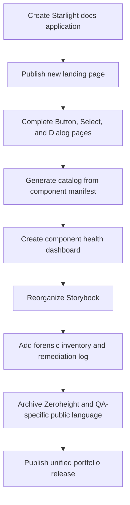

# Documentation Upgrade Package

This folder defines the transformation of **Public Sector Federation** into a more focused, portfolio-ready **Public Sector Design System exploration site**.

The plan keeps the repository's strongest engineering work—Angular, Nx, semantic tokens, provider-neutral component contracts, Storybook, Chromatic, Playwright, accessibility checks, the component manifest, and federated adoption evidence—while changing the public story from a broad architecture and QA laboratory into a coherent design-system product.

## North star

A first-time visitor should understand this within approximately 30 seconds:

> Public Sector Design System is an Angular reference system for discovering, documenting, validating, and governing reusable components across complex applications. It combines semantic tokens, provider-neutral component APIs, Storybook, accessibility validation, Chromatic visual review, and manifest-driven documentation.

## Why this upgrade exists

The current repository is technically strong, but its public presentation has several competing narratives:

1. Angular module federation reference architecture;
2. public-sector application platform;
3. design-system component and token library;
4. QA and visual-validation laboratory;
5. Zeroheight documentation experiment;
6. personal portfolio walkthrough.

The upgraded documentation should tell one primary story:

> This is a governed Angular design system that was discovered, documented, tested, remediated, and proven inside a complex application environment.

The federation and backend examples remain valuable, but they become supporting evidence rather than the homepage identity.

## Documents in this package

| Document | Purpose |
| --- | --- |
| [01 — Vision and north star](./01-vision-and-north-star.md) | Defines the target product identity, audiences, principles, and success criteria. |
| [02 — Current-state audit](./02-current-state-audit.md) | Identifies what is strong, what is confusing, and what should be retained, reframed, or archived. |
| [03 — Target information architecture](./03-target-information-architecture.md) | Defines the site navigation and ownership of each documentation surface. |
| [04 — Target technical architecture](./04-target-technical-architecture.md) | Describes the recommended Starlight, Storybook, Angular, manifest, and token architecture. |
| [05 — Component page blueprint](./05-component-page-blueprint.md) | Establishes the standard structure for every component page. |
| [06 — Manifest-driven documentation](./06-manifest-driven-documentation.md) | Explains how registry metadata can generate catalogs, status dashboards, evidence, and gap reports. |
| [07 — Storybook and Chromatic upgrade](./07-storybook-and-chromatic-upgrade.md) | Defines how Storybook becomes the interactive component workbench and Chromatic becomes the visual review surface. |
| [08 — Accessibility and remediation plan](./08-accessibility-and-remediation-plan.md) | Defines accessibility evidence, manual review, gap tracking, and remediation workflow. |
| [09 — Migration and cleanup plan](./09-migration-and-cleanup-plan.md) | Defines what to rename, archive, retain, and remove from public presentation. |
| [10 — Prioritized backlog](./10-prioritized-backlog.md) | Provides an actionable P0/P1/P2 implementation backlog. |
| [11 — Delivery roadmap](./11-delivery-roadmap.md) | Organizes the upgrade into reviewable checkpoints with acceptance criteria. |
| [12 — Role-proof matrix](./12-role-proof-matrix.md) | Maps the repository evidence to a forensic design-systems engineering role. |
| [13 — Wayfinder interview guide](./13-wayfinder-interview-guide.md) | Provides an interview-practice format for explaining the work clearly. |
| [14 — Zeroheight retirement strategy](./14-zeroheight-retirement-strategy.md) | Defines how Zeroheight becomes historical evidence rather than the canonical documentation surface. |

## Recommended implementation order

## Definition of success

The upgrade succeeds when:

- the documentation site, not the README, is the primary public entry point;
- the first screen communicates a design-system product rather than a portfolio submission;
- live Storybook examples appear near the top of component pages;
- component guidance appears before validation details;
- design tokens are shown in direct relationship to component decisions;
- accessibility evidence is honest, structured, and distinguishable from conformance claims;
- federation is presented as adoption proof, not the main identity;
- Zeroheight is optional historical evidence rather than a dependency;
- the component manifest visibly prevents documentation drift;
- a hiring manager can see discovery, remediation, governance, design-to-code translation, and engineering depth in one coherent system.
