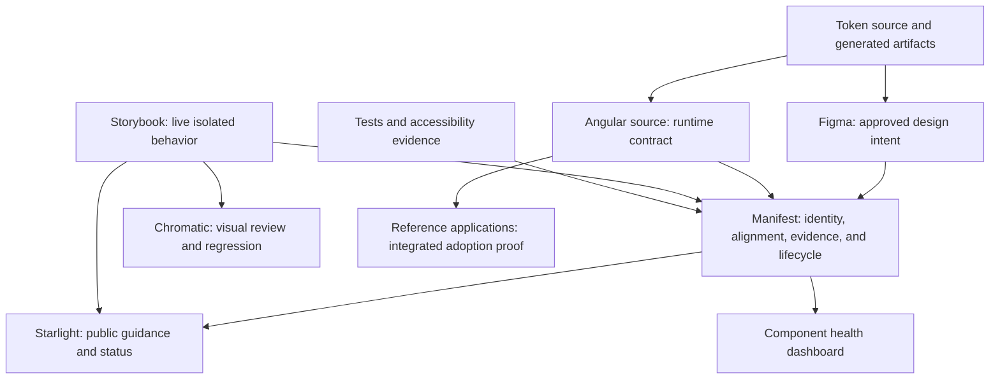
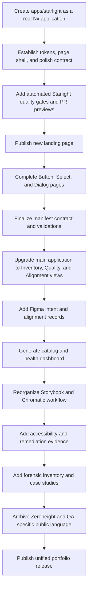

# Documentation Upgrade Package

This folder defines the transformation of **Public Sector Federation** into a more focused, portfolio-ready **Public Sector Design System exploration site**.

The plan keeps the repository's strongest engineering work—Angular, Nx, semantic tokens, provider-neutral component contracts, Storybook, Chromatic, Playwright, accessibility checks, the component manifest, Figma alignment, and federated adoption evidence—while changing the public story from a broad architecture and QA laboratory into a coherent design-system product.

## North star

A first-time visitor should understand this within approximately 30 seconds:

> Public Sector Design System is an Angular reference system for discovering, documenting, validating, and governing reusable components across complex applications. It combines semantic tokens, provider-neutral component APIs, Storybook, accessibility validation, Chromatic visual review, Figma design intent, and manifest-driven documentation.

## Why this upgrade exists

The current repository is technically strong, but its public presentation has several competing narratives:

1. Angular module federation reference architecture;
2. public-sector application platform;
3. design-system component and token library;
4. QA and visual-validation laboratory;
5. Zeroheight documentation experiment;
6. personal portfolio walkthrough.

The upgraded documentation should tell one primary story:

> This is a governed Angular design system that was discovered, documented, tested, remediated, and proven inside a complex application environment.

The federation and backend examples remain valuable, but they become supporting evidence rather than the homepage identity.

## Documents in this package

| Document | Purpose |
| --- | --- |
| [01 — Vision and north star](./01-vision-and-north-star.md) | Defines the target product identity, audiences, principles, and success criteria. |
| [02 — Current-state audit](./02-current-state-audit.md) | Identifies what is strong, what is confusing, and what should be retained, reframed, or archived. |
| [03 — Target information architecture](./03-target-information-architecture.md) | Defines the site navigation and ownership of each documentation surface. |
| [04 — Target technical architecture](./04-target-technical-architecture.md) | Describes the recommended Starlight, Storybook, Angular, manifest, and token architecture. |
| [05 — Component page blueprint](./05-component-page-blueprint.md) | Establishes the standard structure for every component page. |
| [06 — Component manifest contract](./06-component-manifest-contract.md) | Defines the manifest's strict scope, schema domains, validations, generated views, and governance boundaries. |
| [07 — Figma component intent and manifest integration](./07-figma-component-intent-and-manifest-integration.md) | Defines what a Figma component represents, how it should be created, and how Figma identifiers and alignment status fit into the manifest. |
| [08 — Storybook and Chromatic upgrade](./08-storybook-and-chromatic-upgrade.md) | Defines how Storybook becomes the interactive component workbench and Chromatic becomes the visual review surface. |
| [09 — Accessibility and remediation plan](./09-accessibility-and-remediation-plan.md) | Defines accessibility contracts, automated and manual evidence, gap tracking, and remediation workflow. |
| [10 — Migration and cleanup plan](./10-migration-and-cleanup-plan.md) | Defines what to rename, archive, retain, and remove from public presentation. |
| [11 — Prioritized backlog](./11-prioritized-backlog.md) | Provides an actionable P0/P1/P2 implementation backlog, including the application-view, manifest, and Figma workstreams. |
| [12 — Delivery roadmap](./12-delivery-roadmap.md) | Organizes the upgrade into reviewable checkpoints with acceptance criteria. |
| [13 — Role-proof matrix](./13-role-proof-matrix.md) | Maps the repository evidence to a forensic design-systems engineering role. |
| [14 — Wayfinder interview guide](./14-wayfinder-interview-guide.md) | Provides an interview-practice format for explaining the work clearly. |
| [15 — Zeroheight retirement strategy](./15-zeroheight-retirement-strategy.md) | Defines how Zeroheight becomes historical evidence rather than the canonical documentation surface. |
| [16 — Main application three-view upgrade](./16-main-application-view-upgrade.md) | Replaces the sample-heavy QA, performance, and candidate views with Component Inventory, Quality & Remediation, and Design Alignment Lab. |
| [17 — Astro Starlight application and designer-grade quality gate](./17-astro-starlight-application-and-designer-quality-gate.md) | Defines `apps/starlight`, same-origin Angular integration, content architecture, visual discipline, automated checks, and required human polish review. |

## Core source-of-truth relationship

## Recommended implementation order

## Definition of success

The upgrade succeeds when:

- `apps/starlight` is a real, independently built documentation application;
- Starlight is mounted as a first-class route of the same public product and linked directly from Angular;
- the documentation site, not the README, is the primary public entry point;
- the first screen communicates a design-system product rather than a portfolio submission;
- the main application provides Component Inventory, Quality & Remediation, and Design Alignment Lab views;
- visible application components serve the mission of each view rather than acting as generic samples;
- live Storybook examples appear near the top of component pages;
- component guidance appears before validation details;
- design tokens are shown in direct relationship to component decisions;
- Figma communicates design intent without becoming the runtime source of truth;
- the manifest records valid Figma identifiers, alignment status, differences, and honest missing states;
- accessibility evidence is structured and distinguishable from conformance claims;
- visual, responsive, accessibility, content, performance, and cross-surface quality checks block regressions;
- substantial visual changes require explicit human polish approval rather than automatic baseline acceptance;
- federation is presented as adoption proof, not the main identity;
- Zeroheight is optional historical evidence rather than a dependency;
- the component manifest visibly prevents documentation drift;
- a hiring manager can see discovery, remediation, governance, design-to-code translation, and engineering depth in one coherent system.
